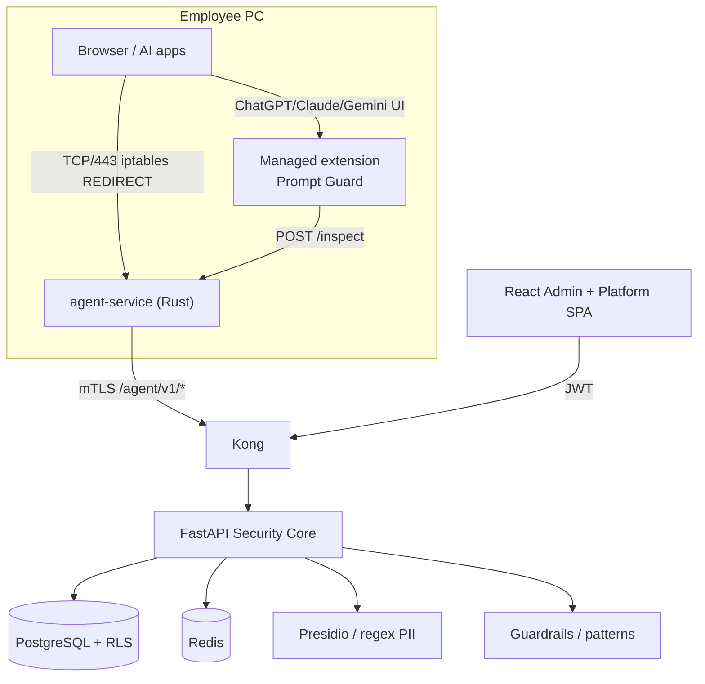
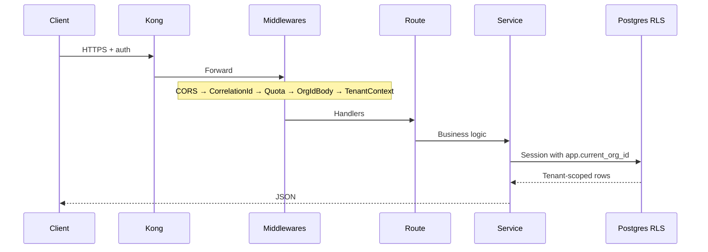
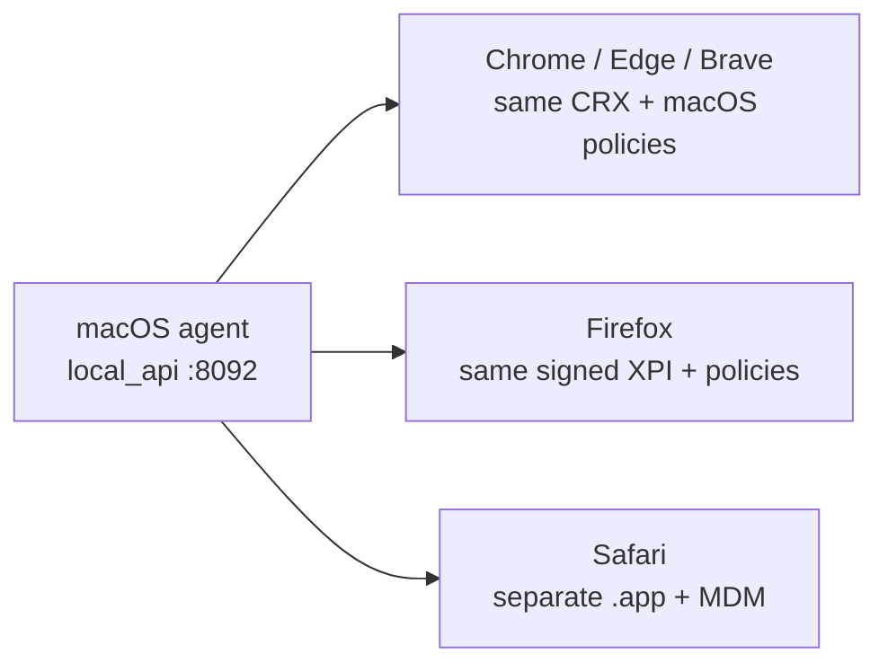

# AI-SPM — AGENTS.md

> **Single source of truth for AI coding assistants** (Cursor, Claude Code, Copilot, Codex, and autonomous agents).
>
> Read this document **completely** before changing code. Search the repo before implementing. Prefer consistency over cleverness. If anything is ambiguous, **ask** — do not guess.

---

## Table of contents

1. [Project Overview](#1-project-overview)
2. [Tech Stack](#2-tech-stack)
3. [Folder Structure](#3-folder-structure)
4. [Architecture](#4-architecture)
5. [Coding Standards](#5-coding-standards)
6. [AI Coding Rules](#6-ai-coding-rules)
7. [Business Rules](#7-business-rules)
   - [Cross-platform extensions & Safari (macOS)](#cross-platform-browser-extensions--safari-macos)
8. [Database](#8-database)
9. [APIs](#9-apis)
10. [Frontend](#10-frontend)
11. [Security](#11-security)
12. [Performance Guidelines](#12-performance-guidelines)
13. [Testing](#13-testing)
14. [Deployment](#14-deployment)
15. [Common Mistakes AI Must Avoid](#15-common-mistakes-ai-must-avoid)
16. [Development Workflow](#16-development-workflow)
17. [File-Level Documentation](#17-file-level-documentation)
18. [Decision Log](#18-decision-log)
19. [AI Checklist Before Writing Code](#19-ai-checklist-before-writing-code)
20. [AI Operating Instructions](#20-ai-operating-instructions)

---

## 1. Project Overview

### What this project is

**AI-SPM** (AI Security Posture Management) is an enterprise, multi-tenant SaaS platform that inspects outbound AI prompts, detects PII and threats, applies org policies, **masks or blocks** sensitive content, and audits outcomes — before company data reaches ChatGPT, Claude, Gemini, or LLM APIs.

### What problem it solves

Employees paste emails, SSNs, CNICs, card numbers, and internal IDs into AI tools. Without control, that data leaks to third-party providers. AI-SPM gives IT:

- One agent install per endpoint (GPO / MDM / MSI / `install-agent.sh`)
- Automatic interception for **LLM API** traffic at the OS network layer
- Managed browser extension for **Cloudflare-protected web UIs** (ChatGPT / Claude / Gemini sites)
- Central policy, PII, threat, and audit in a tenant-isolated gateway
- Admin and platform consoles for ops and fleet visibility

### Who uses it

| Actor | Surface | Auth |
|-------|---------|------|
| Employee (end user) | Any browser / AI app on a managed PC | None (agent + extension enforce policy) |
| Tenant (org) admin | React SPA (`/dashboard`, policies, agents, audit) | JWT with `org_id` |
| Platform (vendor) admin | React SPA (`/platform/tenants`) | Platform JWT (metadata only) |
| IT / endpoint admin | `install-agent.sh`, WiX MSI, systemd | Org token for agent registration |

### High-level architecture



**Two protection paths (both required in current product):**

| Traffic | Interception | Inspect path |
|---------|--------------|--------------|
| LLM **API** hosts (`api.openai.com`, `api.anthropic.com`, `generativelanguage.googleapis.com`, …) | Transparent MITM (iptables → agent `:9443`) | Agent → `POST /agent/v1/prompt?inspect_only=true` |
| Cloudflare **web UIs** (`chatgpt.com`, `claude.ai`, `gemini.google.com`, …) | Network **passthrough** (no decrypt) + IT-managed extension | Extension → agent `local_api` `:8092/inspect` → same gateway pipeline |

### Major technologies

Python 3.12+ FastAPI, SQLAlchemy async, Alembic, PostgreSQL RLS, Redis, Kong, React 18 + Vite + TanStack Query + Zustand + Tailwind, Rust (Tokio/hyper/rustls) agent, optional Presidio/spaCy/Guardrails, Stripe billing hooks, Prometheus/Grafana.

### Deployment architecture

- **Local / staging:** Docker Compose (`deploy/docker-compose.yml`) — Postgres, Redis, MinIO, API, Kong, Prometheus, Grafana, dashboard image.
- **Production:** Kubernetes manifests (`deploy/k8s/`) with HPA 3–20; secrets via K8s Secret / Vault (TODO: harden Vault integration docs).
- **Endpoint:** Linux systemd (`ai-spm-agent`) or Windows Service + WiX MSI; enterprise installer configures transparent redirect, CA trust, and browser extension policies.

---

## 2. Tech Stack

| Layer | Technology | Notes |
|-------|------------|-------|
| **Backend** | FastAPI, Pydantic v2, SQLAlchemy 2 async, Alembic, structlog | Package `ai_spm` under `backend/src/` |
| **Frontend** | React 18, TypeScript, Vite 6, React Router 6, TanStack Query 5, Zustand 5, Tailwind 3, Recharts, Lucide | Tenant admin + platform console |
| **Database** | PostgreSQL 16 | RLS via `aispm_app` role + `app.current_org_id` |
| **Cache** | Redis 7 | Policy cache, signup rate limits, prompt quota |
| **Queue** | None (dedicated broker) | Background work via APScheduler in-process |
| **Search** | None | Audit search is SQL + cursor pagination |
| **Authentication** | bcrypt passwords; tenant JWT; platform JWT (separate secret); agent mTLS + `X-Org-ID` / `X-Agent-ID` | |
| **API gateway** | Kong (DB-less) | Rate limit, correlation-id, route prefix strip |
| **Infrastructure** | Docker Compose, Kubernetes Deployment/HPA, systemd agent unit | |
| **CI/CD** | GitHub Actions (`.github/workflows/ci.yml`) | Backend pytest+ruff, frontend build, agent cargo test |
| **Monitoring** | Prometheus (`/metrics`), Grafana dashboard JSON | Kong admin metrics scraped |
| **Object storage** | MinIO | Artifact / update stubs (TODO: full MSI pipeline) |
| **Billing** | Stripe webhooks | Optional (`STRIPE_ENABLED`) |
| **PII** | Microsoft Presidio + spaCy when `[ml]` extras installed; else regex recognizers | Email, phone, SSN, CNIC, card |
| **Threat** | Guardrails Hub when available; else heuristic patterns | Jailbreak / injection |
| **LLM proxy** | OpenAI-compatible chat completions via org-scoped keys | Used when not `inspect_only` |
| **Endpoint agent** | Rust workspace: `agent-core`, `agent-service`, `agent-installer`, `agent-tray` (stub) | |
| **Browser extension** | MV3 + Firefox gecko id `prompt-guard@aispm.io` | Enterprise-managed via policy |
| **Cloud** | TODO: document primary cloud target if pinned | Manifests are cloud-agnostic K8s |
| **External APIs** | OpenAI / Anthropic / Google Generative Language (proxied); Stripe; AMO signing for Firefox XPI | |

---

## 3. Folder Structure

```
AI-SPM/
├── AGENTS.md                 # This file — agent source of truth
├── README.md                 # Human-oriented overview
├── IMPLEMENTATION_PLAN.md    # Phased delivery plan
├── Makefile                  # up / migrate / seed / test / agent-build
├── backend/                  # FastAPI security core
├── frontend/                 # React SPA
├── agent/                    # Rust endpoint agent workspace
├── browser-extension/        # MV3 Prompt Guard (web UI masking)
├── deploy/                   # Compose, Kong, K8s, Prometheus, Grafana, systemd
├── scripts/                  # install-agent, reconcile extensions, certs, signing
├── docs/                     # DEVELOPER_SETUP, PHASES_2_4
├── infrastructure/certs/     # Dev / local CA material
└── .github/workflows/        # CI
```

### `backend/`

| Path | Purpose | Belongs here | Never put here |
|------|---------|--------------|----------------|
| `src/ai_spm/` | Application package | Domain, APIs, services, infra adapters | Frontend assets, agent Rust |
| `src/ai_spm/admin/` | Tenant admin HTTP API | Admin routes only | Platform or agent auth |
| `src/ai_spm/agent/` | Agent HTTP API | Register, heartbeat, prompt, updates | Admin JWT logic |
| `src/ai_spm/platform/` | Vendor platform API + provisioning | Tenant metadata, suspend/activate | Access to audit **content** |
| `src/ai_spm/public/` | Signup / verify | Unauthenticated onboarding | Authenticated ops |
| `src/ai_spm/billing/` | Stripe webhook | Billing events | General business APIs |
| `src/ai_spm/services/` | Pipeline, policy, audit, dashboard, certs | Orchestration & business rules | Route definitions |
| `src/ai_spm/tenant/` | TenantContext, middleware, RLS, quotas | Cross-cutting tenancy | Feature UI |
| `src/ai_spm/infrastructure/` | DB, Redis, Presidio, Guardrails, LLM, auth | Adapters / I/O | Domain rules duplicated from services |
| `src/ai_spm/domain/` | SQLAlchemy models, enums | Persistence shapes | HTTP handlers |
| `src/ai_spm/jobs/` | APScheduler jobs | Periodic maintenance | Request-scoped work |
| `src/ai_spm/presentation/` | Correlation ID, WebSocket | Cross-cutting HTTP presentation | Business logic |
| `alembic/` | Migrations | Schema changes only | Ad-hoc data scripts without review |
| `tests/` | unit / integration / **security** | Tests mirroring package boundaries | Production secrets |
| `scripts/` | seed_platform_admin, seed_dev_tenant | One-shot ops | Runtime features |

### `frontend/`

| Path | Purpose | Belongs here | Never put here |
|------|---------|--------------|----------------|
| `src/pages/` | Route-level screens | Page composition | Raw fetch without `lib/api` |
| `src/components/` | Layout, UI primitives, ProtectedRoute | Reusable UI | API secrets |
| `src/hooks/` | TanStack Query hooks, WS hook | Data-fetching hooks | Auth persistence (use store) |
| `src/stores/` | Zustand auth session | Client session only | Server source of truth |
| `src/lib/` | `api.ts`, `jwt.ts`, utils | Shared client libs | Business rules that belong on backend |
| `src/types/` | API TypeScript types | Shared shapes | Duplicate ad-hoc interfaces per page |

### `agent/`

| Path | Purpose | Belongs here | Never put here |
|------|---------|--------------|----------------|
| `crates/agent-core/` | Config, gateway, proxy, local_api, network_setup | Shared library logic | Windows Service entry (service crate) |
| `crates/agent-service/` | Daemon binary | Process lifecycle, startup wiring | Heavy business logic (keep in core) |
| `crates/agent-tray/` | Tray UI placeholder | Status UX only | Network interception |
| `crates/agent-installer/` | Linux installer launcher (`aispm-agent-installer`) sealed in `.run` | Guided install entrypoint | Gateway business logic |
| `installer/linux-gui/` | Tkinter wizard + shell launcher | Employee double-click UX | Token generation (admin API) |
| `installer/wix/` | Windows MSI | Packaging | Runtime config truth (use enrollment.env) |
| `tests/integration/` | Rust integration tests | Agent-focused tests | Backend pytest |

### `browser-extension/`

| Path | Purpose | Belongs here | Never put here |
|------|---------|--------------|----------------|
| `manifest.json` | MV3 + gecko id | Permissions / matches | Secrets |
| `inject.js` | MAIN-world fetch/XHR hooks | Prompt extraction / rewrite | Direct gateway calls (use bridge) |
| `bridge.js` | ISOLATED world bridge | `postMessage` ↔ runtime | MITM CA logic |
| `background.js` | Service worker → `127.0.0.1:8092` | Inspect API client | Storing raw PII |

**Extension is part of the product for web UIs.** Do not delete or treat as throwaway. Do not make enterprise features *depend only* on a user manually installing from the store — install via `install-agent.sh` / reconcile policies.

**Cross-platform:** The same CRX/XPI works on Windows and macOS Chromium/Firefox — only **installer/reconcile paths** differ. Safari needs a **separate native wrapper** (see [Cross-platform extensions & Safari](#cross-platform-browser-extensions--safari-macos)).

TODO when Safari work starts: `browser-extension/safari/` (shared JS + Xcode notes) and/or `agent/installer/macos/` for pkg + MDM profiles.

### `deploy/`

Compose, Kong declarative config, K8s Deployment/HPA/ConfigMap, Prometheus, Grafana dashboard, systemd unit templates. **Do not** put application business logic here.

### `scripts/`

| Script | Role |
|--------|------|
| `install-agent.sh` | Enterprise endpoint provisioning (loads `enrollment.env` when present); subcommands `uninstall`/`stop`, `refresh-extensions`. After install, also available as `sudo aispm-agent uninstall` |
| `build-linux-installer.sh` | Stage `dist/linux-installer` assets for sealed Admin Download Agent `.run` |
| `reconcile-browser-extensions.sh` | Chromium forcelist + external_crx; Firefox policies + XPI staging |
| `sign-firefox-extension.sh` | AMO-signed XPI (required for release Firefox) |
| `generate-certs.sh` | Dev CA / cert helpers |

---

## 4. Architecture

### Overall model

**Hybrid endpoint security + central multi-tenant gateway.**

1. Endpoint agent registers with org token → receives mTLS client cert (SAN embeds `org_id`).
2. **API traffic:** transparent redirect → SNI classify → MITM selected API hosts → `inspect_only` to gateway → rewrite or block → forward upstream.
3. **Web UI traffic:** CF hosts passthrough; extension intercepts in-page requests → local_api → same pipeline.
4. Gateway runs the **prompt lifecycle** (policy → threat → PII → optional LLM → response scans → audit → quota).
5. Admin SPA consumes `/admin/v1/*`; platform SPA consumes `/platform/v1/*` (no audit bodies).

### Request lifecycle (HTTP API)



### Prompt pipeline (mandatory order)

Implemented in `backend/src/ai_spm/services/prompt_pipeline.py`:

| Step | Action | Engine | Fail mode |
|------|--------|--------|-----------|
| 1–3 | Policy evaluation (model / topic / provider) | `PolicyEngine` + Redis | Block + audit `POLICY_VIOLATION` |
| 4–5 | Inbound threat scan | `GuardrailsAdapter` | **Fail-closed** (backend) |
| 6 | PII scan + mask | `PresidioAdapter` | **Fail-closed** (backend) |
| — | `inspect_only=true` | Return `masked_messages` + decision; agent/extension rewrite client request | Skip LLM |
| 7 | Forward to LLM (full proxy mode) | `OpenAIAdapter` | 502 on provider error |
| 8 | Response PII scan | Presidio | **Fail-closed** |
| 9 | Outbound threat scan | Guardrails | Block + audit |
| 10 | Append-only audit (**masked content only**) | PostgreSQL | Never store raw PII |
| 11 | Increment prompt quota | Redis / usage | 429 when over quota |

**Do not reorder these steps** without an explicit architectural decision and tests.

### Service / repository pattern

- **Routes** (`*/api/v1/routes.py`): HTTP only — parse, auth dependency, call service, map errors to `HTTPException`.
- **Services** (`services/`, `platform/services/`): Business orchestration; own transactions logically.
- **Domain models** (`domain/models/`): Persistence; queries typically inline in services with `org_id` filters (no large separate repository package — **match existing style**).
- **Infrastructure adapters**: External systems (Presidio, Guardrails, OpenAI, Redis, email).

### Middleware stack (`main.py`)

Order matters:

1. CORS  
2. Correlation ID  
3. Quota  
4. Org-id body validation (IDOR guard)  
5. TenantContext  

### Event system / queues / workers

- **No RabbitMQ/Kafka.**  
- **APScheduler** (`jobs/scheduler.py`): `agent_offline_detector` every ~2 minutes marks stale ONLINE agents OFFLINE (heartbeat older than ~120s).  
- TODO: security score refresh job mentioned in older docs — not implemented as scheduled work.

### Agent internals (simplified)

```
agent-service start
  → load config (/etc/ai-spm/agent.env)
  → endpoint_setup (CA trust; optional iptables)
  → register (retry with backoff if gateway down)
  → spawn: transparent listener | explicit proxy | local_api | heartbeat
```

Heartbeat every 60s; on agent 404 (deleted), re-register.

### Interception mode hierarchy

1. **Transparent network redirect** — enterprise default for API hosts (Linux iptables; Windows WFP TODO).
2. **Explicit system proxy** — legacy / laboratory (`AISPM_EXPLICIT_PROXY_ENABLED`).
3. **local_api + managed extension** — **required** for CF web UIs (not optional for ChatGPT/Claude/Gemini sites).

When adding interception logic, extend `agent/crates/agent-core/src/proxy/` and keep CF hosts on the passthrough + extension path unless Cloudflare MITM becomes viable (ask before changing).

---

## 5. Coding Standards

### Naming

| Area | Convention |
|------|------------|
| Python modules / packages | `snake_case` |
| Python classes | `PascalCase` |
| Python functions / vars | `snake_case` |
| Env vars | `AISPM_*` (agent), FastAPI Settings fields often mirrored as env |
| Rust crates / modules | `snake_case`; types `PascalCase` |
| React components | `PascalCase.tsx` |
| Hooks | `useX` |
| API paths | `/admin\|agent\|platform\|public/v1/...` — never rename without migration plan |

### Formatting

- Python: Ruff (`ruff check` in CI). Match surrounding files; do not mass-reformat unrelated modules.
- TypeScript: project ESLint via `npm run lint`; Prettier if already configured — do not invent a new style.
- Rust: `rustfmt` defaults.

### Class / module structure (Python)

Prefer:

1. Imports (stdlib → third party → local) at **top of file** — no inline imports except rare circular-resolution cases already present; prefer fixing cycle over copying that pattern.
2. Constants / module singletons as used today (`agent_service = AgentService()`).
3. Public service methods first; private helpers `_named`.

### Method order (services)

Constructor / fields → public entrypoints (`process_prompt`, `evaluate`) → private helpers → module-level wiring.

### Error handling

- Routes: translate domain errors to `HTTPException` with stable status codes.
- Pipeline scanners: **fail-closed** on the backend (block if scanner errors).
- Agent / extension: some paths currently **fail-open** so chat UX is not hard-broken when gateway/local_api is down — **do not silently flip to fail-closed** across all paths without product approval; if changing, update tests and this doc.
- Never swallow security failures without an audit event when a request was inspected.

### Logging

- Backend: **structlog** JSON; include correlation ID from middleware.
- Never log raw prompts containing PII — log decisions, lengths, entity types, masked snippets only.
- Agent: prefer `tracing` / existing macros; avoid dumping request bodies.

### Validation

- Pydantic models at API boundary (`core/schemas.py` and route-local models).
- Reject body `org_id` ≠ tenant context.
- Preserve fail paths for quota and suspended orgs.

### Dependency injection

- FastAPI `Depends(get_session)` for tenant DB.
- `get_platform_session()` only for platform/cross-tenant/auth bootstrap paths.
- Do not introduce a new DI container framework.

### SOLID / DRY / KISS / YAGNI

- Reuse `PromptPipelineService`, `PolicyEngine`, Presidio/Guardrails adapters — do not fork parallel scanners.
- Do not add abstractions “for future providers” without a concrete second use.
- Prefer small diffs that mirror neighboring code.

---

## 6. AI Coding Rules

These are **mandatory** constraints for AI agents.

### Never (without explicit human approval)

1. Rewrite working code wholesale “for cleanliness.”
2. Change architecture (e.g. drop transparent mode, move inspection into browser-only, remove RLS).
3. Rename public methods, routes, API paths, or JSON field names used by agent/frontend.
4. Remove comments that encode security rationale or protocol quirks.
5. Change database schema / Alembic history casually — only with an approved migration.
6. Change authentication or permission maps (`infrastructure/auth/password.py`) lightly.
7. Remove or weaken validation, TenantContext, OrgId body checks, or RLS session setup.
8. Change environment variable **names** (breaking installers and Compose).
9. Upgrade dependencies as drive-by changes.
10. Modify Docker/K8s/Kong unless the task is infrastructure.
11. Introduce new libraries / crates without approval.
12. “Optimize” hot paths without profiling evidence and a request.
13. Modify unrelated files to “improve structure.”
14. Delete the browser extension or disable `local_api` in enterprise install defaults while web UI masking is required.
15. Move Cloudflare web hosts onto network MITM without proving pages still load (historically breaks CF).
16. Store raw PII in `audit_events` or logs.
17. Bypass `TenantContext` or use `get_platform_session` on tenant user routes.
18. Commit secrets (`.env`, JWT keys, org tokens, AMO credentials).

### Always

1. Preserve backward compatibility for agent (`/agent/v1/*`) and admin SPA contracts.
2. Keep diffs minimal and local to the request.
3. Explain **why** a change is needed (security fix, bug, feature).
4. Search for existing helpers before adding new ones.
5. Run or outline relevant tests (`make test-security` for tenancy changes).
6. Update this `AGENTS.md` when changing interception topology or pipeline order.
7. Ask when requirements are incomplete instead of inventing product behavior.

---

## 7. Business Rules

### Core security promise

- Sensitive values in prompts must be **masked** or the request **blocked** before leaving the controlled path to the AI provider.
- Audit trail stores **masked** content only.
- Backend pipeline scanner failures → **block** (fail-closed).
- Quota exceeded → reject new prompts (429 / quota middleware).

### Prompt workflows

1. **inspect_only** (MITM + extension): pipeline steps 1–6 (+ audit/quota), return masked messages; client rewrites body and talks to provider.
2. **Full proxy** (gateway holds provider key): continue through LLM + response scans.

### Permissions / roles

- **Tenant user roles** (`UserRole` enum): mapped to permission strings in `infrastructure/auth/password.py` — used to gate admin UI/API actions.
- **Platform roles** (`PlatformRole`): vendor ops; **must never** receive audit event bodies (enforced by API design + security tests).
- **Agent**: authenticated via mTLS + headers; scoped to one `org_id`.

### Data ownership

- Every tenant row lives under `organizations.id` (`org_id`).
- Agents belong to one org; optional `department_id`.
- Cross-tenant access is a **security incident** class of bug — CI must stay green.

### Policy rules

- Org policies constrain models / topics / providers.
- Empty allow-lists may mean “permit” (governance opt-in) — read `PolicyEngine` before changing semantics.
- Policies cached in Redis (`policies:active`, TTL ~300s) — invalidate on CRUD.

### Billing / plans

- Subscription plan caps `max_agents` and prompt usage.
- Agent re-registration should be **idempotent by hostname** (avoid exhausting `max_agents` on every reinstall).
- Stripe webhook updates subscription state when enabled.

### Signup

- `POST /public/v1/signup` → org + admin user + default policy + subscription + verification token.
- Rate-limited via Redis.
- Platform tenant creation API may be absent — prefer signup / seed paths (TODO if product adds `POST /platform/v1/tenants`).

### Extension vs MITM (product rule)

| Surface | Rule |
|---------|------|
| API SDKs / CLI / IDE | Network MITM |
| chatgpt.com / claude.ai / gemini.google.com | Extension + local_api |
| Enterprise install | Enables **both** transparent + local_api + managed policies |

### Cross-platform browser extensions & Safari (macOS)

#### One extension codebase for Chromium + Firefox (all OSes)

Chrome/Edge/Brave/Chromium (**CRX**) and Firefox (**AMO-signed XPI**) are **browser-engine packages**, not OS packages. The same `browser-extension/` artifacts work on **Linux, Windows, and macOS**.

| Artifact | OSes | What changes per OS |
|----------|------|---------------------|
| CRX + Chrome/Edge policies | Linux, Windows, macOS | Policy/file paths only (`/etc/opt/chrome/...` vs GPO/Intune vs macOS managed prefs) |
| Signed XPI + Firefox policies | Linux, Windows, macOS | Policy/XPI staging paths only |
| Agent `local_api` `:8092` | All | Same inspect + `updates.xml` contract |

**Do not** fork `inject.js` / `bridge.js` / `background.js` per OS for Chrome or Firefox. Keep one signing key so the Chromium extension ID stays stable across platforms.

Windows MSI / future macOS agent installers must **reuse** these packages and add OS-specific **reconcile** steps (equivalent of `reconcile-browser-extensions.sh`).

#### Safari — feasible, but a third deployment track

Safari **can** be supported for a future macOS agent. Reuse ~90% of the JS (MAIN-world hooks → bridge → `127.0.0.1:8092/inspect`). Safari is **Apple-only** — one Safari Web Extension covers macOS (and optionally iOS/iPadOS later). There is no “Windows Safari extension.”



Arc / Vivaldi / other Chromium browsers on Mac use the **CRX track**, not Safari.

#### Safari blockers and limitations

| Topic | Reality | Severity |
|-------|---------|----------|
| **Packaging** | Cannot ship CRX/XPI. Need Xcode host `.app` + `.appex`, Apple Developer ID signing, and **notarization**. Bootstrap via Apple’s Safari Web Extension Converter from `browser-extension/`. Extension ID is `BundleId (TeamId)`, not the Chrome CRX id. | Medium (new pipeline) |
| **Enterprise silent install** | No Chrome-style `ExtensionInstallForcelist` + local `updates.xml`. Closest parity: **MDM Declarative Device Management** `com.apple.configuration.safari.extensions.settings` with `State: AlwaysOn` — requires **macOS 15+**, typically **supervised** devices, and the host app already on the machine. ABM/VPP often used to distribute the app. A plain `.pkg` alone is weaker than Linux Chrome forcelist. | **High** for zero-click fleet |
| **Private Browsing** | Safari disables content-injecting extensions in Private Browsing by default. Need MDM `PrivateBrowsing: AlwaysOn` for parity with Chromium Incognito policy. | Medium |
| **MAIN world** | Manifest `"world": "MAIN"` (required for `inject.js` fetch/XHR hooks) needs **Safari 18+ / macOS 15+**. Older Safari unsupported for this design. | Medium (floor OS version) |
| **CSP / API quirks** | Stricter CSP can break MAIN-world script load; may need `scripting.executeScript` fallbacks. Re-test Gemini `StreamGenerate` / Claude / ChatGPT parsers in Safari. | Low–medium (QA) |
| **Updates** | No agent-served Safari update XML like Chrome. Redeploy signed `.app` via MDM/pkg or App Store. | Medium (ops) |

#### Recommended delivery order (do not block macOS agent on Safari)

1. **Phase A — macOS agent without Safari:** transparent/API MITM (as available) + **same** CRX/XPI + macOS Chromium/Firefox reconcile. Ship protection for Chrome/Firefox users first.
2. **Phase B — Safari:** convert extension → Xcode app → sign/notarize → installer copies to `/Applications/` → MDM profile for `AlwaysOn` + Private Browsing + allowed domains (`chatgpt.com`, `claude.ai`, `gemini.google.com`).

#### AI rules for Safari / macOS work

- Do **not** invent a second Chromium/Firefox extension “for Mac.”
- Do **not** claim Safari installs via `updates.xml` forcelist — that path is Chromium-only.
- Do **not** treat Safari as required for the first macOS agent release unless product explicitly requires it.
- When implementing Safari: keep shared JS in `browser-extension/`; put Apple-only packaging under `browser-extension/safari/` or `agent/installer/macos/` (TODO until created).
- Ask before promising silent Safari install without MDM/supervised devices.

---

## 8. Database

### Engine

PostgreSQL 16 via `asyncpg` / SQLAlchemy async. Connection string: `DATABASE_URL`.

### Migration strategy

- Alembic under `backend/alembic/`.
- Current baseline: `001_initial_saas_multitenant.py`.
- New schema changes: **new revision** only; never edit applied migrations that shipped.
- Run: `make migrate` / `alembic upgrade head`.

### Primary tables (hub: `organizations`)

| Table | Notes |
|-------|-------|
| `organizations` | slug, status, `org_token_hash`, settings JSONB |
| `users` | org-scoped; unique (org_id, email) |
| `agents` | status ONLINE/OFFLINE/REVOKED; hostname; cert metadata |
| `departments` | org-scoped |
| `policies` | rules JSON; action ALLOW/BLOCK/MASK etc. |
| `audit_events` | append-oriented; **masked_content**; soft UUID refs to agent/user (no hard FK required) |
| `llm_provider_configs` | org + provider unique; keys treated as sensitive |
| `subscriptions` | plan, status, Stripe refs |
| `usage_daily` | unique (org_id, date) |
| `tenant_invitations` | |
| `email_verification_tokens` | |
| `platform_users` / `platform_audit_logs` | vendor plane |
| `billing_events` | unique `stripe_event_id`; not RLS |

### RLS

Enabled on tenant tables (users, agents, policies, audit_events, departments, llm_provider_configs, subscriptions, usage_daily, invitations, email tokens).

Session setup (`infrastructure/db/session.py`):

```text
SET ROLE aispm_app;
SELECT set_config('app.current_org_id', '<uuid>', true);
```

Platform sessions **bypass** RLS intentionally — never use for tenant admin handlers.

### Soft deletes / locking / transactions

- Org/agent lifecycle uses **status** fields (e.g. suspended, revoked) more than SQL soft-delete columns.
- Prefer short transactions; commit after service unit of work.
- TODO: document explicit row-level locking strategy if added for billing races.

### Indexes / performance

- Unique constraints on slug, org+email, org+provider, org+date usage.
- Audit queries: prefer cursor/`created_at` filters already used in `AuditService` — extend those patterns for new filters.
- Always include `org_id` in WHERE clauses even with RLS (defense in depth).

---

## 9. APIs

### Namespaces

| Prefix | Auth | Scope |
|--------|------|-------|
| `/public/v1/*` | None | Signup, verify (returns `org_token` once), health |
| `/admin/v1/*` | Tenant JWT | Single org |
| `/agent/v1/*` | mTLS + `X-Org-ID` / `X-Agent-ID` | Single org |
| `/platform/v1/*` | Platform JWT | Tenant **metadata** only |
| `/billing/webhooks/stripe` | Stripe signature | Subscription events |
| `/health`, `/ready`, `/metrics` | None / scrape | Liveness, readiness (DB), ops |

### Representative admin routes

- `POST /admin/v1/auth/login`, `GET /admin/v1/auth/me`
- `GET /admin/v1/dashboard/metrics`, `GET /admin/v1/dashboard/threats`
- `GET /admin/v1/agents`, revoke/delete
- `GET /admin/v1/agents/enrollment` — gateway URL + org metadata (**no** raw org token)
- `POST /admin/v1/org-token/rotate` — new org token plaintext **once**
- `GET /admin/v1/agents/installer/linux` — sealed self-extracting `.run` (rotates token, embeds enrollment + installer; SHA-256 integrity)
- `GET /admin/v1/audit`, export endpoints
- CRUD `/admin/v1/policies`, users, llm-configs
- `POST /admin/v1/gdpr/export|delete`
- `WS /admin/v1/ws/dashboard?token=JWT`

### Agent enrollment package (tenant-bound download)

Admin console **Download Agent** (`/agents/download`) streams a **single sealed** Linux `.run` (SFX) bound to the caller’s `org_id` — not an editable unzipped folder of scripts.

| Layer | Role |
|-------|------|
| Bash stub + SHA-256 | Self-extract to `/tmp`; refuse install if payload was modified |
| Gzipped tar payload | `enrollment.env`, guided installer, `install-agent.sh`, `agent-service` when packaged |

Sealed payload contents:

| File | Role |
|------|------|
| `enrollment.env` | `AISPM_GATEWAY_URL`, `AISPM_ORG_ID`, `AISPM_ORG_TOKEN`, `AISPM_ORG_NAME` (tenant bind) |
| `aispm-agent-installer` | CLI launcher (Rust or shell) |
| `aispm-agent-installer-gui.py` | Guided Tkinter install UI |
| `install-agent.sh` | Privileged engine (`pkexec`/`sudo`) — agent + network MITM + **managed extension** |
| `reconcile-browser-extensions.sh` | Enterprise policies for Chrome-family + Firefox |
| `browser-extension/` | Prompt Guard sources (+ signed XPI when present) staged to `/opt/ai-spm` |
| `agent-service` | Prebuilt agent binary when packaging ran |

**Tenant isolation (SaaS):** Each admin downloads a package stamped with **their** `org_id` + rotating `org_token`. The endpoint agent registers with that org only (mTLS SAN embeds `org_id`). The extension talks only to the local agent (`127.0.0.1:8092`); the agent talks to the gateway as that tenant. Admin JWT + RLS ensure one org never sees another org’s agents, prompts, or audit. Platform admins get metadata only — never audit bodies.

Employees run: `chmod +x aispm-agent-linux-*.run && ./aispm-agent-linux-*.run`. They approve **one** OS password prompt (pkexec/sudo); install is automatic (agent + managed extension). No `python3-tk` and no terminal typing required. After install, reopen browsers so managed policies force-install Prompt Guard on available Chrome / Chromium / Edge / Brave / Vivaldi / Firefox.

Gateway URL stamped into packages: `AISPM_PUBLIC_GATEWAY_URL` (default `http://localhost:8090` for local Kong). Assets: `make installer-linux` → `dist/linux-installer/` (Compose mounts to `/opt/ai-spm/installer-linux`). Optional: `AISPM_INSTALLER_SIGNING_KEY` for HMAC metadata in the stub.

### Agent routes

- `POST /agent/v1/register`
- `POST /agent/v1/heartbeat`
- `POST /agent/v1/unregister` — endpoint self-removal (deletes fleet row on uninstall)
- `POST /agent/v1/prompt` (`inspect_only` query)
- `GET /agent/v1/updates/check`, download

### Platform routes

- `POST /platform/v1/auth/login`
- `GET /platform/v1/tenants`, detail, suspend, activate, usage  
- TODO: create-tenant via platform API if product requires it (today: public signup / seeds)

### Response / error conventions

- JSON bodies; HTTP status for errors.
- Do not invent GraphQL — there is none.
- Rate limiting: Kong ~1000/min (see `deploy/kong/kong.yml`); signup also Redis-limited.

### Local agent HTTP (not Kong)

`http://127.0.0.1:8092` — extension inspect + CRX/`updates.xml` packaging endpoints. Only localhost.

### Frontend API base URL

- Docker / common laptop layout: Kong on host **`8090`** → set `VITE_API_URL=http://localhost:8090`.
- Docs/`api.ts` default may say `8080` — prefer Compose-mapped **8090** on this project’s default compose file.
- Direct uvicorn: `make backend-dev` → `:8000`.

---

## 10. Frontend

### Framework

React 18 + Vite + TypeScript + Tailwind. Entry: `frontend/src/main.tsx` → `App.tsx`.

### Routing

| Path | Scope |
|------|-------|
| `/login`, `/platform/login` | Public |
| `/dashboard`, `/threats`, `/agents`, `/agents/download`, `/policies`, `/audit`, `/settings` | Admin JWT |
| `/platform/tenants` | Platform JWT |

Use `ProtectedRoute` with `scope="admin" | "platform"`.

### State

- **Auth:** Zustand + `sessionStorage` key `ai-spm.session` (`stores/auth.ts`).
- **Server state:** TanStack Query (`hooks/queries.ts`).
- **Live dashboard:** `useDashboardWebSocket`.

### API communication

All HTTP through `lib/api.ts` (`adminApi`, `platformApi`). On 401, logout. Do not scatter raw `fetch` with hardcoded hosts.

### UI guidelines

- Follow existing layout (`MainLayout`, `Sidebar`, `nav.ts`) and UI primitives (`MetricCard`, `StatusBadge`, `States`).
- This is a **console/dashboard**, not a marketing landing page — preserve the established admin visual language (do not apply consumer-brand landing rules to these screens).
- Exhaustive handling for TypeScript unions/enums (switch must cover all cases).

### Styling

Tailwind utility classes matching neighboring pages. Avoid introducing a second CSS framework.

---

## 11. Security

### Authentication

| Plane | Mechanism |
|-------|-----------|
| Tenant admin | bcrypt password + JWT (`JWT_SECRET_KEY`) claiming `org_id` |
| Platform admin | Separate `PLATFORM_JWT_SECRET_KEY` |
| Agent | Org token at register → mTLS client cert; headers thereafter |

Seeded platform admin (dev): see README (`platform-admin@aispm.io`) — **rotate in production**.

### Authorization

RBAC permission maps for admin actions. Platform must not read audit content (security tests enforce).

### Tenant isolation (five layers — do not weaken)

1. Auth `org_id`  
2. `TenantContext` middleware  
3. Body `org_id` mismatch rejection  
4. Query `WHERE org_id = …`  
5. PostgreSQL RLS  

### XSS / CSRF / injection

- SPA: React escaping; avoid `dangerouslySetInnerHTML` unless justified.
- SQL: SQLAlchemy parameterization only — never string-built SQL with user input.
- Extension injects into AI pages carefully — do not broaden `matches` to all websites.

### Secrets & env

- Never commit `.env`. Use Vault / K8s secrets in prod for JWT and Stripe keys.
- LLM provider keys org-scoped; treat as secrets (TODO: real KMS wrapping — currently placeholder encryption semantics).

### Logging sensitive data

Forbidden: raw emails/SSNs/cards/CNICs/prompts before masking. Allowed: decisions, counts, masked strings, correlation IDs.

### Encryption / passwords

- Passwords: bcrypt.  
- Org tokens: hashed at rest (`org_token_hash`).  
- Agent mTLS: certs under `/etc/ai-spm/certs/` (Linux) or `C:\ProgramData\AISPM\certs\` (Windows).

### MITM CA

Local enterprise CA on the endpoint for API host interception. Installer trusts CA in system + browser NSS stores. Compromising this CA is high impact — protect key material; do not log PEMs.

---

## 12. Performance Guidelines

- **Pagination:** Audit and list endpoints use cursor / limits — do not load unbounded tables into memory.
- **Caching:** Policy Engine Redis TTL — invalidate on policy writes.
- **Lazy loading:** Frontend route-level code split only if already patterned; do not mass-add without need.
- **Batch processing:** Prefer existing services for GDPR export over N+1 ad-hoc loops.
- **Agent:** Passthrough splice non-MITM traffic; avoid decrypting everything.
- **QUIC:** Installer blocks UDP/443 so HTTPS cannot bypass TLS inspection via HTTP/3 — preserve this on Linux enterprise installs.
- **Memory:** Stream upstream responses in MITM where implemented; do not buffer entire LLM streams into giant strings unnecessarily.

---

## 13. Testing

### Backend

| Suite | Path | Expectation |
|-------|------|-------------|
| Security (CI blocking) | `backend/tests/security/` | Cross-tenant API + RLS + platform boundaries |
| Unit | `tests/unit/` | PII / threat engines |
| Integration | `tests/integration/` | Auth/agent, policy |

Commands:

```bash
make test-security
cd backend && pytest -v
```

### Frontend

`npm run build` (tsc + vite) in CI; add component tests only if the repo already establishes a pattern (TODO: expand dedicated FE test suite if product requires).

### Agent

```bash
cd agent && cargo test --workspace
```

### Mocking

Follow `conftest.py` fixtures; prefer DB + Redis from CI services over inventing new global mocks.

### Coverage

No hard % gate documented — **security tests must pass**. Treat tenancy regressions as release blockers.

---

## 14. Deployment

### Local full stack

```bash
make up                 # Compose: PG, Redis, MinIO, Kong, API, …
make migrate && make seed
make backend-dev        # optional direct :8000
make frontend-dev       # :5173
```

### Endpoint agent (Linux)

```bash
sudo AISPM_GATEWAY_URL="https://gateway.example.com" \
  AISPM_ORG_ID="<org-uuid>" \
  AISPM_ORG_TOKEN="<org-token>" \
  ./scripts/install-agent.sh

sudo ./scripts/install-agent.sh refresh-extensions
sudo ./scripts/install-agent.sh stop
```

**Order for extension reload:** agent running (serves `:8092` updates.xml) → then open Chrome. Policy uses `ExtensionInstallForcelist` pointing at `http://127.0.0.1:8092/extension/updates.xml`.

### Firefox

Release Firefox requires Mozilla-signed XPI. Re-sign after version bumps:

```bash
AMO_JWT_ISSUER=... AMO_JWT_SECRET=... ./scripts/sign-firefox-extension.sh
sudo ./scripts/install-agent.sh refresh-extensions
```

### Build commands

| Target | Command |
|--------|---------|
| Backend image / stack | `make up` / `make build` |
| Agent release | `make agent-build` |
| Frontend | `cd frontend && npm run build` |
| Certs | `make certs` |

### Health / monitoring

- `GET /health`  
- `GET /metrics` (Prometheus)  
- Grafana: `deploy/grafana/dashboards/ai-spm-overview.json` (Compose Grafana often on host **3001**)

### Rollback

- App: redeploy previous image / git SHA; Alembic downgrade only with explicit DBA approval.
- Agent: previous binary + `systemctl restart ai-spm-agent`; extension version via `external_version` / updates.xml.
- TODO: formal blue/green procedure if not yet written for your environment.

### Important ports (this repo’s Compose defaults)

| Port | Service |
|------|---------|
| 5432 | Postgres |
| 6380→6379 | Redis (host remap) |
| 8090→8000 | Kong → API |
| 8000 | API in-container / `backend-dev` |
| 5173 | Vite |
| 8092 | Agent local_api |
| 9443 | Transparent redirect target |
| 9090 / 3001 | Prometheus / Grafana |

---

## 15. Common Mistakes AI Must Avoid

1. **Assuming “no browser extension”** — outdated relative to code; web UIs need managed extension + local_api.
2. **MITMing chatgpt.com / claude.ai / gemini.google.com** — currently intentional passthrough; MITM breaks CF-protected UIs.
3. **Removing ExtensionInstallForcelist** — Chrome won’t reinstall after Preferences clear; keep forcelist + updates.xml + external_crx.
4. **Opening Chrome before agent is up** after refresh — forcelist fetch to `:8092` fails; extension missing.
5. **Bypassing services / TenantContext** from routes.
6. **Writing raw SQL without org_id** or using platform session for tenant data.
7. **Storing unmasked prompts** in audit or logs.
8. **Duplicating PII/threat logic** in the extension instead of calling local_api → gateway.
9. **Hardcoding gateway ports** inconsistently (8080 vs 8090) — check `deploy/docker-compose.yml` and `frontend/.env`.
10. **Creating a new agent row every reinstall** — must stay idempotent by hostname or quotas exhaust (429).
11. **Driving enterprise UX via “ask user to load unpacked extension”** — policies + CRX/XPI only.
12. **Silent pass-through on backend scanner errors.**
13. **Changing Kong routes** without updating frontend `VITE_API_URL` and agent gateway URL docs.
14. **Introducing circular imports** / mid-file imports as a habit.
15. **Mixing admin JWT into agent routes** or vice versa.
16. **Firefox: deploying unsigned XPI** to release Firefox — install will fail; stage signed XPI.
17. **Scope creep refactors** while fixing a single bug.
18. **Forking Chrome/Firefox extensions per OS** — reuse CRX/XPI; only reconcile paths differ.
19. **Treating Safari like Chrome forcelist** — Safari needs a signed host `.app` + MDM (`AlwaysOn`); no local `updates.xml` force-install.
20. **Blocking the first macOS agent on Safari** — ship Chromium/Firefox + agent first unless product requires Safari day one.

---

## 16. Development Workflow

### New features

1. Confirm enterprise fit (agent install / auto start / mask before send / correct interception path).  
2. Locate the owning module (pipeline vs agent proxy vs extension vs admin UI).  
3. Implement minimal change; reuse adapters.  
4. Add/adjust tests (security tests if tenancy touched).  
5. Update AGENTS.md / docs if topology or contracts change.  
6. Ask for review on auth, schema, or interception changes.

### Bug fixes

1. Reproduce with evidence (logs, `curl` to `/inspect` or `/agent/v1/prompt`, browser version pages).  
2. Narrowest fix; avoid “cleanup” in the same PR.  
3. Prefer regression tests.

### Refactors

Only when requested. Preserve public APIs. No drive-by renames.

### Code review focus

- Tenant isolation intact?  
- Pipeline order preserved?  
- Fail mode intentional?  
- Agent/extension contracts stable?  
- Secrets absent?

### PRs

- Small, focused diffs.  
- CI: security-tests + frontend build + agent tests green.  
- Do not force-push main; do not skip hooks unless human insists.

### Test changes locally

```bash
make test-security
cd backend && pytest -v
cd agent && cargo test --workspace
cd frontend && npm run build
# Extension: sudo ./scripts/install-agent.sh refresh-extensions
```

---

## 17. File-Level Documentation

### Backend critical files

| File | Purpose | Dependencies | Never change casually | Extension points |
|------|---------|--------------|----------------------|------------------|
| `services/prompt_pipeline.py` | 11-step lifecycle + AgentService bits | Policy, Guardrails, Presidio, Audit, LLM | Step order; fail-closed; masked audit | New scan stages only with design review |
| `services/enrollment_service.py` | Org-token rotate + sealed Linux `.run` SFX | Installer asset dir + gateway URL | Token hash semantics; payload SHA bind | — |
| `services/policy_engine.py` | Policy evaluate + Redis cache | Redis, policies table | Cache key semantics | New rule fields via policy JSON |
| `tenant/middleware.py` | TenantContext | Auth headers/JWT | Skipping context | New auth schemes carefully |
| `tenant/rls.py` / `infrastructure/db/session.py` | RLS session | Postgres role | Disabling RLS | — |
| `infrastructure/presidio/adapter.py` | PII mask | Presidio or regex | Mask formats that break round-trips | New recognizers |
| `infrastructure/guardrails/adapter.py` | Threat scan | Guardrails or patterns | Fail-open on errors | New detectors |
| `admin/api/v1/routes.py` | Tenant API | Services | Path renames | New admin resources |
| `agent/api/v1/routes.py` | Agent API | Pipeline, certs | Contract with Rust client | Update channels |
| `config.py` | Settings | pydantic-settings | Renaming env vars | New settings with defaults |
| `main.py` | App wiring | All routers | Middleware order | New routers with isolation |

### Agent critical files

| File | Purpose | Never break |
|------|---------|-------------|
| `proxy/mod.rs` | MITM domain lists, `should_mitm`, CF passthrough list | CF exclusion list without alternative |
| `proxy/transparent.rs` | Transparent accept / SNI / splice | Socket mark / original dest handling |
| `proxy/mitm.rs` | TLS MITM inspect/rewrite | inspect_only contract |
| `local_api.rs` | Extension inspect + CRX updates | Binding localhost; updates.xml version |
| `network_setup.rs` | iptables + QUIC block | QUIC bypass hole |
| `gateway/client.rs` | mTLS client | Auth headers + registration retry semantics |
| `heartbeat.rs` | Liveness / re-register | Permanent exit when unregistered |
| `config.rs` | Env defaults | Enterprise default flags in installer |

### Extension critical files

| File | Purpose | Notes |
|------|---------|-------|
| `inject.js` | Hook fetch/XHR; ChatGPT / Claude / Gemini parsers | Provider-specific; test each site after edits. **Gemini:** only `StreamGenerate` (f.req `[null,"[[\"prompt\",0,…]]"]`); ignore `batchexecute` telemetry (`bard_activity_enabled`, `r_…` rpcids). |
| `bridge.js` / `background.js` | Talk to local_api | Fail-open behavior intentional for UX in places |
| `manifest.json` | Version + matches | Bump version when shipping; resign Firefox |

### Installer / reconcile

| File | Purpose |
|------|---------|
| `scripts/install-agent.sh` | Enterprise endpoint provisioning |
| `scripts/reconcile-browser-extensions.sh` | Chrome forcelist + external_crx + Firefox policies |

### Frontend critical files

| File | Purpose |
|------|---------|
| `lib/api.ts` | API + WS URL construction |
| `stores/auth.ts` | Session persistence |
| `App.tsx` | Route table |

---

## 18. Decision Log

| Decision | Why | Tradeoff | Remain unchanged? |
|----------|-----|----------|-------------------|
| Network transparent MITM for **API** hosts | Universal coverage for SDKs/CLI without per-app plugins | Requires local CA + QUIC block | Yes for enterprise |
| **Passthrough + extension** for CF web UIs | Full MITM breaks Cloudflare-protected AI sites | Depends on managed extension + local_api | Yes until CF-compatible MITM proven |
| Five-layer tenant isolation + RLS | Defense in depth for SaaS | Slight session complexity | **Hard requirement** |
| Platform JWT cannot read audit bodies | Vendor ops without content exposure | Platform tooling less powerful | Yes |
| Append-only masked audit | Compliance / forensics without secret sprawl | Admins never see raw PII | Yes |
| Kong DB-less + FastAPI behind | Simple edge rate-limit & routing | Kong config in git | Prefer keep |
| APScheduler in-process | Fewer moving parts | Not HA-scheduler | Acceptable until scale need |
| Idempotent agent register by hostname | Reinstall must not burn agent quota | Hostname collisions rare | Prefer keep |
| Org-bound sealed `.run` installer (Download Agent) | Single opaque file; embeds secrets; SHA refuses casual edit; no editable Scripts folder | Download rotates org token; determined attackers can still unpack | Prefer keep |
| `AISPM_PUBLIC_GATEWAY_URL` for enrollment | Same packages work for localhost Kong and future cloud gateway | Operators must set URL correctly | Prefer keep |
| `inspect_only` split | Agent keeps real upstream TLS to provider after mask | Two-phase protocol | Yes for MITM/extension |
| Dev fallback regex PII without `[ml]` | Local bootstrapping | Weaker detection | Production should install `[ml]` |
| Fail-open in some agent/extension error paths | Don’t hard-break employee chat when gateway down | Temporary unprotected window | **Product decision** — ask before flipping globally to fail-closed |
| Same CRX/XPI on Linux / Windows / macOS | Extensions are browser-scoped, not OS-scoped | OS-specific reconcile/policy paths only | Yes |
| Safari = separate `.app` + MDM track | Apple packaging + no local forcelist/`updates.xml` | Extra Apple Developer / notarization / MDM cost | Yes until Apple offers CRX-like enterprise install |
| Do not block first macOS agent on Safari | Chrome/Firefox + agent cover most Mac web UI traffic | Safari users unprotected until Phase B | Prefer keep |

---

## 19. AI Checklist Before Writing Code

Copy and mentally tick before every non-trivial change:

- [ ] I read the relevant sections of this AGENTS.md.
- [ ] I understand the feature and which interception path it uses (API MITM vs extension).
- [ ] I know the owning module and searched for existing implementations.
- [ ] I am not duplicating Policy / PII / threat / audit logic.
- [ ] I will not break `/admin`, `/agent`, `/platform`, or local_api contracts.
- [ ] I will not modify unrelated files or rename public APIs.
- [ ] I preserve tenant isolation and masked audit invariants.
- [ ] I follow naming, import, and DI patterns already in-tree.
- [ ] If schema/auth/interception topology is involved, I have a migration/test plan.
- [ ] If anything is ambiguous, **I will ask** instead of inventing behavior.

---

## 20. AI Operating Instructions

**Mandatory for every AI coding agent:**

1. **Read this AGENTS.md completely** before making code changes.
2. **Search the project** (symbols, routes, env vars) before implementing anything.
3. **Reuse** existing services, adapters, hooks, and scripts whenever possible.
4. **Follow existing patterns** — consistency over novelty.
5. Prefer **smallest possible diffs**.
6. **Never assume requirements** — ask when product behavior, fail-open vs fail-closed, or deployment topology is unclear.
7. **Explain the plan** before large or architectural changes.
8. **Never delete** functionality (extension path, transparent redirect, RLS, security tests) without explicit approval.
9. After changing pipeline, tenancy, agent proxy, or extension install: update tests and this document.
10. When blocked by missing information, insert a clear question or a `TODO:` in docs — do not fabricate endpoints, tables, or cloud providers.

### Quick enterprise fit questions

Before implementing a feature:

- Does it work with one agent install (+ managed policies for browsers)?  
- Does filtering start without manual per-user browser store installs?  
- Is sensitive data masked before the provider sees it?  
- Is API traffic handled at the network layer, and web UI traffic via the managed extension where MITM is impossible?  
- On macOS: are Chromium/Firefox using the **same** CRX/XPI with macOS policies? Is Safari (if in scope) using a **signed host app + MDM**, not a fake forcelist?

If the answer depends on a user manually loading an unpacked extension for production, **stop and redesign**.

---

## Related documentation

- [README.md](README.md) — overview and quick start  
- [IMPLEMENTATION_PLAN.md](IMPLEMENTATION_PLAN.md) — phased delivery  
- [docs/DEVELOPER_SETUP.md](docs/DEVELOPER_SETUP.md) — local environment & MITM  
- [docs/PHASES_2_4.md](docs/PHASES_2_4.md) — component map  
- [docs/ENTERPRISE_SPRINT_BACKLOG.md](docs/ENTERPRISE_SPRINT_BACKLOG.md) — 8-week / 4-sprint client delivery backlog (all tasks)  
- [docs/SPRINT1_DEMO.md](docs/SPRINT1_DEMO.md) — Sprint 1 exit demo (signup → agent → audit)  
- [agent/README.md](agent/README.md) — agent configuration  
- [scripts/install-agent.sh](scripts/install-agent.sh) — enterprise Linux installer  

---

## License

Proprietary — AI-SPM Platform
