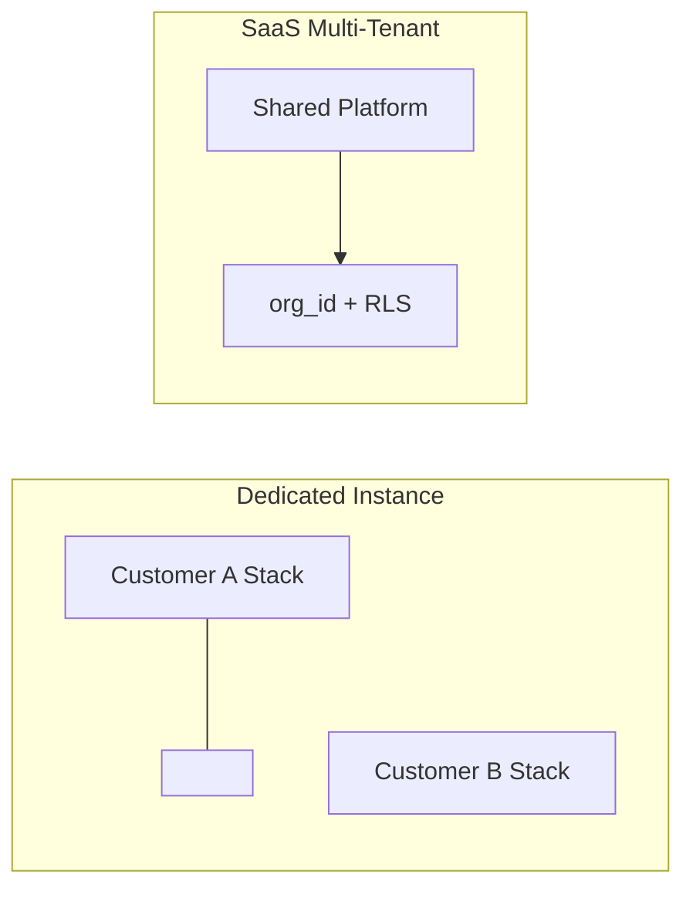
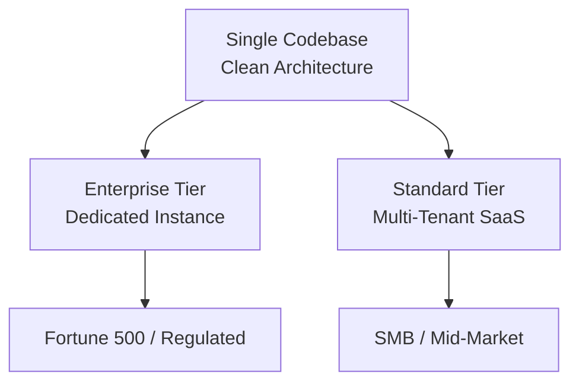

# AI-SPM Platform — Architecture Decision Comparison

**Status:** Planning — Use this to finalize deployment model before development  
**Related:** `IMPLEMENTATION_ROADMAP.md`, `IMPLEMENTATION_ROADMAP_DEDICATED_INSTANCE.md`, `IMPLEMENTATION_ROADMAP_SAAS_MULTI_TENANT.md`

---

## Quick Recommendation

| If your primary market is… | Choose |
|---------------------------|--------|
| Enterprise + on-prem + compliance | **Dedicated Instance** first |
| SMB + self-service + subscription SaaS | **SaaS Multi-Tenant** first |
| Both (most likely long-term) | **Dedicated MVP (12 wk)** → add SaaS tier in Phase 2 |

---

## Side-by-Side Comparison

| Dimension | Dedicated Instance | SaaS Multi-Tenant |
|-----------|-------------------|-------------------|
| **Isolation model** | Separate DB + gateway per customer | Shared DB with `org_id` + PostgreSQL RLS |
| **Data leak risk** | Lowest (physical separation) | Low (requires strict engineering + pen test) |
| **MVP timeline** | 12 weeks | 16 weeks (+ tenant layer) |
| **Provisioning** | ~30 min per customer (Terraform) | ~5 min self-service signup |
| **Ops burden** | Scales with customer count (N stacks) | Single platform to operate |
| **Unit economics** | Higher cost per SMB customer | Better at volume |
| **Agent MSI** | Per-customer build (gateway URL embedded) | Universal MSI + org token at install |
| **Admin dashboard** | Single org, no switcher | Tenant-scoped JWT; optional subdomain |
| **Platform admin UI** | Not needed | Required (tenant list, suspend) |
| **Billing** | Invoice / contract | Stripe subscriptions |
| **Compliance sales** | Easier ("your own database") | Requires SOC2 + pen test proof |
| **Code complexity** | Lower | Higher (middleware, RLS, cross-tenant tests) |
| **Upgrade rollout** | Upgrade N instances | Deploy once |
| **Blast radius** | One customer | All customers (if platform fails) |

---

## Isolation Comparison

| Question | Dedicated | SaaS |
|----------|-----------|------|
| Can Company A see Company B audit logs? | **No** — different database | **No** — if RLS + middleware implemented |
| Can Company A use Company B org token? | **No** — different gateway | **No** — token bound to org_id |
| Can vendor ops see customer prompts? | Only if customer grants access | Platform admin architecturally blocked from audit API |
| Where is PII masked? | Customer's gateway | Shared gateway (transient — not stored) |

---

## Shared Product (Same in Both Models)

Both deployment models use the **same core product**:

- Windows Endpoint Agent (Rust + Tauri + MSI)
- Kong Gateway + FastAPI Security Core
- Presidio PII masking
- Guardrails threat detection
- Policy engine + department RBAC
- Admin dashboard
- Append-only audit logs (masked content only)
- 11-step prompt lifecycle

---

## Flow Comparison

### Customer Onboarding

| Step | Dedicated | SaaS |
|------|-----------|------|
| 1 | Sales → ops provisions stack | User signs up at app.aispm.io |
| 2 | Terraform deploys Compose/K8s | System creates org + admin |
| 3 | Unique gateway FQDN | Shared gateway URL |
| 4 | Per-customer MSI built | Universal MSI + org token |
| 5 | GPO deploy | GPO/MDM deploy |
| 6 | UAT per instance | UAT within tenant |

### Prompt Lifecycle

Identical 11 steps in both models. SaaS adds: tenant context check, quota check, suspension check.

---

## Technology Differences

| Component | Dedicated | SaaS |
|-----------|-----------|------|
| **Deploy target** | Docker Compose / VM per customer | Kubernetes (shared) |
| **Database** | 1 PostgreSQL per customer | 1 PostgreSQL cluster + RLS |
| **Multi-tenancy code** | None | TenantContext middleware required |
| **Provisioning** | Terraform `customer-instance` module | Signup API + seed job |
| **Monitoring** | Per-instance (+ optional central metrics) | Central with `org_id` labels |
| **Billing** | External / manual | Stripe integrated |

---

## Decision Checklist

Answer these to finalize architecture:

- [ ] **Primary buyer:** Enterprise (500+ employees) or SMB?
- [ ] **Deployment preference:** On-prem acceptable requirement?
- [ ] **Self-service signup needed at launch?**
- [ ] **Target customers in Year 1:** <10 or 100+?
- [ ] **Compliance requirements:** SOC2/HIPAA from day one?
- [ ] **Team ops capacity:** Can you manage 20+ separate stacks?
- [ ] **MVP deadline:** Must ship in 12 weeks?
- [ ] **Pricing model:** Annual enterprise contract or monthly SaaS?

**Scoring:**
- Mostly enterprise / on-prem / 12 weeks / <10 customers → **Dedicated**
- Mostly SMB / self-service / 100+ customers / subscription → **SaaS**
- Mixed → **Dedicated MVP now**, SaaS in Phase 2 (codebase supports both via `org_id` in schema)

---

## Hybrid Strategy (Recommended Long-Term)

1. Build core product once (parent roadmap)
2. Launch **Dedicated** for first 5–10 enterprise customers (12 weeks)
3. Add **tenant layer** (RLS, middleware, platform admin) for SaaS tier (+4 weeks)
4. Offer both tiers on website: "Enterprise Dedicated" vs "Cloud SaaS"

---

## Next Steps (Planning Phase)

1. **Review** both roadmap documents with stakeholders  
2. **Complete** decision checklist above  
3. **Select** primary deployment model for MVP  
4. **Lock** ADRs in chosen roadmap document  
5. **Begin** Sprint 1 from selected roadmap  

---

**Document End**
