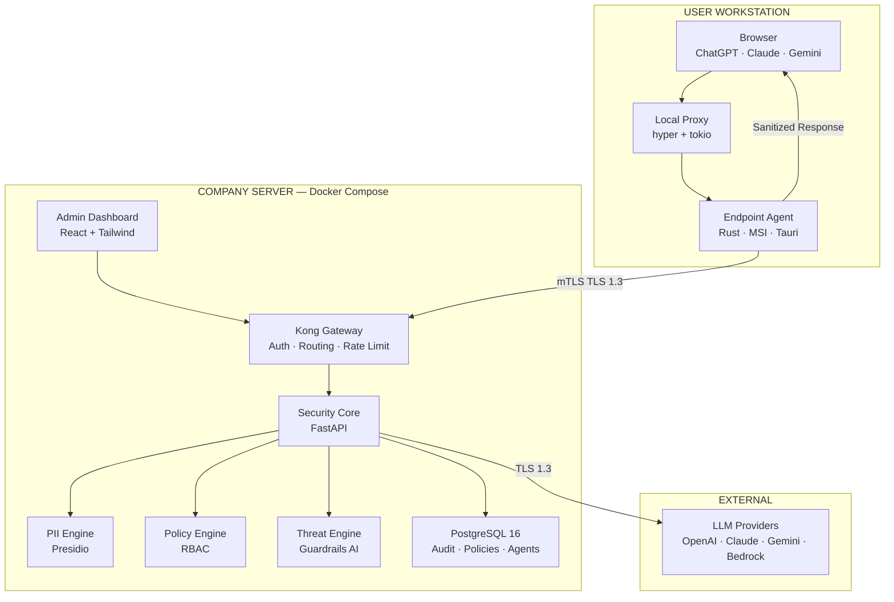
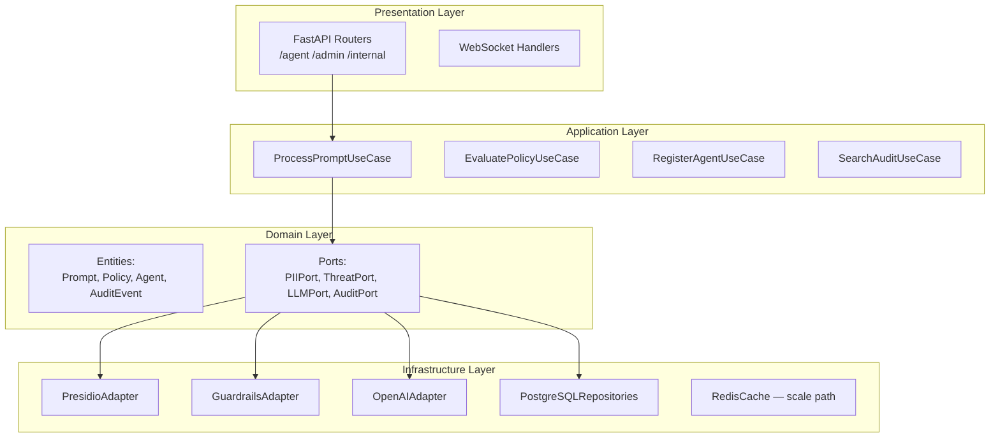
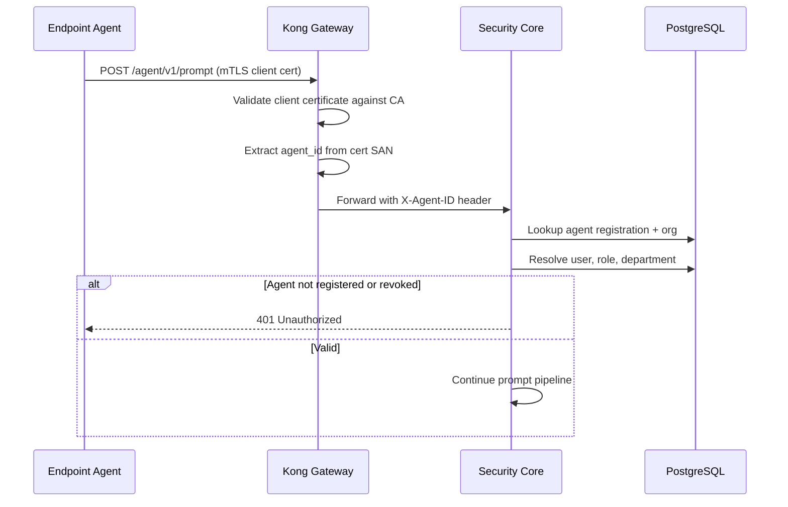
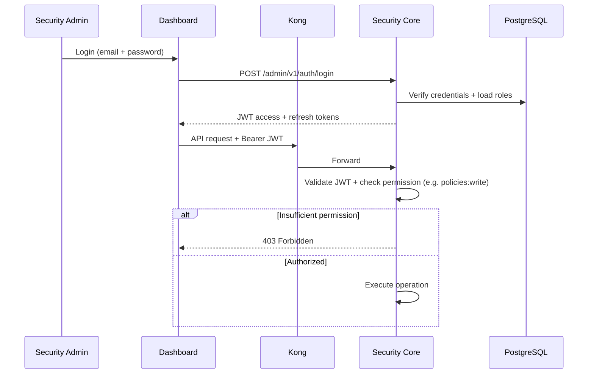
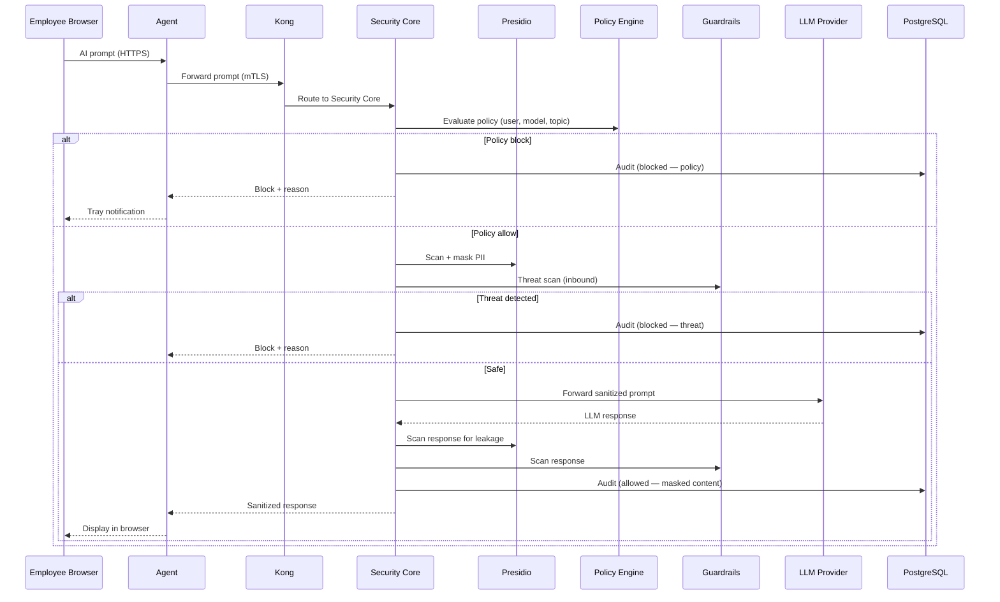
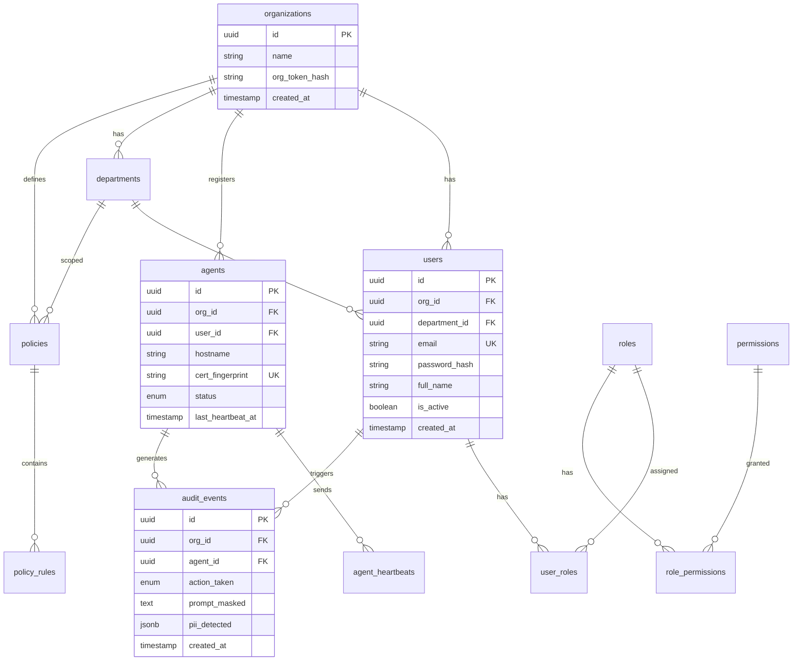
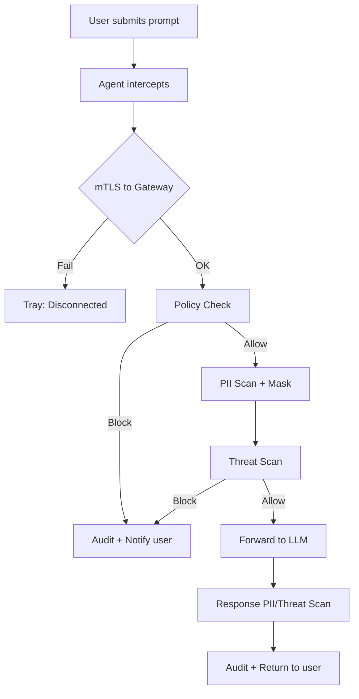
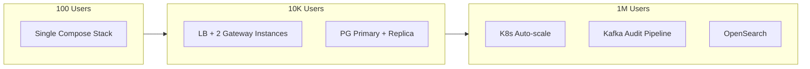
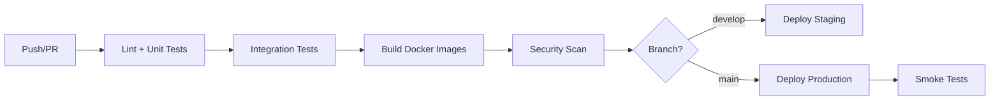
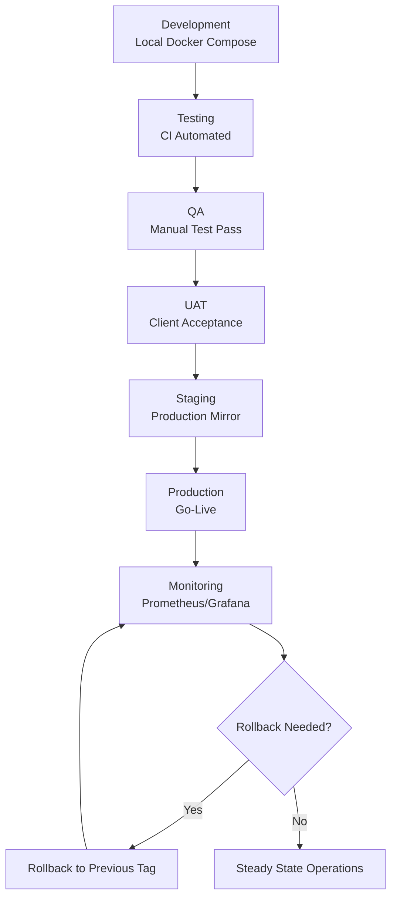

# AI-SPM Platform — Enterprise Implementation Roadmap

**Document Version:** 1.0  
**Source:** AI-SPM Technical Proposal v2.0 (June 2026)  
**Target:** Enterprise-grade SaaS — MVP (12 weeks) with path to 10M+ users  
**Architecture Pattern:** Clean Architecture, SOLID, Modular Monolith (MVP) → Microservices (scale)

> **Planning Phase — Deployment Model Fork**  
> This is the **base product roadmap**. For architecture finalization, use one of:
>
> | Document | Deployment Model | Best For |
> |----------|------------------|----------|
> | [`IMPLEMENTATION_ROADMAP_DEDICATED_INSTANCE.md`](IMPLEMENTATION_ROADMAP_DEDICATED_INSTANCE.md) | One isolated stack per customer | Enterprise, on-prem, compliance-first, **12-week MVP** |
> | [`IMPLEMENTATION_ROADMAP_SAAS_MULTI_TENANT.md`](IMPLEMENTATION_ROADMAP_SAAS_MULTI_TENANT.md) | Shared platform, many tenants | Self-service SaaS, SMB volume, **16-week MVP** |
> | [`ARCHITECTURE_DECISION_COMPARISON.md`](ARCHITECTURE_DECISION_COMPARISON.md) | Side-by-side decision guide | Choosing between models |

---

# 1. Executive Summary

## Project Overview

The **AI Security Posture Management (AI-SPM) Platform** is an enterprise AI security solution comprising two core components:

1. **Windows Endpoint Agent** — A lightweight Rust-based agent installed on employee workstations that transparently intercepts all AI provider traffic (ChatGPT, Claude, Gemini, etc.) before it leaves the organization.
2. **Central AI Security Gateway** — A server-side security stack (Kong + FastAPI Security Core) that authenticates agents, enforces policies, masks PII, detects threats, proxies requests to LLM providers, and maintains immutable audit logs.

Employees continue using AI tools normally in their browsers. Security is applied transparently. Administrators manage the platform via a React-based admin dashboard.

## Business Objective

| Challenge | Business Risk | Platform Response |
|-----------|---------------|-------------------|
| Employees use ChatGPT/Claude directly | Security bypass, shadow AI | Endpoint agent intercepts all AI traffic |
| Sensitive data in AI prompts | Data breach, regulatory fines | Gateway masks PII (CNIC, SSN, cards) via Presidio |
| No control over AI model access | Policy violations, cost overruns | Central gateway enforces RBAC model permissions |
| AI-specific attacks (injection, jailbreak) | Security incidents | Guardrails AI threat scanning on every interaction |
| No visibility into AI usage | Failed audits, compliance gaps | Immutable audit logs + admin monitoring dashboard |

## Technical Objective

Deliver a production-ready MVP in **12 weeks** with:

- Transparent AI traffic interception (zero change to employee workflow)
- Sub-300ms p95 end-to-end latency overhead (agent + gateway)
- mTLS-secured agent-to-gateway communication
- Append-only audit trail with PII never stored in original form
- Docker Compose deployment deployable in under 30 minutes
- Code-signed MSI agent distributable via Active Directory GPO

Design all components for **future scalability to millions of users** without architectural rewrites.

## Core Features (MVP — In Scope)

| # | Feature | Component |
|---|---------|-----------|
| 1 | Windows Endpoint Agent (MSI) | Rust + Tauri + WiX |
| 2 | AI Security Gateway | Kong + FastAPI |
| 3 | PII Detection & Masking Engine | Microsoft Presidio + spaCy |
| 4 | Policy Engine with RBAC | FastAPI + PostgreSQL |
| 5 | AI Threat Detection Module | Guardrails AI |
| 6 | Admin Dashboard | React + TypeScript + Tailwind |
| 7 | Audit Log System | PostgreSQL (append-only) |
| 8 | Docker Deployment Package | Docker Compose |
| 9 | Technical Documentation | Architecture, API, Admin, GPO guides |

## Deferred (Future Phase — Documented in Roadmap Section 23)

- macOS / Linux endpoint agents
- Kafka / Flink streaming pipeline
- Neo4j graph database
- Advanced Garak / 0DIN automation
- HA Kubernetes deployment

## Non-Functional Requirements

| NFR | Target | Rationale |
|-----|--------|-----------|
| Latency overhead | <300ms p95 (agent + gateway) | Transparent UX; employees must not notice delay |
| Agent idle RAM | <30 MB | Always-on background service |
| Agent installer size | ~8–15 MB | Enterprise MSI distribution |
| Gateway deployment | <30 minutes via Docker Compose | IT operational simplicity |
| Availability (MVP) | 99.5% single-node | HA deferred to K8s phase |
| Audit immutability | Append-only, no PII originals stored | Compliance and forensics |
| Agent tamper resistance | Code-signed Authenticode binary | Security software requirement |
| Communication security | TLS 1.3 + mTLS agent↔gateway | Zero-trust between endpoints |
| Concurrent agents (MVP) | 1,000+ per gateway node | Sufficient for pilot enterprises |
| Scalability path | 10M users via horizontal gateway scaling | Future-proof architecture |

## Success Criteria (Go-Live Acceptance)

- [ ] Agent MSI installs silently on Windows 10/11
- [ ] ChatGPT and Claude traffic intercepted by agent
- [ ] Agent fleet visible in admin dashboard (online/offline)
- [ ] PII (CNIC, SSN, credit card) masked before LLM call
- [ ] Prompt injection attempts detected and blocked
- [ ] RBAC policies enforced per department
- [ ] All interactions logged in searchable audit trail
- [ ] Gateway deployed via Docker Compose
- [ ] Total latency overhead <300ms (p95)
- [ ] Documentation complete and reviewed by client

---

# 2. Complete Requirement Analysis

## REQ-001: Windows Endpoint Agent

| Attribute | Value |
|-----------|-------|
| **Purpose** | Transparently intercept AI provider traffic from employee browsers and route through security gateway |
| **Functional Scope** | Local HTTP/HTTPS proxy for AI domains; mTLS gateway connector; Windows Service; system tray UI; auto-updater; 60s heartbeat |
| **Technical Scope** | Rust (hyper + tokio), Tauri 2 tray, windows-service crate, WiX MSI, rustls mTLS, hyper proxy |
| **Dependencies** | REQ-002 (Gateway), REQ-010 (Agent Registration), REQ-011 (mTLS Certs) |
| **Risk Level** | High — HTTPS interception complexity, domain coverage |
| **Priority** | P0 — Critical Path |
| **Complexity** | High |
| **Phase** | Phase 1–4 (Weeks 1–12) |

## REQ-002: AI Security Gateway (Kong)

| Attribute | Value |
|-----------|-------|
| **Purpose** | Edge authentication, routing, rate limiting, TLS termination for agent traffic |
| **Functional Scope** | Agent auth plugin; request routing to Security Core; rate limiting; request/response logging |
| **Technical Scope** | Kong Gateway OSS/Enterprise; custom auth plugin; TLS 1.3 termination |
| **Dependencies** | REQ-003, REQ-011 |
| **Risk Level** | Medium |
| **Priority** | P0 |
| **Complexity** | Medium |
| **Phase** | Phase 1 (Weeks 1–3) |

## REQ-003: Security Core (FastAPI)

| Attribute | Value |
|-----------|-------|
| **Purpose** | Orchestrate PII scan, policy check, threat detection, LLM proxy, audit logging |
| **Functional Scope** | Full prompt lifecycle (11 steps); OpenAI/Claude/Gemini proxy; response leakage scan |
| **Technical Scope** | Python FastAPI async; Clean Architecture layers (domain, application, infrastructure) |
| **Dependencies** | REQ-004, REQ-005, REQ-006, REQ-007, REQ-008 |
| **Risk Level** | High — Core business logic |
| **Priority** | P0 |
| **Complexity** | High |
| **Phase** | Phase 1–4 |

## REQ-004: PII Detection & Masking Engine

| Attribute | Value |
|-----------|-------|
| **Purpose** | Detect and mask sensitive data before LLM API calls |
| **Functional Scope** | CNIC, SSN, credit cards, emails, phones; custom recognizers; mask before forward; never store originals |
| **Technical Scope** | Microsoft Presidio Analyzer + Anonymizer; spaCy NER; custom regex recognizers for CNIC |
| **Dependencies** | REQ-003 |
| **Risk Level** | High — False negatives = data breach |
| **Priority** | P0 |
| **Complexity** | Medium |
| **Phase** | Phase 2 (Weeks 4–6) |

## REQ-005: Policy & RBAC Engine

| Attribute | Value |
|-----------|-------|
| **Purpose** | Enforce department-level rules on every AI interaction |
| **Functional Scope** | Model permissions; topic permissions; department roles; block/allow decisions |
| **Technical Scope** | JSON policy rules in PostgreSQL; policy evaluation middleware; RBAC for admin dashboard |
| **Dependencies** | REQ-003, REQ-007, REQ-009 |
| **Risk Level** | Medium |
| **Priority** | P0 |
| **Complexity** | Medium |
| **Phase** | Phase 3 (Weeks 7–9) |

## REQ-006: Threat Detection Module

| Attribute | Value |
|-----------|-------|
| **Purpose** | Detect prompt injection, jailbreak, and malicious content |
| **Functional Scope** | Inbound prompt scan; outbound response leakage scan; block with user notification |
| **Technical Scope** | Guardrails AI validators; custom jailbreak detectors |
| **Dependencies** | REQ-003 |
| **Risk Level** | High |
| **Priority** | P0 |
| **Complexity** | Medium |
| **Phase** | Phase 4 (Weeks 10–12) |

## REQ-007: Audit Log System

| Attribute | Value |
|-----------|-------|
| **Purpose** | Immutable, searchable record of all AI interactions and agent events |
| **Functional Scope** | Full event recording; masked content only; search; export; real-time dashboard feed |
| **Technical Scope** | PostgreSQL append-only tables; full-text search (tsvector); partitioning by month |
| **Dependencies** | REQ-003 |
| **Risk Level** | Medium — Compliance critical |
| **Priority** | P0 |
| **Complexity** | Medium |
| **Phase** | Phase 1–4 |

## REQ-008: Admin Dashboard

| Attribute | Value |
|-----------|-------|
| **Purpose** | Monitor usage, configure policies, view threats, manage agent fleet |
| **Functional Scope** | Usage metrics; threat feed; agent fleet panel; security score; policy UI; audit log viewer |
| **Technical Scope** | React 18 + TypeScript + Tailwind CSS; React Query; WebSocket for live updates |
| **Dependencies** | REQ-003, REQ-005, REQ-007, REQ-009 |
| **Risk Level** | Low |
| **Priority** | P0 |
| **Complexity** | Medium |
| **Phase** | Phase 3–4 |

## REQ-009: Authentication & Authorization (Admin + Agent)

| Attribute | Value |
|-----------|-------|
| **Purpose** | Secure admin dashboard access; authenticate registered agents via mTLS + org token |
| **Functional Scope** | Admin login; JWT sessions; RBAC permissions; agent registration; org token provisioning |
| **Technical Scope** | FastAPI JWT; Kong mTLS; PostgreSQL user/role tables |
| **Dependencies** | REQ-002, REQ-011 |
| **Risk Level** | High |
| **Priority** | P0 |
| **Complexity** | Medium |
| **Phase** | Phase 1, 3 |

## REQ-010: Agent Registration & Fleet Management

| Attribute | Value |
|-----------|-------|
| **Purpose** | Auto-register agents on first launch; track online/offline status |
| **Functional Scope** | Org token registration; heartbeat every 60s; fleet dashboard; offline flagging |
| **Technical Scope** | PostgreSQL agent_registry; heartbeat API; WebSocket fleet updates |
| **Dependencies** | REQ-001, REQ-002 |
| **Risk Level** | Low |
| **Priority** | P0 |
| **Complexity** | Low |
| **Phase** | Phase 1, 3 |

## REQ-011: mTLS & Certificate Management

| Attribute | Value |
|-----------|-------|
| **Purpose** | Mutual TLS between agent and gateway — only registered agents connect |
| **Functional Scope** | CA issuance; agent cert provisioning; cert rotation; org token binding |
| **Technical Scope** | rustls (agent); Kong TLS plugin; internal CA or cert-manager (future) |
| **Dependencies** | None (foundational) |
| **Risk Level** | High |
| **Priority** | P0 |
| **Complexity** | High |
| **Phase** | Phase 1–2 |

## REQ-012: Agent Auto-Updater

| Attribute | Value |
|-----------|-------|
| **Purpose** | Silent agent patch deployment via MSI |
| **Functional Scope** | Gateway version check; MSI download; silent install; rollback on failure |
| **Technical Scope** | Agent update API; MSI hosting on gateway; WiX upgrade paths |
| **Dependencies** | REQ-001, REQ-003 |
| **Risk Level** | Medium |
| **Priority** | P1 |
| **Complexity** | Medium |
| **Phase** | Phase 3–4 |

## REQ-013: LLM Provider Integration

| Attribute | Value |
|-----------|-------|
| **Purpose** | Proxy sanitized prompts to external LLM providers |
| **Functional Scope** | OpenAI (MVP); Claude; Gemini; Bedrock (extensible adapter pattern) |
| **Technical Scope** | FastAPI LLM adapter interface; OpenAI SDK; Anthropic SDK; async streaming support |
| **Dependencies** | REQ-003 |
| **Risk Level** | Medium |
| **Priority** | P0 (OpenAI); P1 (others) |
| **Complexity** | Medium |
| **Phase** | Phase 1 (OpenAI); Phase 2+ (Claude) |

## REQ-014: Docker Deployment Package

| Attribute | Value |
|-----------|-------|
| **Purpose** | Single-command server deployment |
| **Functional Scope** | Docker Compose stack; env configuration; health checks; <30 min deploy |
| **Technical Scope** | Docker Compose; multi-stage Dockerfiles; .env templates |
| **Dependencies** | All server components |
| **Risk Level** | Low |
| **Priority** | P0 |
| **Complexity** | Low |
| **Phase** | Phase 4 |

## REQ-015: Code Signing (Authenticode)

| Attribute | Value |
|-----------|-------|
| **Purpose** | Tamper-resistant agent binary trusted by Windows |
| **Functional Scope** | Sign MSI and agent binary; timestamp server |
| **Technical Scope** | Authenticode certificate; signtool.exe in CI |
| **Dependencies** | REQ-001, client-provided certificate |
| **Risk Level** | Medium — Client dependency |
| **Priority** | P0 |
| **Complexity** | Low |
| **Phase** | Phase 4 |

## REQ-016: GPO Silent Deployment

| Attribute | Value |
|-----------|-------|
| **Purpose** | Mass agent deployment via Active Directory Group Policy |
| **Functional Scope** | Silent MSI install; no user interaction; pre-configured org token |
| **Technical Scope** | WiX MSI properties; GPO deployment guide documentation |
| **Dependencies** | REQ-001, REQ-015 |
| **Risk Level** | Low |
| **Priority** | P0 |
| **Complexity** | Low |
| **Phase** | Phase 3–4 |

## REQ-017: User Block Notification

| Attribute | Value |
|-----------|-------|
| **Purpose** | Notify employee when request is blocked |
| **Functional Scope** | Tray notification: "Request blocked — sensitive data detected" |
| **Technical Scope** | Tauri notification API; block reason codes from gateway |
| **Dependencies** | REQ-001, REQ-003 |
| **Risk Level** | Low |
| **Priority** | P0 |
| **Complexity** | Low |
| **Phase** | Phase 2–3 |

## REQ-018: Response Leakage Scan

| Attribute | Value |
|-----------|-------|
| **Purpose** | Scan LLM responses for sensitive data leakage before returning to user |
| **Functional Scope** | Presidio + Guardrails on outbound responses |
| **Technical Scope** | Same pipeline as inbound, applied post-LLM |
| **Dependencies** | REQ-004, REQ-006 |
| **Risk Level** | Medium |
| **Priority** | P0 |
| **Complexity** | Low |
| **Phase** | Phase 2, 4 |

## REQ-019: Real-Time Dashboard Updates

| Attribute | Value |
|-----------|-------|
| **Purpose** | Live AI usage, blocks, threats on admin dashboard |
| **Functional Scope** | WebSocket push for metrics, threat feed, agent status |
| **Technical Scope** | FastAPI WebSocket; Redis pub/sub (scale path) |
| **Dependencies** | REQ-008 |
| **Risk Level** | Low |
| **Priority** | P1 |
| **Complexity** | Medium |
| **Phase** | Phase 3 |

## REQ-020: Technical Documentation

| Attribute | Value |
|-----------|-------|
| **Purpose** | Enable client IT and security teams to operate the platform |
| **Functional Scope** | Architecture doc; API reference; admin guide; GPO deployment guide |
| **Technical Scope** | Markdown + OpenAPI spec; diagrams |
| **Dependencies** | All deliverables |
| **Risk Level** | Low |
| **Priority** | P0 |
| **Complexity** | Low |
| **Phase** | Phase 4 |

## REQ-021: Performance — Latency Target

| Attribute | Value |
|-----------|-------|
| **Purpose** | Transparent security — users must not perceive delay |
| **Functional Scope** | <300ms p95 total overhead (agent proxy + gateway pipeline + LLM excluded) |
| **Technical Scope** | Async pipeline; connection pooling; Presidio caching; benchmark suite |
| **Dependencies** | All components |
| **Risk Level** | Medium |
| **Priority** | P0 |
| **Complexity** | Medium |
| **Phase** | Phase 4 |

## REQ-022: Security Score (Dashboard)

| Attribute | Value |
|-----------|-------|
| **Purpose** | Aggregate security posture metric for executives |
| **Functional Scope** | Score based on blocks, threats, agent coverage, policy compliance |
| **Technical Scope** | Computed metric API; dashboard widget |
| **Dependencies** | REQ-007, REQ-008 |
| **Risk Level** | Low |
| **Priority** | P1 |
| **Complexity** | Low |
| **Phase** | Phase 3 |

## REQ-023: Audit Search & Export

| Attribute | Value |
|-----------|-------|
| **Purpose** | Compliance reporting and forensic investigation |
| **Functional Scope** | Full-text search; date/user/action filters; CSV/JSON export |
| **Technical Scope** | PostgreSQL tsvector; paginated API; export job queue |
| **Dependencies** | REQ-007, REQ-008 |
| **Risk Level** | Low |
| **Priority** | P0 |
| **Complexity** | Medium |
| **Phase** | Phase 3 |

## REQ-024: Implied — HTTPS Interception Strategy

| Attribute | Value |
|-----------|-------|
| **Purpose** | Intercept HTTPS traffic to AI provider domains without breaking TLS |
| **Functional Scope** | System proxy configuration; PAC file or WPAD; domain allowlist; cert pinning bypass for AI domains only |
| **Technical Scope** | Local MITM proxy with enterprise root CA installed via GPO; OR browser extension fallback |
| **Dependencies** | REQ-001, REQ-016 |
| **Risk Level** | **Critical** — Architectural decision required Week 1 |
| **Priority** | P0 |
| **Complexity** | Very High |
| **Phase** | Phase 1–2 |

**Decision:** Use **local transparent proxy with enterprise-trusted root CA** distributed via GPO. Rationale: Required for intercepting browser HTTPS to chat.openai.com, claude.ai without browser extensions. Document security implications in architecture doc.

## REQ-025: Implied — Multi-Tenancy (Future)

| Attribute | Value |
|-----------|-------|
| **Purpose** | Support multiple organizations on shared infrastructure |
| **Functional Scope** | Tenant isolation; per-tenant policies; org-scoped audit logs |
| **Technical Scope** | tenant_id on all tables; row-level security in PostgreSQL |
| **Dependencies** | All modules |
| **Risk Level** | Medium |
| **Priority** | P2 (Post-MVP) |
| **Complexity** | High |
| **Phase** | Future |

---

# 3. System Architecture

## High-Level Architecture



**Reasoning:** Dual-component design separates concerns — agent handles local interception (low latency, always-on), gateway handles security logic (centralized policy, audit). Kong at edge provides industry-standard auth/rate-limit without custom nginx config.

## Low-Level Architecture — Security Core (Clean Architecture)



**Reasoning:** Clean Architecture isolates Presidio/Guardrails/OpenAI as swappable adapters. Domain logic (policy evaluation, audit rules) has zero framework dependencies — testable without HTTP/DB.

## Modular Architecture

| Module | Package | Responsibility |
|--------|---------|----------------|
| `gateway-edge` | Kong config + plugins | TLS, auth, rate limit |
| `security-core` | FastAPI app | Orchestration |
| `pii-engine` | Python module | Presidio pipeline |
| `threat-engine` | Python module | Guardrails validators |
| `policy-engine` | Python module | RBAC + rule evaluation |
| `audit-service` | Python module | Append-only logging |
| `llm-proxy` | Python module | Provider adapters |
| `agent-api` | FastAPI router | Agent-facing endpoints |
| `admin-api` | FastAPI router | Dashboard-facing endpoints |
| `fleet-service` | Python module | Agent registry + heartbeat |
| `endpoint-agent` | Rust workspace | Proxy, connector, service, tray |
| `admin-dashboard` | React SPA | Monitoring + config UI |

## Microservice vs Modular Monolith Recommendation

| Phase | Architecture | Reasoning |
|-------|-------------|-----------|
| **MVP (Weeks 1–12)** | **Modular Monolith** | Single FastAPI deployable; shared PostgreSQL; faster iteration; meets 12-week deadline |
| **10K–100K users** | Modular Monolith + Redis + read replicas | Horizontal Kong instances; PostgreSQL replica for audit reads |
| **100K–1M users** | **Extract services:** audit-service, pii-engine, threat-engine as separate containers | Independent scaling of CPU-heavy Presidio/Guardrails |
| **1M–10M users** | Full microservices + Kafka event bus | Async audit pipeline; Flink for real-time analytics (per deferred scope) |

**Recommendation:** Start modular monolith with **strict module boundaries** and port/adapter interfaces so extraction requires configuration change, not rewrite.

## API Gateway (Kong)

- **Role:** TLS termination, mTLS validation, rate limiting, request routing to FastAPI upstream
- **Plugins:** `mtls-auth`, `rate-limiting`, `correlation-id`, `file-log`, `prometheus`
- **Reasoning:** Kong provides battle-tested edge security; avoids building custom auth middleware at scale

## Authentication Flow



## Authorization Flow (Admin RBAC)



## Event Flow (Prompt Lifecycle)



## Background Jobs

| Job | Trigger | Purpose | Technology |
|-----|---------|---------|------------|
| `audit_partition_maintenance` | Cron daily | Create monthly audit partitions | pg_partman / custom script |
| `agent_offline_detector` | Cron every 2 min | Mark agents offline if no heartbeat >120s | APScheduler / Celery |
| `security_score_calculator` | Cron every 5 min | Recompute org security score | APScheduler |
| `audit_export` | On-demand async | Generate CSV/JSON export files | Celery + S3/MinIO |
| `presidio_model_warmup` | Startup | Load spaCy models into memory | FastAPI lifespan |
| `cert_expiry_checker` | Cron daily | Alert on agent cert expiry <30 days | APScheduler |

**MVP:** Use APScheduler embedded in FastAPI. **Scale path:** Celery + Redis queue.

## Queue System

| Phase | Queue | Use Case |
|-------|-------|----------|
| MVP | In-process async (asyncio) | Audit writes, non-blocking |
| 10K+ | Redis + Celery | Export jobs, offline detection |
| 1M+ | Kafka | Audit event streaming, analytics pipeline |

## Cache Layer

| Cache | Key Pattern | TTL | Purpose |
|-------|-------------|-----|---------|
| Redis — Policy | `policy:{dept_id}:{version}` | 5 min | Avoid DB hit per request |
| Redis — Agent | `agent:{agent_id}` | 60s | Registration lookup |
| Redis — Presidio | N/A (in-process) | Startup | spaCy model in memory |
| Redis — Rate limit | Kong built-in | 1 min | Per-agent rate limits |

## Storage Layer

| Store | Data | Reasoning |
|-------|------|-----------|
| PostgreSQL | Policies, users, agents, audit logs | ACID for compliance |
| Local filesystem / MinIO | MSI packages, export files | Agent updater artifacts |
| Redis | Cache, pub/sub, job queue | Low-latency reads |

## Database Layer

- **Primary:** PostgreSQL 16 (single node MVP)
- **Read replica:** Audit search queries (Phase 2 scale)
- **Connection pooling:** PgBouncer between FastAPI and PostgreSQL
- **Partitioning:** Audit logs by month

## Search Layer

- **MVP:** PostgreSQL full-text search (`tsvector` on audit_events)
- **Scale path:** OpenSearch/Elasticsearch for audit log search at 1M+ events/day

## Notification Layer

| Channel | Recipient | Trigger |
|---------|-----------|---------|
| Agent tray notification | Employee | Block (PII, policy, threat) |
| Dashboard WebSocket | Security admin | Real-time threat, block events |
| Email (future) | Security admin | Critical threat alert |
| Webhook (future) | SIEM | Audit event stream |

## Logging Layer

| Log Type | Destination | Format |
|----------|-------------|--------|
| Application | stdout → Docker logs | JSON structured |
| Audit | PostgreSQL (append-only) | Domain schema |
| Access | Kong access log | JSON |
| Agent | Local file + gateway forward | JSON |

## Monitoring Layer

| Metric | Tool | Alert Threshold |
|--------|------|-----------------|
| Request latency p95 | Prometheus + Grafana | >300ms |
| Error rate | Prometheus | >1% |
| Agent heartbeat miss rate | Custom metric | >5% fleet offline |
| PII detection rate | Custom metric | Anomaly detection |
| Kong upstream health | Kong health checks | Unhealthy |

## Security Layer

- mTLS agent↔gateway
- TLS 1.3 gateway↔LLM
- JWT admin auth with refresh rotation
- RBAC on all admin endpoints
- Append-only audit (no UPDATE/DELETE on audit_events)
- PII originals never persisted
- Code-signed agent binary
- Security headers on dashboard (CSP, HSTS, X-Frame-Options)

---

# 4. Technology Stack

| Category | Technology | Reasoning |
|----------|------------|-----------|
| **Frontend** | React 18 + TypeScript + Tailwind CSS + Vite | Type-safe SPA; Tailwind for rapid admin UI; Vite for fast builds |
| **Frontend State** | TanStack Query + Zustand | Server state caching; minimal client state for auth/UI |
| **Backend** | Python 3.12 + FastAPI | Native Presidio/Guardrails integration; async high-throughput |
| **API Gateway** | Kong Gateway 3.x | Industry-standard plugins; mTLS; rate limiting at edge |
| **Database** | PostgreSQL 16 | ACID audit logs; JSONB policies; full-text search; partitioning |
| **Search Engine** | PostgreSQL tsvector (MVP) → OpenSearch (scale) | Avoid extra infra in MVP; migrate at 1M+ audit events |
| **Queue** | APScheduler (MVP) → Redis + Celery → Kafka | Progressive complexity matching scale |
| **Cache** | Redis 7 | Policy/agent cache; pub/sub for dashboard; rate limit backing |
| **Object Storage** | MinIO (S3-compatible) | MSI packages; audit exports; self-hosted in Docker |
| **Authentication (Admin)** | JWT (access 15m + refresh 7d) + bcrypt | Stateless admin sessions; standard pattern |
| **Authentication (Agent)** | mTLS client certificates + org token | Strong device identity; no shared secrets in prompts |
| **Authorization** | RBAC (roles + permissions) | Department-scoped policy management |
| **PII Engine** | Microsoft Presidio + spaCy `en_core_web_lg` | Enterprise NER + regex; extensible custom recognizers |
| **Threat Engine** | Guardrails AI | Real-time injection/jailbreak detection |
| **Endpoint Agent** | Rust + hyper + tokio + Tauri 2 | Memory-safe; <30MB RAM; ~8-15MB installer |
| **Agent Installer** | WiX Toolset (MSI) | Enterprise GPO silent deployment standard |
| **CI/CD** | GitHub Actions / GitLab CI | Build, test, sign, Docker push pipelines |
| **Containerization** | Docker + Docker Compose | MVP single-command deploy |
| **Reverse Proxy** | Kong (embedded) | TLS termination + routing |
| **Monitoring** | Prometheus + Grafana | Metrics, dashboards, SLO tracking |
| **Alerting** | Alertmanager + PagerDuty/Slack webhook | Latency, error rate, fleet offline alerts |
| **Logging** | Structured JSON → Loki or ELK (scale) | Correlation IDs across agent→gateway→LLM |
| **Testing** | pytest, Playwright, k6, cargo test | Unit, API, E2E, load, agent tests |
| **Documentation** | OpenAPI 3.1 + MkDocs | Auto-generated API reference |
| **Infrastructure** | Docker Compose (MVP) → Terraform + K8s | IaC from day one for K8s migration |
| **Cloud** | Client on-prem Linux (8 vCPU, 16GB) | Proposal assumption; cloud-agnostic containers |
| **Secrets Management** | Docker secrets / HashiCorp Vault (scale) | API keys, DB passwords, JWT secrets |
| **Configuration Management** | Environment variables + `.env` templates | 12-factor app; no secrets in code |
| **Load Balancing** | Kong upstream load balancing (multi-instance) | Horizontal gateway scaling |

---

# 5. Database Architecture

## Schema Strategy

- **Normalized relational model** for users, roles, policies, agents
- **JSONB columns** for flexible policy rules (avoid schema migration per rule type)
- **Append-only audit_events** — no UPDATE/DELETE permissions for app role
- **Monthly range partitioning** on audit_events.created_at
- **Soft deletes** on policies and agents (revoked_at timestamp)
- **tenant_id** column on all tables (default single tenant for MVP; multi-tenant ready)

## Entity Relationship Diagram



## Core Tables Summary

| Table | Key Columns | Constraints | Indexes |
|-------|-------------|-------------|---------|
| organizations | id, name, org_token_hash | org_token_hash UNIQUE | PK |
| users | id, org_id, email, password_hash, department_id | UNIQUE(org_id, email) | idx_users_org, idx_users_dept |
| departments | id, org_id, name, code | UNIQUE(org_id, code) | idx_dept_org |
| roles | id, org_id, name | UNIQUE(org_id, name) | — |
| permissions | id, code | code UNIQUE | — |
| role_permissions | role_id, permission_id | PK composite | — |
| user_roles | user_id, role_id | PK composite | — |
| agents | id, org_id, cert_fingerprint, status, last_heartbeat_at | cert_fingerprint UNIQUE | idx_agents_status, idx_agents_heartbeat |
| policies | id, org_id, department_id, rules JSONB, is_active | — | idx_policies_dept, GIN(rules) |
| audit_events | id, org_id, agent_id, user_id, action_taken, prompt_masked, pii_detected, created_at | PARTITION BY RANGE(created_at) | idx_audit_created, GIN tsvector |
| agent_heartbeats | id, agent_id, status, created_at | — | idx_heartbeat_agent |
| llm_provider_configs | id, org_id, provider, api_key_encrypted | — | idx_llm_org |

## Index Strategy

- **B-tree** on all FK columns and filter columns (status, created_at, department_id)
- **GIN** on JSONB columns (policies.rules, audit_events.pii_detected)
- **GIN tsvector** on audit_events.prompt_masked for full-text search
- **Partial index** on agents WHERE status = 'online' for fleet queries

## Partitioning

```sql
CREATE TABLE audit_events (...) PARTITION BY RANGE (created_at);
CREATE TABLE audit_events_2026_07 PARTITION OF audit_events
    FOR VALUES FROM ('2026-07-01') TO ('2026-08-01');
-- Auto-create via pg_partman daily cron
```

## Sharding (10M+ users)

- Shard by org_id when PostgreSQL exceeds single-node capacity
- Audit events → dedicated OpenSearch cluster
- Application-level routing via org_id hash

## Replication

| Scale | Strategy |
|-------|----------|
| MVP | Single PostgreSQL |
| 10K users | Primary + 1 read replica (audit search) |
| 100K+ | Primary + 2 replicas; PgBouncer (pool_size=100) |
| 1M+ | Patroni HA cluster with automatic failover |

## Backup & DR

| Type | Frequency | Retention | RPO | RTO |
|------|-----------|-----------|-----|-----|
| Full pg_dump | Daily | 30 days | 24h | 4h |
| WAL archiving | Continuous | 7 days | 1h | 4h |
| Config/Vault | On change | 90 days | — | 1h |

## Archiving & Retention

| Data | Hot (PostgreSQL) | Archive (S3) | Purge |
|------|------------------|--------------|-------|
| Audit events | 12 months | 7 years default | Per org policy |
| Agent heartbeats | 30 days | Daily aggregates | Delete raw |
| Admin sessions | 90 days | — | Auto-purge |

---

# 6. Folder Structure

## Monorepo Root

```
ai-spm/
├── README.md
├── docker-compose.yml
├── docker-compose.prod.yml
├── .env.example
├── Makefile
├── docs/
│   ├── architecture/
│   ├── api/                           # OpenAPI spec
│   ├── admin-guide/
│   └── agent-gpo-deployment/
├── infrastructure/
│   ├── docker/
│   ├── kong/
│   ├── postgres/init/
│   ├── prometheus/
│   └── terraform/
├── scripts/
│   ├── init-db.sh
│   ├── generate-certs.sh
│   ├── seed-dev-data.sh
│   └── benchmark-latency.sh
└── .github/workflows/
    ├── ci-backend.yml
    ├── ci-frontend.yml
    ├── ci-agent.yml
    └── release.yml
```

## Backend (Clean Architecture)

```
backend/src/ai_spm/
├── main.py
├── config/settings.py
├── domain/
│   ├── entities/          # Prompt, Policy, Agent, AuditEvent
│   ├── value_objects/     # PIIMatch, ThreatResult
│   └── ports/             # PIIPort, ThreatPort, LLMPort, AuditPort
├── application/
│   ├── use_cases/         # ProcessPrompt, EvaluatePolicy, RegisterAgent
│   └── services/          # SecurityScore, FleetMonitor
├── infrastructure/
│   ├── database/models/   # SQLAlchemy ORM
│   ├── database/repositories/
│   ├── presidio/          # PresidioAdapter
│   ├── guardrails/        # GuardrailsAdapter
│   ├── llm/               # OpenAI, Anthropic, Gemini adapters
│   ├── cache/redis_cache.py
│   └── storage/minio_storage.py
├── presentation/
│   ├── api/v1/agent/      # Agent routers + schemas
│   ├── api/v1/admin/      # Admin routers + schemas
│   ├── middleware/        # auth, correlation_id, rate_limit
│   └── websocket/         # dashboard_ws.py
├── jobs/                  # scheduler, audit_partition, agent_offline
└── events/                # audit_created, threat_detected
```

## Frontend

```
frontend/src/
├── api/                   # client.ts, auth.ts, policies.ts, audit.ts
├── components/
│   ├── ui/                # Shared primitives
│   ├── layout/            # Sidebar, Header, MainLayout
│   ├── dashboard/         # MetricsCards, ThreatFeed, SecurityScore
│   ├── agents/            # AgentFleetTable, AgentStatusBadge
│   ├── policies/          # PolicyList, PolicyEditor
│   └── audit/             # AuditLogTable, AuditSearch, AuditExport
├── pages/                 # Login, Dashboard, Agents, Policies, Audit, Threats
├── hooks/                 # useAuth, useWebSocket, usePermissions
├── store/authStore.ts
└── routes/index.tsx
```

## Endpoint Agent (Rust workspace)

```
agent/
├── crates/
│   ├── agent-core/        # proxy/, gateway/, heartbeat/, updater/
│   ├── agent-service/     # Windows Service binary
│   └── agent-tray/        # Tauri 2 tray UI
├── installer/wix/         # Product.wxs, Bundle.wxs
└── tests/integration/
```

---

# 7. Module Breakdown

*(See Section 2 requirement analysis for full REQ mapping. Module summary below.)*

| Module | Purpose | Key Dependencies | Phase |
|--------|---------|------------------|-------|
| MOD-01 Local Proxy | Intercept AI HTTPS traffic | MOD-02, enterprise CA | 1-2 |
| MOD-02 Gateway Connector | mTLS prompt forwarding | MOD-11, MOD-03 | 1-2 |
| MOD-03 Kong Gateway | Edge auth, routing, rate limit | MOD-04 | 1 |
| MOD-04 Prompt Pipeline | 11-step lifecycle orchestration | MOD-05-09 | 1-4 |
| MOD-05 PII Engine | Presidio detect + mask | spaCy, custom CNIC | 2 |
| MOD-06 Threat Engine | Guardrails injection/jailbreak | Guardrails AI | 4 |
| MOD-07 Policy/RBAC | Department rules + admin permissions | PostgreSQL, Redis | 3 |
| MOD-08 Audit System | Append-only logs, search, export | PostgreSQL partitions | 1-4 |
| MOD-09 LLM Proxy | OpenAI/Claude/Gemini adapters | API keys, TLS | 1-2 |
| MOD-10 Admin Dashboard | Monitoring + config UI | All admin APIs | 3-4 |
| MOD-11 Fleet Management | Register, heartbeat, online/offline | agents table | 1, 3 |
| MOD-12 Windows Service/Tray | Always-on + status UI | MOD-01, MOD-02 | 2-3 |
| MOD-13 Auto-Updater | Silent MSI patch | MinIO, MOD-11 | 3-4 |
| MOD-14 Docker Deploy | Compose stack <30 min | All server modules | 4 |

### MOD-04 Prompt Pipeline — Business Rules

1. Authenticate agent (mTLS + registration lookup)
2. Resolve user, role, department from agent binding
3. Evaluate policy (model, topic, token limits) — **deny by default**
4. Scan PII — mask if detected (confidence ≥ 0.7)
5. Scan threats inbound — block if detected
6. Forward sanitized prompt to LLM provider
7. Scan response for PII leakage
8. Scan response for threats
9. Write audit event (masked content only)
10. Return response or block notification to agent
11. **Fail-closed:** any scanner error → block request

### MOD-05 PII Engine — Detected Entity Types

| Entity | Recognizer | Mask Format |
|--------|------------|-------------|
| CNIC | Custom regex `\d{5}-\d{7}-\d{1}` | `*************` |
| SSN | Presidio US_SSN | `***-**-****` |
| Credit Card | Presidio CREDIT_CARD | `****-****-****-1234` |
| Email | Presidio EMAIL_ADDRESS | `***@***.com` |
| Phone | Presidio PHONE_NUMBER | `***-***-****` |

**Critical rule:** Original sensitive values NEVER stored in audit logs or forwarded to LLM.

---

# 8. API Design

**Base URLs:**
- Agent: `https://gateway.{domain}/agent/v1`
- Admin: `https://gateway.{domain}/admin/v1`

**Versioning:** URL path (`/v1`). Breaking changes → `/v2` with 6-month deprecation.

**Rate Limits:** Agent 100/min; Admin 1000/min; Login 5/min per IP.

**Pagination:** Cursor-based for audit (`?cursor=uuid&limit=50`).

**Standard Error Response:**
```json
{
  "error": {
    "code": "POLICY_BLOCKED",
    "message": "User not permitted to use model gpt-4",
    "correlation_id": "550e8400-e29b-41d4-a716-446655440000"
  }
}
```

## Agent Endpoints

| Method | Endpoint | Auth | Purpose |
|--------|----------|------|---------|
| POST | /agent/v1/register | X-Org-Token + CSR | First-launch registration |
| POST | /agent/v1/prompt | mTLS | Submit intercepted prompt |
| POST | /agent/v1/heartbeat | mTLS | 60s health signal |
| GET | /agent/v1/updates/check | mTLS | Check for agent updates |
| GET | /agent/v1/updates/{version}/download | mTLS | Download MSI |

## Admin Endpoints

| Method | Endpoint | Auth | Permission |
|--------|----------|------|------------|
| POST | /admin/v1/auth/login | None | — |
| POST | /admin/v1/auth/refresh | Refresh token | — |
| POST | /admin/v1/auth/logout | JWT | — |
| GET | /admin/v1/dashboard/metrics | JWT | dashboard:read |
| GET | /admin/v1/dashboard/threats | JWT | threats:read |
| GET | /admin/v1/agents | JWT | agents:read |
| POST | /admin/v1/agents/{id}/revoke | JWT | agents:write |
| GET | /admin/v1/policies | JWT | policies:read |
| POST | /admin/v1/policies | JWT | policies:write |
| PUT | /admin/v1/policies/{id} | JWT | policies:write |
| DELETE | /admin/v1/policies/{id} | JWT | policies:write |
| GET | /admin/v1/audit | JWT | audit:read |
| POST | /admin/v1/audit/export | JWT | audit:export |
| GET | /admin/v1/audit/export/{job_id} | JWT | audit:export |
| GET | /admin/v1/roles | JWT | roles:read |
| GET | /admin/v1/users | JWT | users:read |
| POST | /admin/v1/users | JWT | users:write |
| GET | /admin/v1/health | Internal | — |
| WS | /admin/v1/ws/dashboard | JWT | dashboard:read |

### POST /agent/v1/prompt — Full Contract

**Request:**
```json
{
  "provider": "openai",
  "model": "gpt-4",
  "prompt": "My CNIC is 35202-1234567-9 — summarize this report",
  "conversation_id": "thread-abc",
  "metadata": { "source_url": "https://chat.openai.com/", "timestamp": "2026-07-02T10:30:00Z" }
}
```

**Response 200 (allowed):**
```json
{
  "action": "allowed",
  "response": "Here is the summary...",
  "latency_ms": 245,
  "pii_masked": ["CNIC"],
  "correlation_id": "uuid"
}
```

**Response 200 (blocked):**
```json
{
  "action": "blocked",
  "reason": "THREAT_DETECTED",
  "message": "Request blocked — potential prompt injection detected",
  "correlation_id": "uuid"
}
```

**Error codes:** 401 UNAUTHORIZED, 403 POLICY_BLOCKED, 429 RATE_LIMITED, 502 LLM_PROVIDER_ERROR

---

# 9. Workflow

## WF-01: Prompt Lifecycle (Complete)

### User Flow
1. Employee opens ChatGPT/Claude/Gemini in browser (no change)
2. Types prompt and submits
3. If allowed: response appears normally
4. If blocked: tray notification "Request blocked — sensitive data detected"

### Backend Flow
1. Agent intercepts HTTPS request to AI domain
2. Agent forwards to gateway via mTLS
3. Kong validates cert → routes to Security Core
4. Security Core: auth → policy → PII → threat → LLM → response scan → audit
5. Return sanitized response or block to agent

### Database Flow
1. Lookup agent + user + department
2. Load cached policy (Redis → PostgreSQL fallback)
3. INSERT audit_events (append-only, masked content)
4. UPDATE agents.last_heartbeat_at (on heartbeat, not per prompt)

### Background Job Flow
1. `agent_offline_detector`: mark offline if heartbeat >120s
2. `security_score_calculator`: recompute score every 5 min
3. WebSocket push threat/block events to dashboard

### Notification Flow
- Block → agent tray notification with reason code
- Threat → dashboard WebSocket + threat feed update
- Agent offline → dashboard fleet panel status change

### Error Flow
- mTLS failure → agent status "Disconnected"; retry with backoff
- LLM provider 5xx → retry once; then return 502 to agent
- Presidio/Guardrails crash → fail-closed block; alert ops

### Recovery Flow
- Agent reconnects → resume mTLS; sync config_version
- Gateway restart → agents retry; no data loss (stateless pipeline)
- DB failover → Patroni promotes replica; connection pool reconnect



## WF-02: Agent Registration

1. IT deploys MSI via GPO (org token embedded in MSI property)
2. Agent starts Windows Service on boot
3. Agent generates key pair + CSR
4. POST /agent/v1/register with org token + CSR
5. Gateway validates token → issues client certificate
6. Agent stores cert securely → begins mTLS communication
7. Agent appears in admin dashboard fleet panel

## WF-03: Admin Policy Configuration

1. Admin logs into dashboard
2. Navigates to Policies → Create Policy
3. Selects department, configures allowed models, blocked topics
4. Saves → POST /admin/v1/policies
5. Policy cached in Redis (5 min TTL)
6. Next employee prompt evaluates new policy

## WF-04: Audit Search & Export

1. Admin navigates to Audit Logs
2. Applies filters (date, user, action, keyword)
3. GET /admin/v1/audit with cursor pagination
4. For export: POST /admin/v1/audit/export → async job
5. Poll GET /admin/v1/audit/export/{job_id}
6. Download CSV/JSON from MinIO presigned URL

---

# 10. UI Implementation Roadmap

## SCREEN-01: Login Page

| Attribute | Implementation |
|-----------|----------------|
| **Purpose** | Authenticate security administrators |
| **Components** | LoginForm, Logo, ErrorAlert |
| **API** | POST /admin/v1/auth/login |
| **State** | authStore (Zustand): tokens, user, permissions |
| **Validation** | Email format; password required; client-side + server errors |
| **Permissions** | Public (unauthenticated) |
| **Loading** | Submit button spinner; disable form |
| **Empty** | N/A |
| **Error** | Invalid credentials alert; rate limit message |
| **Responsive** | Centered card; mobile-friendly |
| **Accessibility** | aria-labels; keyboard navigation; focus management |

## SCREEN-02: Dashboard (Home)

| Attribute | Implementation |
|-----------|----------------|
| **Purpose** | Real-time security posture overview |
| **Components** | MetricsCards, UsageChart (recharts), ThreatFeed, SecurityScore, ActiveAgentsWidget |
| **API** | GET /admin/v1/dashboard/metrics; WS /admin/v1/ws/dashboard |
| **State** | TanStack Query (metrics); WebSocket (live updates) |
| **Validation** | Period selector (24h/7d/30d) |
| **Permissions** | dashboard:read |
| **Loading** | Skeleton cards; chart placeholder |
| **Empty** | "No AI activity yet" with setup guide link |
| **Error** | Retry button; error boundary |
| **Responsive** | Grid: 4 cols desktop, 2 tablet, 1 mobile |
| **Accessibility** | Chart alt text; live region for threat feed |

## SCREEN-03: Agent Fleet Panel

| Attribute | Implementation |
|-----------|----------------|
| **Purpose** | Monitor all endpoint agents (online/offline/revoked) |
| **Components** | AgentFleetTable, AgentStatusBadge, AgentDetailDrawer, RevokeButton |
| **API** | GET /admin/v1/agents; POST /admin/v1/agents/{id}/revoke |
| **State** | TanStack Query with 30s refetch; WebSocket agent_status_changed |
| **Validation** | Confirm dialog on revoke |
| **Permissions** | agents:read (view); agents:write (revoke) |
| **Loading** | Table skeleton rows |
| **Empty** | "No agents registered — deploy MSI via GPO" |
| **Error** | Toast notification |
| **Responsive** | Horizontal scroll table on mobile |
| **Accessibility** | Status badges with text + color; sortable columns |

## SCREEN-04: Policy Management

| Attribute | Implementation |
|-----------|----------------|
| **Purpose** | Configure department AI usage rules |
| **Components** | PolicyList, PolicyEditor (form), ModelPermissions multi-select, TopicBlockList |
| **API** | CRUD /admin/v1/policies |
| **State** | TanStack Query; optimistic updates on save |
| **Validation** | Required name, department; at least one allowed model; JSON schema validation |
| **Permissions** | policies:read (view); policies:write (edit) |
| **Loading** | Form skeleton |
| **Empty** | "No policies configured — create default policy" |
| **Error** | Inline field errors; conflict detection |
| **Responsive** | Full-width form on mobile |
| **Accessibility** | Labelled form fields; error announcements |

## SCREEN-05: Audit Log Viewer

| Attribute | Implementation |
|-----------|----------------|
| **Purpose** | Search and export AI interaction history |
| **Components** | AuditSearch (filters), AuditLogTable (virtualized), AuditExport button, AuditDetailModal |
| **API** | GET /admin/v1/audit; POST /admin/v1/audit/export |
| **State** | TanStack Query infinite scroll (cursor pagination) |
| **Validation** | Date range required for export; max 90-day range |
| **Permissions** | audit:read (view); audit:export (export) |
| **Loading** | Virtualized table loading rows |
| **Empty** | "No audit events match filters" |
| **Error** | Export job failure notification |
| **Responsive** | Collapsible filters on mobile |
| **Accessibility** | Table headers; keyboard row navigation |

## SCREEN-06: Threat Feed

| Attribute | Implementation |
|-----------|----------------|
| **Purpose** | Real-time view of detected threats and blocks |
| **Components** | ThreatFeedList, ThreatSeverityBadge, ThreatDetailPanel |
| **API** | GET /admin/v1/dashboard/threats; WebSocket threat_detected |
| **State** | WebSocket + TanStack Query |
| **Permissions** | threats:read |
| **Loading** | Pulse animation on new items |
| **Empty** | "No threats detected — security posture healthy" |
| **Error** | WebSocket reconnect indicator |
| **Responsive** | Card list on mobile |
| **Accessibility** | Severity announced via live region |

## SCREEN-07: Settings / User Management

| Attribute | Implementation |
|-----------|----------------|
| **Purpose** | Manage admin users, roles, LLM provider keys |
| **Components** | UserTable, RoleEditor, LLMProviderConfig |
| **API** | /admin/v1/users, /admin/v1/roles, LLM config endpoints |
| **Permissions** | users:write, roles:read |
| **Validation** | Email uniqueness; password strength |
| **Loading/Empty/Error** | Standard patterns per SCREEN-01 |

## Employee UI (Agent Tray — Tauri)

| State | Icon | Tooltip |
|-------|------|---------|
| Protected | Green shield | "AI-SPM Active — Protected" |
| Disconnected | Yellow warning | "Disconnected from gateway" |
| Blocked | Red block | "Last request blocked — {reason}" |

Right-click menu: Status, Version, Report Issue (future)

---

# 11. Authentication & Authorization

## Admin Authentication

| Flow | Implementation |
|------|----------------|
| **Login** | Email + bcrypt password → JWT access (15m) + refresh (7d) |
| **Registration** | Admin-created only (no self-registration in MVP) |
| **Forgot Password** | Email reset token (future); MVP: admin reset |
| **Password Reset** | Token-based reset endpoint (future phase) |
| **2FA** | TOTP (future phase); deferred post-MVP |
| **Session Management** | JWT access in memory; refresh in httpOnly cookie |
| **Logout** | Invalidate refresh token server-side |

## Agent Authentication

| Flow | Implementation |
|------|----------------|
| **Registration** | Org token (MSI-embedded) + CSR → issued client cert |
| **Connection** | mTLS on every request; Kong validates cert |
| **Revocation** | Admin revokes → cert added to CRL; agent rejected |
| **Rotation** | Re-register before cert expiry (90-day default) |

## RBAC Model

| Role | Permissions |
|------|-------------|
| **super_admin** | All permissions |
| **security_admin** | dashboard:read, policies:write, audit:read, audit:export, agents:read, agents:write, threats:read |
| **auditor** | dashboard:read, audit:read, audit:export, threats:read |
| **viewer** | dashboard:read, agents:read, threats:read |

**Permission format:** `{resource}:{action}` (e.g., `policies:write`)

## JWT Structure

```json
{
  "sub": "user-uuid",
  "org_id": "org-uuid",
  "roles": ["security_admin"],
  "permissions": ["dashboard:read", "policies:write"],
  "exp": 1720000000
}
```

## API Tokens (Future)

- Service account tokens for SIEM integration
- Scoped to audit:read only
- Hashed storage; rotatable

## Security Policies

- Password min 12 chars; bcrypt cost 12
- Account lockout after 5 failed attempts (15 min)
- JWT secret rotated quarterly
- mTLS cert expiry 90 days with 30-day renewal alert

---

# 12. Security Architecture

## OWASP Top 10 Mitigations

| Risk | Mitigation |
|------|------------|
| A01 Broken Access Control | RBAC on all admin endpoints; mTLS for agents; deny-by-default policies |
| A02 Cryptographic Failures | TLS 1.3 everywhere; bcrypt passwords; encrypted API keys at rest |
| A03 Injection | Pydantic validation; parameterized SQL (SQLAlchemy); Presidio input sanitization |
| A04 Insecure Design | Fail-closed pipeline; PII never stored; append-only audit |
| A05 Security Misconfiguration | Docker secrets; hardened Kong config; security headers |
| A06 Vulnerable Components | Dependabot; cargo audit; pip-audit in CI |
| A07 Auth Failures | Rate-limited login; JWT expiry; mTLS for agents |
| A08 Data Integrity Failures | Code-signed MSI; cert verification on updates |
| A09 Logging Failures | Structured JSON logs; correlation IDs; immutable audit |
| A10 SSRF | LLM provider URL allowlist; no user-controlled outbound URLs |

## Additional Controls

| Control | Implementation |
|---------|----------------|
| **CSRF** | SameSite cookies; CSRF token on admin mutations |
| **XSS** | React auto-escaping; CSP headers; no dangerouslySetInnerHTML |
| **SQL Injection** | SQLAlchemy ORM; no raw SQL with user input |
| **Rate Limiting** | Kong rate-limiting plugin; login brute-force protection |
| **Brute Force** | 5 login attempts/min per IP; account lockout |
| **Encryption at Rest** | PostgreSQL TDE (scale); encrypted API keys column |
| **Encryption in Transit** | TLS 1.3 + mTLS |
| **Secrets** | Docker secrets / Vault; never in git |
| **Audit Logs** | Append-only DB role; no app-level delete |
| **Security Headers** | HSTS, CSP, X-Frame-Options, X-Content-Type-Options |
| **File Upload** | MSI only from signed gateway; signature verification |
| **Input Validation** | Pydantic schemas on all API inputs |
| **Output Encoding** | JSON responses; HTML escaped in dashboard |
| **Infrastructure** | Non-root Docker containers; network segmentation |
| **Agent Tamper Resistance** | Authenticode signing; Windows Service protection |


---

# 13. Performance Optimization

| Area | Strategy | Target |
|------|----------|--------|
| **Caching** | Redis policy cache (5 min); agent lookup cache (60s) | Policy eval <5ms |
| **Database** | Connection pooling (PgBouncer); read replica for audit search | 1000 concurrent connections |
| **Query Optimization** | Partial indexes; EXPLAIN ANALYZE on audit queries; cursor pagination | Audit search <200ms |
| **Lazy Loading** | Dashboard metrics loaded per widget; audit table virtualized | First paint <1s |
| **Queues** | Async audit writes; background export jobs | Non-blocking prompt pipeline |
| **Workers** | 4 uvicorn workers; scale horizontally | 500 req/s per node |
| **CDN** | Static dashboard assets via CDN (scale) | Asset load <100ms |
| **Compression** | gzip/brotli on API responses >1KB | 60% bandwidth reduction |
| **Asset Optimization** | Vite code splitting; tree shaking | Dashboard bundle <500KB |
| **Connection Pooling** | httpx pool to LLM providers; PgBouncer to PostgreSQL | Reuse connections |
| **Search Optimization** | tsvector GIN index; OpenSearch at scale | Search <200ms at 10M events |
| **Pagination** | Cursor-based audit (no OFFSET on large tables) | Consistent performance |
| **Virtualization** | react-virtual for audit table (10K+ rows) | 60fps scroll |
| **Memory** | Presidio model loaded once at startup; Rust agent <30MB | No memory leaks |
| **CPU** | Async FastAPI; parallel PII + policy where independent | Pipeline <150ms excl. LLM |

**Latency Budget (p95 target <300ms total overhead):**

| Stage | Budget |
|-------|--------|
| Agent local proxy | 5ms |
| mTLS transport | 10ms |
| Kong routing | 5ms |
| Policy evaluation (cached) | 5ms |
| PII scan (Presidio) | 50ms |
| Threat scan (Guardrails) | 80ms |
| Audit write (async) | 5ms (non-blocking) |
| Response scan | 50ms |
| Agent return | 10ms |
| **Total (excl. LLM)** | **~220ms** |

---

# 14. Scalability Plan

## 100 Users

| Component | Configuration |
|-----------|---------------|
| Gateway | Single Docker Compose stack |
| PostgreSQL | Single instance, 4GB RAM |
| Redis | Single instance |
| Agents | 100 Windows endpoints |
| Kong | 1 instance |
| **Strategy** | MVP architecture as-is |

## 1,000 Users

| Component | Configuration |
|-----------|---------------|
| Gateway | Same stack; tune uvicorn workers to 8 |
| PostgreSQL | 8GB RAM; connection pool 100 |
| Redis | 2GB cache |
| Monitoring | Prometheus + Grafana deployed |
| **Strategy** | Vertical scaling; benchmark latency weekly |

## 10,000 Users

| Component | Configuration |
|-----------|---------------|
| Gateway | 2 Kong + 2 FastAPI instances behind LB |
| PostgreSQL | Primary + 1 read replica |
| Redis | Sentinel for HA |
| Audit | Monthly partitions active |
| **Strategy** | Horizontal gateway; read replica for audit search |

## 100,000 Users

| Component | Configuration |
|-----------|---------------|
| Gateway | 4-8 FastAPI instances; auto-scale on CPU |
| PostgreSQL | Primary + 2 read replicas; PgBouncer |
| Audit | Extract to OpenSearch for search |
| PII/Threat | Dedicated worker containers |
| **Strategy** | Begin microservice extraction (audit, pii-engine) |

## 1 Million Users

| Component | Configuration |
|-----------|---------------|
| Gateway | Kubernetes deployment; 10+ pods |
| PostgreSQL | Patroni HA cluster; sharding by org_id |
| Event Bus | Kafka for audit events |
| CDN | Dashboard static assets |
| **Strategy** | Full microservices; multi-region (optional) |

## 10 Million Users

| Component | Configuration |
|-----------|---------------|
| Gateway | Multi-region K8s; geo-routing |
| Database | Sharded PostgreSQL + OpenSearch cluster |
| Streaming | Kafka + Flink analytics pipeline |
| Agents | macOS/Linux agents; regional gateways |
| **Strategy** | SaaS multi-tenant; Neo4j relationship graph (deferred feature) |



---

# 15. Logging & Monitoring

## Log Types

| Type | Format | Destination | Retention |
|------|--------|-------------|-----------|
| Application | JSON structured | stdout → Docker → Loki | 30 days |
| Audit | Domain schema | PostgreSQL (append-only) | 12 months hot |
| Access | JSON | Kong access log | 30 days |
| Agent | JSON | Local file + gateway aggregate | 7 days local |
| Security | JSON | Dedicated security log stream | 90 days |

**Required log fields:** timestamp, correlation_id, org_id, agent_id, user_id, event_type, latency_ms

## Metrics (Prometheus)

| Metric | Type | Alert |
|--------|------|-------|
| prompt_pipeline_duration_seconds | Histogram | p95 > 0.3s |
| prompts_total | Counter | — |
| prompts_blocked_total | Counter by reason | Spike >3x baseline |
| pii_detected_total | Counter by entity_type | — |
| threats_detected_total | Counter | Any high severity |
| agents_online | Gauge | <90% of registered |
| llm_provider_errors_total | Counter | >1% error rate |

## Health Checks

| Service | Endpoint | Interval |
|---------|----------|----------|
| FastAPI | GET /admin/v1/health | 10s |
| Kong | Kong status API | 10s |
| PostgreSQL | pg_isready | 10s |
| Redis | PING | 10s |
| Agent | Heartbeat every 60s | 60s |

## Tracing

- **MVP:** Correlation ID propagated agent → Kong → FastAPI → LLM
- **Scale:** OpenTelemetry + Jaeger for distributed tracing

## Dashboards (Grafana)

1. **Platform Overview:** Request rate, latency, error rate, active agents
2. **Security:** Blocks by reason, PII detections, threat feed rate
3. **Infrastructure:** CPU, memory, disk, connection pools

## Alerts

| Alert | Severity | Channel |
|-------|----------|---------|
| p95 latency >300ms | Warning | Slack |
| Error rate >1% | Critical | PagerDuty |
| >10% agents offline | Warning | Slack |
| Threat detected (high) | Critical | Slack + Email |
| DB connection pool exhausted | Critical | PagerDuty |
| Certificate expiry <30 days | Warning | Email |

## Incident Response

1. Alert fires → on-call acknowledges
2. Check Grafana dashboard + correlation ID logs
3. Identify component (agent/gateway/LLM/DB)
4. Mitigate (scale, restart, block provider)
5. Post-incident review within 48h

---

# 16. DevOps Architecture

## Git Strategy

- **Monorepo:** backend, frontend, agent, infrastructure, docs
- **Conventional Commits:** feat:, fix:, chore:, docs:
- **Protected main branch:** require PR + CI pass

## Branching Strategy

```
main (production-ready)
├── develop (integration)
├── feature/REQ-xxx-description
├── fix/issue-description
└── release/v1.0.0
```

## Code Review

- Minimum 1 approval for merge
- Security-sensitive changes (auth, PII, mTLS) require 2 approvals
- Automated lint + test must pass

## CI/CD Pipeline



| Stage | Backend | Frontend | Agent |
|-------|---------|----------|-------|
| Lint | ruff, mypy | eslint, tsc | clippy |
| Unit Test | pytest | vitest | cargo test |
| Integration | pytest + testcontainers | Playwright | integration tests |
| Build | Docker push | Static build → nginx | MSI build + sign |
| Security | pip-audit, bandit | npm audit | cargo audit |

## Docker

- Multi-stage builds for minimal images
- Non-root user in containers
- Health checks in Dockerfile
- Resource limits in Compose

## Kubernetes (Deferred — Document Migration Path)

- Helm charts prepared in infrastructure/k8s/
- Same Docker images; K8s manifests for Kong, FastAPI, PostgreSQL (operator), Redis
- HPA on FastAPI pods based on CPU/request rate

## Deployment Strategy

| Environment | Purpose | Deploy Trigger |
|-------------|---------|----------------|
| Development | Local docker compose | Manual |
| Testing | CI automated tests | Every PR |
| QA | QA team validation | Merge to develop |
| UAT | Client acceptance | Weekly during Phase 3-4 |
| Staging | Production mirror | Pre-release |
| Production | Live system | Tagged release on main |

## Rollback Strategy

- Docker Compose: `docker compose down && docker compose up` with previous image tags
- Database: Alembic downgrade (tested in staging first)
- Agent: Previous MSI version available on gateway; auto-updater rollback

## Blue/Green Deployment (Scale Path)

- Two identical gateway stacks; switch Kong upstream
- Zero-downtime for admin dashboard and agent API

## Canary Deployment (Scale Path)

- Route 5% agent traffic to new FastAPI version
- Monitor latency/error rate for 30 min before full rollout

## Environment Strategy

| Variable | Dev | Staging | Production |
|----------|-----|---------|------------|
| LOG_LEVEL | DEBUG | INFO | WARNING |
| JWT expiry | 1h | 15m | 15m |
| Rate limits | Disabled | Enabled | Enabled |
| LLM | Mock adapter | OpenAI sandbox | Production keys |

## Secrets Management

- **MVP:** Docker secrets + `.env` (not committed)
- **Scale:** HashiCorp Vault with dynamic DB credentials

## Infrastructure as Code

- **MVP:** Docker Compose YAML in git
- **Scale:** Terraform modules for cloud resources; Helm for K8s

---

# 17. Testing Strategy

| Test Type | Scope | Tool | Coverage Goal |
|-----------|-------|------|---------------|
| **Unit Tests** | Domain logic, adapters, utils | pytest, cargo test, vitest | 80% backend domain |
| **Feature Tests** | Use cases with mocked ports | pytest | All use cases |
| **Integration Tests** | API + DB + Redis | pytest + testcontainers | All API endpoints |
| **API Tests** | Contract validation | pytest + schemathesis | OpenAPI spec compliance |
| **UI Tests** | Dashboard flows | Playwright | All screens (Section 10) |
| **Performance Tests** | Latency p95 | k6 / locust | <300ms pipeline |
| **Load Tests** | Concurrent agents | k6 (1000 virtual agents) | No degradation at 1K |
| **Security Tests** | OWASP, injection, auth bypass | pytest + OWASP ZAP | All auth endpoints |
| **Regression Tests** | Full suite on every PR | CI pipeline | 100% pass required |
| **Agent Tests** | Interception, mTLS, service | cargo test + Win VM | ChatGPT/Claude domains |

## Test Areas from Proposal (Mapped)

| Proposal Test Area | Phase | Method |
|--------------------|-------|--------|
| Agent interception | 2-4 | Win 10/11 VM; verify ChatGPT + Claude capture |
| PII masking accuracy | 2-4 | Test suite: CNIC, SSN, card, email detection rates |
| Policy enforcement | 3-4 | RBAC matrix: role × model × topic |
| Threat detection | 4 | Simulated injection + jailbreak attempts |
| Agent deployment | 4 | Silent MSI via GPO; auto-registration |
| Performance | 4 | k6 benchmark; p95 <300ms |

## Automation Strategy

- Every PR: lint + unit + integration
- Nightly: full E2E + load test
- Pre-release: security scan + UAT checklist

---

# 18. Development Phases

## Phase 1: Foundation (Weeks 1–3)

| Attribute | Detail |
|-----------|--------|
| **Objectives** | Gateway core, agent prototype, auth, logging, OpenAI proxy |
| **Modules** | MOD-03, MOD-04 (basic), MOD-09 (OpenAI), MOD-11, MOD-01 (prototype) |
| **Deliverables** | Kong running; FastAPI proxy to OpenAI; agent registration; audit logging; agent proxy prototype |
| **Dependencies** | Linux server; OpenAI API key; dev certificates |
| **Acceptance Criteria** | End-to-end: prompt → gateway → OpenAI → logged response |
| **Demo (Wk 3)** | Gateway proxy demo + agent prototype intercepting test traffic |

**Completion Checklist:**
- [ ] Monorepo initialized with folder structure
- [ ] Docker Compose dev environment running
- [ ] PostgreSQL schema v1 migrated (Alembic)
- [ ] Kong configured with mTLS plugin
- [ ] FastAPI OpenAI proxy endpoint working
- [ ] Agent registration API working
- [ ] Audit event INSERT working
- [ ] Agent local proxy prototype (single domain)
- [ ] CI pipeline running lint + unit tests
- [ ] Correlation ID middleware implemented

## Phase 2: Security Pipeline (Weeks 4–6)

| Attribute | Detail |
|-----------|--------|
| **Objectives** | PII masking, mTLS agent, ChatGPT/Claude interception, Windows Service |
| **Modules** | MOD-05, MOD-02, MOD-01 (full), MOD-12, MOD-18 |
| **Deliverables** | Presidio pipeline; CNIC custom recognizer; mTLS connector; Claude domain support; Windows Service |
| **Dependencies** | Phase 1 complete; sample CNIC patterns; test Windows machines |
| **Acceptance Criteria** | Agent on test PC intercepts ChatGPT; CNIC masked at gateway; sanitized prompt forwarded |
| **Demo (Wk 6)** | Agent + Security demo on test PC |

**Completion Checklist:**
- [ ] Presidio integrated with custom CNIC recognizer
- [ ] PII masking on inbound prompts
- [ ] Response leakage scan implemented
- [ ] mTLS agent ↔ gateway working
- [ ] ChatGPT + Claude domain interception
- [ ] Windows Service registered (auto-start)
- [ ] Block notification to tray UI
- [ ] PII accuracy test suite passing
- [ ] Latency benchmark baseline established

## Phase 3: Policy & Dashboard (Weeks 7–9)

| Attribute | Detail |
|-----------|--------|
| **Objectives** | RBAC policy engine, admin dashboard, agent fleet, MSI installer |
| **Modules** | MOD-07, MOD-08 (search), MOD-10, MOD-11 (fleet UI), MOD-16 |
| **Deliverables** | Policy CRUD; department rules enforced; React dashboard; agent fleet panel; MSI installer; GPO guide |
| **Dependencies** | Phase 2 complete; Active Directory access for GPO testing |
| **Acceptance Criteria** | Admin dashboard live; policies enforced per department; agent fleet visible; MSI silent install works |
| **Demo (Wk 9)** | Policy + Fleet demo |

**Completion Checklist:**
- [ ] RBAC roles and permissions seeded
- [ ] Policy engine evaluating on every request
- [ ] Redis policy cache working
- [ ] Admin login + JWT auth
- [ ] Dashboard metrics, threat feed, security score
- [ ] Agent fleet panel (online/offline)
- [ ] Audit log search with filters
- [ ] Audit export (CSV)
- [ ] WiX MSI installer built
- [ ] Tauri tray UI (Protected/Disconnected/Blocked)
- [ ] GPO deployment guide drafted
- [ ] WebSocket live updates on dashboard

## Phase 4: Threat Detection & Go-Live (Weeks 10–12)

| Attribute | Detail |
|-----------|--------|
| **Objectives** | Guardrails threat detection, Docker package, code signing, UAT, documentation |
| **Modules** | MOD-06, MOD-13, MOD-14, MOD-015, MOD-020, MOD-021 |
| **Deliverables** | Threat module; Docker Compose prod package; signed MSI; full documentation; UAT sign-off |
| **Dependencies** | Phase 3 complete; Authenticode certificate; UAT environment |
| **Acceptance Criteria** | All 9 deliverables complete; all go-live acceptance criteria met |
| **Demo (Wk 12)** | Go-Live |

**Completion Checklist:**
- [ ] Guardrails AI integrated (inbound + outbound)
- [ ] Prompt injection test suite passing
- [ ] Jailbreak detection working
- [ ] Agent auto-updater implemented
- [ ] MSI code-signed with Authenticode
- [ ] Docker Compose prod package (<30 min deploy)
- [ ] Performance test: p95 <300ms
- [ ] Security scan (OWASP ZAP) passed
- [ ] Architecture documentation complete
- [ ] API reference (OpenAPI) published
- [ ] Admin guide complete
- [ ] GPO deployment guide complete
- [ ] UAT signed off by client

---

# 19. Sprint Planning

**Sprint duration:** 1 week  
**Total sprints:** 12

## Sprint 1 (Week 1)
| Tasks | Deliverables | Est. | Dependencies |
|-------|-------------|------|--------------|
| Monorepo setup, Docker Compose, PostgreSQL schema | Dev environment running | 3d | Server access |
| FastAPI project skeleton (Clean Architecture) | Backend structure | 2d | — |
| Kong Docker setup, basic routing | Kong proxying to FastAPI | 2d | Docker |
| Agent Rust workspace init, hyper proxy spike | Agent repo structure | 2d | — |

**Testing:** Dev environment smoke test  
**Review:** Architecture review with team

## Sprint 2 (Week 2)
| Tasks | Deliverables | Est. | Dependencies |
|-------|-------------|------|--------------|
| Agent registration API + org token | POST /agent/v1/register | 2d | Sprint 1 |
| mTLS certificate generation scripts | generate-certs.sh | 2d | — |
| OpenAI proxy adapter | LLM forwarding working | 2d | OpenAI key |
| Audit event logging (append-only) | Audit INSERT pipeline | 2d | DB schema |
| Agent local proxy (chat.openai.com) | Single domain intercept | 3d | Agent workspace |

**Testing:** Registration integration test; OpenAI proxy test  
**Review:** Security review of mTLS design

## Sprint 3 (Week 3)
| Tasks | Deliverables | Est. | Dependencies |
|-------|-------------|------|--------------|
| Kong mTLS plugin configuration | Agent auth at edge | 2d | Sprint 2 |
| Correlation ID + structured logging | JSON logs | 1d | — |
| Agent gateway connector (mTLS) | Agent → gateway communication | 3d | mTLS certs |
| End-to-end integration test | Full prompt pipeline (no PII yet) | 2d | All above |
| **Phase 1 Demo prep** | Demo environment | 1d | — |

**Testing:** E2E test: agent → gateway → OpenAI → audit  
**Review:** Phase 1 demo with client (Wk 3 milestone)

## Sprint 4 (Week 4)
| Tasks | Deliverables | Est. | Dependencies |
|-------|-------------|------|--------------|
| Presidio integration + spaCy model | PII analyzer working | 3d | — |
| Custom CNIC recognizer | CNIC detection | 1d | Sample patterns |
| PII masking pipeline in Security Core | Mask before LLM forward | 2d | Presidio |
| PII accuracy test suite | Test fixtures for all entity types | 2d | — |

**Testing:** PII detection rate tests (CNIC, SSN, card, email)  
**Review:** PII false negative analysis

## Sprint 5 (Week 5)
| Tasks | Deliverables | Est. | Dependencies |
|-------|-------------|------|--------------|
| Response leakage scan | Outbound PII scan | 2d | Sprint 4 |
| Claude/Anthropic domain interception | Multi-provider agent | 3d | Agent proxy |
| Windows Service implementation | agent-service crate | 2d | — |
| Block notification (tray) | Tauri notification | 1d | — |

**Testing:** Agent interception on Win 10/11; Claude traffic test  
**Review:** Agent architecture review

## Sprint 6 (Week 6)
| Tasks | Deliverables | Est. | Dependencies |
|-------|-------------|------|--------------|
| mTLS hardening + cert revocation | Secure agent connection | 2d | Sprint 3 |
| Latency benchmark script | baseline metrics | 1d | — |
| Agent heartbeat implementation | 60s heartbeat | 1d | — |
| **Phase 2 Demo prep** | CNIC masking demo on test PC | 2d | All Phase 2 |

**Testing:** Full security pipeline test; latency baseline  
**Review:** Phase 2 demo with client (Wk 6 milestone)

## Sprint 7 (Week 7)
| Tasks | Deliverables | Est. | Dependencies |
|-------|-------------|------|--------------|
| RBAC schema + seed data | Roles, permissions | 2d | — |
| Policy engine (evaluate on request) | Policy middleware | 3d | RBAC |
| Redis policy cache | Cached policy eval | 1d | Redis |
| Admin auth (login, JWT) | POST /admin/v1/auth/login | 2d | — |

**Testing:** Policy matrix tests; auth tests  
**Review:** RBAC design review

## Sprint 8 (Week 8)
| Tasks | Deliverables | Est. | Dependencies |
|-------|-------------|------|--------------|
| React dashboard scaffold + auth | Login + layout | 2d | Admin auth |
| Dashboard metrics API + UI | MetricsCards, UsageChart | 3d | Audit data |
| Policy CRUD API + UI | PolicyEditor | 3d | Policy engine |
| Agent fleet API + offline detector job | Fleet panel backend | 2d | Heartbeat |

**Testing:** Playwright login test; policy CRUD test  
**Review:** UI/UX review

## Sprint 9 (Week 9)
| Tasks | Deliverables | Est. | Dependencies |
|-------|-------------|------|--------------|
| Audit log search + virtualized table | AuditLogViewer | 3d | — |
| Audit export (CSV async job) | Export functionality | 2d | — |
| WiX MSI installer | MSI package | 2d | Agent binaries |
| Tauri tray UI (3 states) | System tray app | 2d | — |
| WebSocket dashboard updates | Live threat feed | 2d | — |
| **Phase 3 Demo prep** | Full dashboard demo | 1d | — |

**Testing:** MSI silent install test; dashboard E2E  
**Review:** Phase 3 demo with client (Wk 9 milestone)

## Sprint 10 (Week 10)
| Tasks | Deliverables | Est. | Dependencies |
|-------|-------------|------|--------------|
| Guardrails AI integration | Threat engine | 3d | — |
| Inbound threat scan (injection, jailbreak) | Block on threat | 2d | Guardrails |
| Outbound response threat scan | Response validation | 1d | — |
| Threat feed UI | ThreatFeed component | 2d | Dashboard |
| Security score calculator | Score API + widget | 1d | — |

**Testing:** Injection/jailbreak simulation suite  
**Review:** Threat detection accuracy review

## Sprint 11 (Week 11)
| Tasks | Deliverables | Est. | Dependencies |
|-------|-------------|------|--------------|
| Agent auto-updater | Update check + MSI download | 2d | MinIO |
| Docker Compose production package | Prod stack | 2d | All services |
| Prometheus + Grafana setup | Monitoring dashboards | 2d | — |
| Performance testing (k6) | p95 latency validation | 2d | — |
| OWASP ZAP security scan | Security report | 1d | — |

**Testing:** Load test 1000 agents; latency p95; security scan  
**Review:** Performance review

## Sprint 12 (Week 12)
| Tasks | Deliverables | Est. | Dependencies |
|-------|-------------|------|--------------|
| MSI Authenticode signing | Signed agent binary | 1d | Client certificate |
| Documentation (architecture, API, admin, GPO) | All docs | 3d | — |
| UAT support + bug fixes | UAT sign-off | 3d | Client availability |
| Production deployment | Go-live | 1d | UAT pass |
| **Go-Live Demo** | Full platform demo | 1d | All deliverables |

**Testing:** Full regression suite; UAT acceptance tests  
**Review:** Go-live sign-off with client (Wk 12 milestone)

---

# 20. Deployment Roadmap



| Stage | Activities | Gate Criteria |
|-------|-----------|---------------|
| **Development** | Feature branches; local compose; unit tests | CI green |
| **Testing** | Integration + API tests on PR | All tests pass |
| **QA** | Manual test plan execution | QA sign-off |
| **UAT** | Client validates acceptance criteria | Client sign-off |
| **Staging** | Production-config deployment | Smoke tests pass |
| **Production** | Tagged release deploy; agent MSI via GPO | All go-live criteria met |
| **Monitoring** | Dashboards, alerts configured | Alerts firing correctly |
| **Rollback** | Previous Docker image tags; DB downgrade script tested | RTO <4h |
| **Disaster Recovery** | Quarterly restore drill | RPO <1h validated |

### Production Deployment Steps

1. Backup PostgreSQL
2. Pull tagged Docker images
3. Run Alembic migrations
4. `docker compose -f docker-compose.prod.yml up -d`
5. Verify health checks on all services
6. Deploy signed MSI via GPO
7. Monitor agent registration rate
8. Verify dashboard metrics updating
9. Run smoke test prompt through agent
10. Enable alerting

---

# 21. Production Readiness Checklist

## Infrastructure
- [ ] Linux server provisioned (8 vCPU, 16GB RAM minimum)
- [ ] Docker and Docker Compose installed
- [ ] TLS certificates provisioned (gateway + internal CA)
- [ ] DNS configured for gateway endpoint
- [ ] Firewall rules: 443 inbound (gateway), outbound to LLM providers
- [ ] Backup schedule configured (daily pg_dump + WAL)
- [ ] Monitoring stack deployed (Prometheus + Grafana)
- [ ] Alerting configured (Slack/PagerDuty webhooks)

## Security
- [ ] All secrets in Docker secrets / Vault (not .env in prod)
- [ ] mTLS CA and client cert provisioning tested
- [ ] JWT secrets rotated from dev defaults
- [ ] Kong TLS 1.3 only; weak ciphers disabled
- [ ] RBAC roles seeded; default admin password changed
- [ ] Append-only DB role configured for audit_events
- [ ] Security headers enabled on dashboard
- [ ] OWASP ZAP scan passed
- [ ] Agent MSI Authenticode signed
- [ ] Org token securely distributed (not in git)

## Application
- [ ] All 9 deliverables deployed and functional
- [ ] OpenAI/LLM API keys configured and tested
- [ ] Presidio models loaded; CNIC recognizer active
- [ ] Guardrails validators configured
- [ ] Policy rules configured for all departments
- [ ] Agent registration flow tested end-to-end
- [ ] Heartbeat and offline detection working
- [ ] Audit log search and export working
- [ ] Dashboard WebSocket live updates working
- [ ] Auto-updater tested (optional update flow)

## Performance
- [ ] Latency benchmark: p95 <300ms (excl. LLM)
- [ ] Load test: 1000 concurrent agents without degradation
- [ ] Database connection pool tuned
- [ ] Redis cache hit rate >80% for policies

## Agent Deployment
- [ ] MSI tested on Windows 10 and Windows 11
- [ ] Silent install via GPO tested in AD environment
- [ ] Enterprise root CA distributed via GPO
- [ ] Agent auto-registration verified
- [ ] ChatGPT traffic interception verified
- [ ] Claude traffic interception verified
- [ ] Tray UI states verified (Protected/Disconnected/Blocked)
- [ ] Block notification displayed correctly

## Documentation & Operations
- [ ] Architecture documentation reviewed
- [ ] API reference (OpenAPI) published
- [ ] Admin guide reviewed by client
- [ ] GPO deployment guide reviewed by client
- [ ] Runbook for common operations (restart, rollback, cert renewal)
- [ ] Incident response plan documented
- [ ] On-call rotation defined

## Acceptance
- [ ] All go-live acceptance criteria met (Section 1)
- [ ] UAT signed off by client
- [ ] Weekly demo milestones completed (Wk 3, 6, 9, 12)

---

# 22. Risk Assessment

## Technical Risks

| Risk | Impact | Probability | Mitigation |
|------|--------|-------------|------------|
| HTTPS interception complexity | High — agent may not capture traffic | High | Week 1 spike; enterprise CA via GPO; fallback browser extension documented |
| Presidio false negatives | High — PII leak | Medium | Custom CNIC recognizer; confidence thresholds; extensive test suite; fail-closed option |
| mTLS cert management at scale | Medium — agent disconnections | Medium | Automated cert rotation; 30-day expiry alerts; clear renewal runbook |
| LLM provider API changes | Medium — proxy breaks | Medium | Adapter pattern; provider version pinning; integration tests |
| Guardrails false positives | Medium — blocked legitimate prompts | Medium | Tunable thresholds; admin override; feedback loop |
| Latency exceeds 300ms | Medium — poor UX | Medium | Async pipeline; caching; benchmark in every sprint from Wk 6 |

## Business Risks

| Risk | Impact | Probability | Mitigation |
|------|--------|-------------|------------|
| 12-week timeline slip | High | Medium | Parallel agent + gateway development; strict scope (MVP only) |
| Client AD/GPO access delayed | Medium — agent deployment untested | Medium | Early request in Week 0; test AD lab setup |
| Authenticode certificate delay | High — unsigned agent | Medium | Request certificate at kick-off; test signing in CI early |
| OpenAI API key/cost issues | Low — testing blocked | Low | Mock LLM adapter for dev; budget agreed upfront |

## Performance Risks

| Risk | Impact | Probability | Mitigation |
|------|--------|-------------|------------|
| Presidio CPU bottleneck at scale | High | Medium | Model preloading; dedicated PII workers at 100K+ |
| Audit table growth | Medium — slow queries | High | Monthly partitioning from day one; archival policy |
| Single PostgreSQL failure | High — full outage | Low (MVP) | Backup/restore tested; Patroni HA at scale |

## Security Risks

| Risk | Impact | Probability | Mitigation |
|------|--------|-------------|------------|
| Agent binary tampering | High | Low | Authenticode signing; integrity checks |
| Org token leakage | High — unauthorized agents | Low | Token rotation; hashed storage; MSI token obfuscation |
| Admin credential compromise | High | Low | RBAC least privilege; audit admin actions; 2FA (future) |
| MITM on agent CA | Critical | Low | GPO-only CA distribution; CA access restricted |

## Infrastructure Risks

| Risk | Impact | Probability | Mitigation |
|------|--------|-------------|------------|
| Server under-provisioned | Medium — performance | Medium | Minimum spec documented (8 vCPU, 16GB); monitoring alerts |
| Docker Compose limits at scale | Medium | High (at growth) | K8s migration path documented; modular monolith boundaries |
| Backup failure | High — data loss | Low | Automated backup verification; quarterly restore drill |

---

# 23. Future Improvements

## Scalability Improvements
- macOS and Linux endpoint agents
- HA Kubernetes deployment with auto-scaling
- Kafka / Flink streaming pipeline for real-time analytics
- Multi-region gateway deployment
- Multi-tenant SaaS architecture with org isolation

## Security Improvements
- 2FA for admin dashboard (TOTP)
- Advanced Garak / 0DIN automated red-teaming
- SIEM integration (Splunk, Sentinel webhook)
- Neo4j graph database for AI usage relationship analysis
- Hardware security module (HSM) for key storage

## Performance Improvements
- Dedicated PII/threat worker pools
- OpenSearch for audit search at scale
- Edge caching of policy decisions
- LLM response streaming (reduce perceived latency)

## Architecture Improvements
- Extract microservices: audit-service, pii-engine, threat-engine
- Event-driven architecture with Kafka
- GraphQL admin API (optional)
- Plugin architecture for custom recognizers

## Automation Improvements
- GitOps deployment (ArgoCD)
- Automated agent fleet health remediation
- Self-healing cert rotation
- Chaos engineering tests

## AI Features
- AI-powered policy recommendation based on usage patterns
- Anomaly detection on usage trends (ML-based)
- Automated threat pattern learning
- Natural language policy configuration

## Analytics
- Executive reporting dashboard
- Department-level AI usage analytics
- Cost attribution per department/model
- Compliance report generation (SOC2, GDPR)

## Monitoring
- OpenTelemetry distributed tracing
- Real-user monitoring (RUM) for agent latency
- Predictive alerting (ML on metrics)
- SLA dashboard per organization

## Enterprise Features
- SSO integration (SAML/OIDC — Okta, Azure AD)
- Multi-organization tenancy
- Custom branding (white-label dashboard)
- API for third-party integrations
- Data Loss Prevention (DLP) integration
- Microsoft 365 Copilot interception

---

# 24. Final Developer Checklist

## Project Initialization
- [ ] Create monorepo with backend, frontend, agent, infrastructure, docs
- [ ] Configure Git branching strategy (main, develop, feature/*)
- [ ] Set up CI/CD pipelines (GitHub Actions / GitLab CI)
- [ ] Create Docker Compose dev environment
- [ ] Configure pre-commit hooks (ruff, eslint, clippy)
- [ ] Set up project board (Jira/Linear) mapped to sprints

## Environment Setup
- [ ] Provision Linux server (8 vCPU, 16GB RAM)
- [ ] Install Docker + Docker Compose
- [ ] Generate mTLS CA and development certificates
- [ ] Configure `.env` templates (never commit secrets)
- [ ] Obtain OpenAI API key for integration testing
- [ ] Obtain Authenticode certificate for agent signing
- [ ] Set up Windows 10/11 test VMs
- [ ] Request Active Directory access for GPO testing

## Database
- [ ] Design and review ER diagram
- [ ] Implement Alembic migrations (all tables from Section 5)
- [ ] Seed RBAC roles and permissions
- [ ] Seed default organization and admin user
- [ ] Configure append-only role for audit_events
- [ ] Set up monthly partition automation
- [ ] Configure PgBouncer connection pooling
- [ ] Set up backup schedule (pg_dump + WAL)

## Authentication & Authorization
- [ ] Implement org token generation and hashing
- [ ] Implement agent registration (CSR → cert issuance)
- [ ] Configure Kong mTLS plugin
- [ ] Implement admin login (JWT access + refresh)
- [ ] Implement RBAC permission middleware
- [ ] Seed roles: super_admin, security_admin, auditor, viewer
- [ ] Implement account lockout after failed attempts
- [ ] Implement agent cert revocation

## Endpoint Agent
- [ ] Initialize Rust workspace (agent-core, agent-service, agent-tray)
- [ ] Implement local HTTP/HTTPS proxy (hyper + tokio)
- [ ] Implement AI domain matcher (OpenAI, Claude, Gemini domains)
- [ ] Implement enterprise CA trust for HTTPS interception
- [ ] Implement mTLS gateway connector (rustls)
- [ ] Implement Windows Service (windows-service crate)
- [ ] Implement Tauri 2 system tray UI (3 states)
- [ ] Implement 60-second heartbeat
- [ ] Implement block notification to user
- [ ] Implement auto-updater (version check + MSI install)
- [ ] Build WiX MSI installer with org token property
- [ ] Code-sign MSI with Authenticode
- [ ] Test silent install via GPO
- [ ] Verify ChatGPT traffic interception (Win 10/11)
- [ ] Verify Claude traffic interception (Win 10/11)

## AI Security Gateway
- [ ] Deploy Kong with TLS + mTLS plugins
- [ ] Implement FastAPI Clean Architecture skeleton
- [ ] Implement correlation ID middleware
- [ ] Implement structured JSON logging
- [ ] Implement rate limiting (Kong + application level)

## Security Core — Prompt Pipeline
- [ ] Implement ProcessPromptUseCase (11-step lifecycle)
- [ ] Implement policy evaluation (deny-by-default)
- [ ] Integrate Presidio PII analyzer
- [ ] Implement custom CNIC recognizer
- [ ] Implement PII masking (inbound)
- [ ] Implement response leakage scan (outbound PII)
- [ ] Integrate Guardrails AI (inbound threat)
- [ ] Integrate Guardrails AI (outbound threat)
- [ ] Implement fail-closed on scanner errors
- [ ] Implement OpenAI LLM adapter
- [ ] Implement Claude/Anthropic LLM adapter (extensible)
- [ ] Implement async audit event write

## Policy Engine
- [ ] Implement policy CRUD API
- [ ] Implement policy evaluation engine
- [ ] Implement department-scoped policies
- [ ] Implement model allow/deny rules
- [ ] Implement topic block rules
- [ ] Implement Redis policy cache
- [ ] Write policy matrix test suite

## Audit System
- [ ] Implement append-only audit_events table
- [ ] Implement monthly partitioning
- [ ] Implement audit search API (filters, cursor pagination)
- [ ] Implement full-text search (tsvector)
- [ ] Implement audit export (CSV/JSON async job)
- [ ] Verify original PII never stored in audit

## Agent Fleet Management
- [ ] Implement agent registration API
- [ ] Implement heartbeat API
- [ ] Implement offline detection job (>120s)
- [ ] Implement agent revoke API
- [ ] Implement fleet list API with filters

## Admin Dashboard
- [ ] Scaffold React + TypeScript + Tailwind + Vite
- [ ] Implement login page
- [ ] Implement auth store + JWT handling
- [ ] Implement main layout (sidebar, header)
- [ ] Implement dashboard home (metrics, charts, security score)
- [ ] Implement agent fleet panel
- [ ] Implement policy management (list, create, edit, delete)
- [ ] Implement audit log viewer (search, filters, virtualized table)
- [ ] Implement audit export UI
- [ ] Implement threat feed (real-time WebSocket)
- [ ] Implement user/role management (settings)
- [ ] Implement permission-gated UI components
- [ ] Implement loading, empty, and error states on all screens
- [ ] Implement responsive design (mobile/tablet/desktop)
- [ ] Implement accessibility (ARIA, keyboard nav)

## API Implementation
- [ ] POST /agent/v1/register
- [ ] POST /agent/v1/prompt
- [ ] POST /agent/v1/heartbeat
- [ ] GET /agent/v1/updates/check
- [ ] GET /agent/v1/updates/{version}/download
- [ ] POST /admin/v1/auth/login
- [ ] POST /admin/v1/auth/refresh
- [ ] POST /admin/v1/auth/logout
- [ ] GET /admin/v1/dashboard/metrics
- [ ] GET /admin/v1/dashboard/threats
- [ ] GET /admin/v1/agents
- [ ] POST /admin/v1/agents/{id}/revoke
- [ ] CRUD /admin/v1/policies
- [ ] GET /admin/v1/audit
- [ ] POST /admin/v1/audit/export
- [ ] GET /admin/v1/audit/export/{job_id}
- [ ] GET /admin/v1/roles
- [ ] CRUD /admin/v1/users
- [ ] GET /admin/v1/health
- [ ] WS /admin/v1/ws/dashboard
- [ ] Generate OpenAPI 3.1 specification

## Testing
- [ ] Unit tests: domain layer (80% coverage)
- [ ] Unit tests: Presidio adapter (PII detection accuracy)
- [ ] Unit tests: Guardrails adapter (threat detection)
- [ ] Unit tests: policy evaluation matrix
- [ ] Integration tests: all API endpoints
- [ ] Integration tests: agent registration + mTLS
- [ ] E2E tests: Playwright dashboard flows
- [ ] Agent tests: interception on Windows VMs
- [ ] Performance test: k6 latency p95 <300ms
- [ ] Load test: 1000 concurrent agents
- [ ] Security test: OWASP ZAP scan
- [ ] Regression suite in CI on every PR

## Deployment
- [ ] Docker Compose production stack (Kong, FastAPI, PG, Redis, MinIO, Dashboard, Prometheus, Grafana)
- [ ] Multi-stage Dockerfiles (non-root)
- [ ] Health checks on all containers
- [ ] Deploy to staging environment
- [ ] Run smoke tests on staging
- [ ] Deploy to production
- [ ] Deploy agent MSI via GPO
- [ ] Verify agent fleet registration
- [ ] Verify end-to-end prompt pipeline in production

## Monitoring & Operations
- [ ] Configure Prometheus metrics scraping
- [ ] Create Grafana dashboards (platform, security, infrastructure)
- [ ] Configure Alertmanager rules
- [ ] Configure Slack/PagerDuty alerting
- [ ] Document runbook (restart, rollback, cert renewal)
- [ ] Document incident response procedure
- [ ] Schedule quarterly DR restore drill

## Documentation
- [ ] Architecture document with diagrams
- [ ] OpenAPI API reference
- [ ] Admin guide (dashboard usage, policy config)
- [ ] Agent GPO deployment guide
- [ ] Operations runbook
- [ ] Client review and sign-off

## Production Release
- [ ] Complete production readiness checklist (Section 21)
- [ ] UAT sign-off from client
- [ ] Go-live deployment executed
- [ ] Post-go-live monitoring for 48 hours
- [ ] Phase 4 demo / go-live milestone completed
- [ ] Handover to operations team

---

**Document End**

*This roadmap converts every requirement from the AI-SPM Technical Proposal v2.0 into actionable development tasks. Implementation order follows the 12-week phased plan with explicit dependencies, risks, and enterprise scalability path.*

