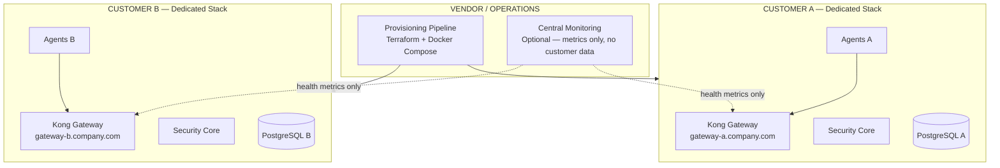
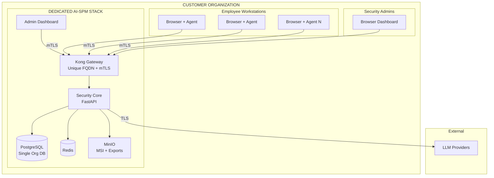
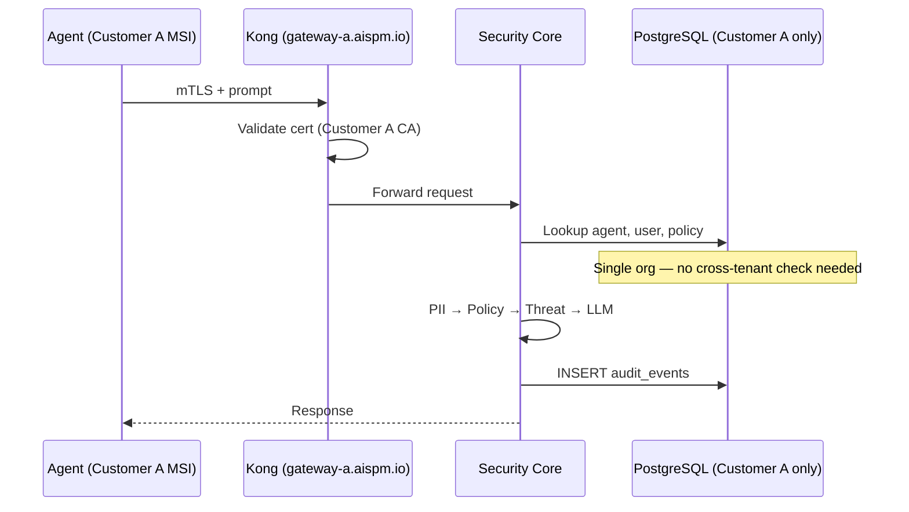
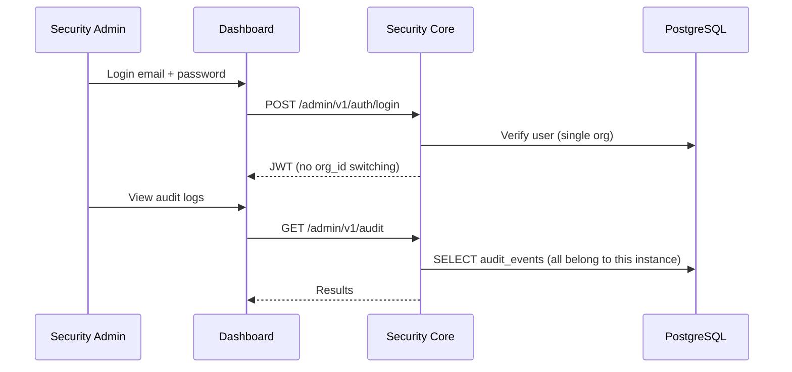
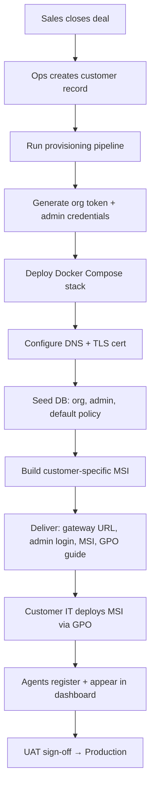
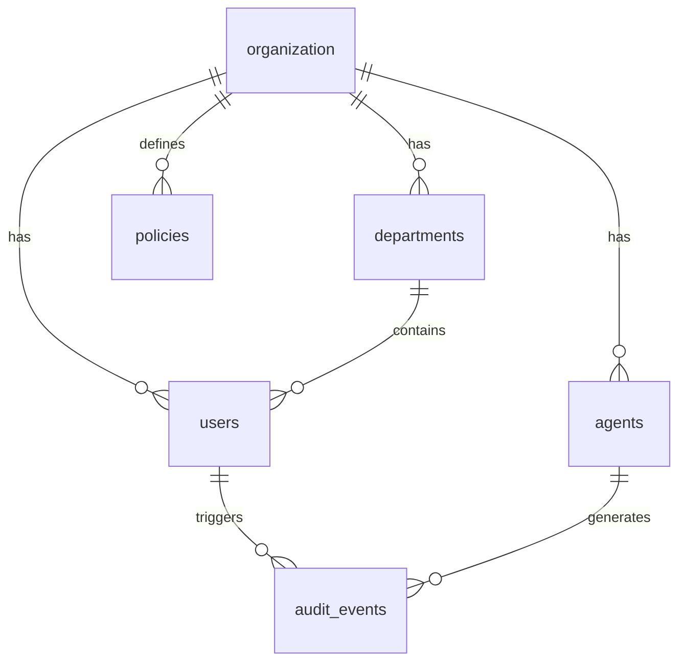
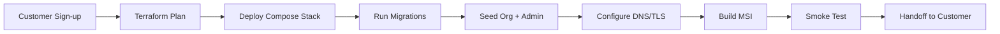

# AI-SPM Platform — Dedicated Instance Architecture Roadmap

**Document Version:** 1.0  
**Deployment Model:** **Dedicated Instance (Single-Tenant per Customer)**  
**Parent Document:** `IMPLEMENTATION_ROADMAP.md`  
**Status:** Planning — Architecture Finalization  
**Source:** AI-SPM Technical Proposal v2.0 (June 2026)

---

## Document Purpose

This roadmap finalizes the **Dedicated Instance** deployment model: **each customer (company) receives a fully isolated AI-SPM stack** — own gateway, database, Redis, and configuration. No customer shares runtime infrastructure or data stores with another customer.

Use this document to plan, estimate, and implement when selling AI-SPM as:

- **On-premise** (customer Linux server)
- **Managed dedicated** (you host one VM/K8s namespace per customer)
- **Private cloud** (customer AWS/Azure account, one stack per org)

---

# 1. Executive Summary

## Deployment Model Overview



## Why Choose Dedicated Instance

| Factor | Benefit |
|--------|---------|
| **Data isolation** | Strongest — separate database per customer; zero cross-tenant query risk |
| **Compliance** | Easier SOC2, HIPAA, GDPR — data never co-mingled |
| **MVP speed** | Aligns with original 12-week proposal; no multi-tenant layer needed |
| **Customer trust** | Enterprise buyers often require dedicated or on-prem |
| **Customization** | Per-customer LLM keys, policies, cert CA, retention without affecting others |
| **Blast radius** | One customer outage does not affect others |

## Trade-offs

| Factor | Cost |
|--------|------|
| **Operational cost** | Higher per customer — N stacks to patch, monitor, backup |
| **Provisioning time** | ~30 min automated; manual review for enterprise |
| **Unit economics** | Better at enterprise price points; weaker at low-cost SMB volume |
| **Feature rollout** | Must upgrade N instances (automated pipeline required) |

## Business Objective

Sell AI-SPM to enterprises where **data sovereignty and isolation are non-negotiable**. Each company gets multiple admin users and unlimited employee agents within their instance.

## Technical Objective

- One **organization** per instance (single `org_id` — no tenant middleware required)
- Deploy full stack in **<30 minutes** via automated provisioning
- Same core product: agent + gateway + PII + policy + threat + dashboard
- Central ops can monitor health **without accessing customer audit data**

## Core Features (Same Product, Dedicated Deploy)

| # | Feature | Dedicated Instance Notes |
|---|---------|--------------------------|
| 1 | Windows Endpoint Agent | MSI built per customer: unique gateway URL + org token |
| 2 | AI Security Gateway | Dedicated Kong per customer |
| 3 | PII Masking Engine | Same Presidio pipeline |
| 4 | Policy & RBAC Engine | RBAC within single org (departments) |
| 5 | Threat Detection | Same Guardrails module |
| 6 | Admin Dashboard | Single-org dashboard; no tenant switcher |
| 7 | Audit Log System | Dedicated PostgreSQL; customer owns backups |
| 8 | Deployment Package | `docker-compose.customer.yml` + Terraform module |
| 9 | Documentation | Per-customer runbook + GPO guide |

## Non-Functional Requirements (Dedicated)

| NFR | Target |
|-----|--------|
| Instance provisioning | <30 min automated |
| Data isolation | 100% — separate DB per customer |
| Latency overhead | <300ms p95 |
| Availability per instance | 99.5% MVP → 99.9% with HA option |
| Backup | Customer-controlled or managed daily |
| Agent capacity per instance | 1,000+ (MVP) → 10,000+ with scaling |

## Success Criteria

- [ ] Two pilot customers on separate instances with zero shared infrastructure
- [ ] Customer A admin cannot reach Customer B gateway URL without credentials
- [ ] Automated provisioning creates working stack from template
- [ ] Per-customer MSI connects only to that customer's gateway
- [ ] All original go-live acceptance criteria met **per instance**

---

# 2. Architecture Decision Record (ADR)

## ADR-001: Dedicated Instance as Primary MVP Model

| Field | Decision |
|-------|----------|
| **Status** | Proposed — Recommended for MVP |
| **Context** | Product sold to multiple companies; isolation required |
| **Decision** | Deploy **one full stack per customer**; single org per database |
| **Rationale** | Strongest isolation; fastest path; matches original proposal |
| **Consequences** | Need provisioning automation early; ops team scales with customer count |

## ADR-002: No Application-Level Multi-Tenancy in MVP

| Field | Decision |
|-------|----------|
| **Status** | Accepted |
| **Decision** | Omit `tenant middleware`, PostgreSQL RLS, and platform admin UI in MVP |
| **Rationale** | One org per instance makes multi-tenant code unnecessary |
| **Consequences** | Migration to shared SaaS later requires data export/import per customer |

## ADR-003: Per-Customer Gateway URL

| Field | Decision |
|-------|----------|
| **Decision** | Each customer gets unique FQDN: `gateway.{customer-slug}.aispm.io` or customer domain |
| **Rationale** | mTLS certs, DNS, and MSI config are customer-specific |
| **MSI properties** | `GATEWAY_URL`, `ORG_TOKEN`, `CUSTOMER_ID` baked at build time |

## ADR-004: Central Ops Without Data Access

| Field | Decision |
|-------|----------|
| **Decision** | Optional central monitoring receives **metrics only** (latency, uptime, agent count) — not audit content |
| **Rationale** | Preserves customer data sovereignty while enabling vendor support |

---

# 3. Complete Requirement Analysis (Dedicated Instance)

All base requirements from `IMPLEMENTATION_ROADMAP.md` apply. Below are **dedicated-instance-specific** requirements.

## REQ-DI-001: Instance Provisioning Automation

| Attribute | Value |
|-----------|-------|
| **Purpose** | Create a new customer stack repeatably |
| **Functional Scope** | Terraform/Compose template; DNS; TLS cert; org seed; admin user; org token generation |
| **Technical Scope** | Terraform module OR Ansible playbook + Docker Compose |
| **Dependencies** | REQ-014 (Docker package) |
| **Priority** | P0 |
| **Phase** | Phase 1 (Weeks 1–3) |

## REQ-DI-002: Per-Customer MSI Build Pipeline

| Attribute | Value |
|-----------|-------|
| **Purpose** | Agent connects only to correct customer gateway |
| **Functional Scope** | CI job: input customer_id → output signed MSI with embedded config |
| **Technical Scope** | WiX properties; GitHub Actions matrix build |
| **Priority** | P0 |
| **Phase** | Phase 3 |

## REQ-DI-003: Single-Organization Database Seed

| Attribute | Value |
|-----------|-------|
| **Purpose** | One org per instance — simplify schema usage |
| **Functional Scope** | Seed script creates one organization, default admin, default department |
| **Technical Scope** | `scripts/seed-customer-instance.sh` |
| **Priority** | P0 |
| **Phase** | Phase 1 |

## REQ-DI-004: Customer-Managed Secrets

| Attribute | Value |
|-----------|-------|
| **Purpose** | LLM API keys and JWT secrets stay in customer instance |
| **Functional Scope** | `.env` or Vault per instance; no central secret store with customer keys |
| **Priority** | P0 |
| **Phase** | Phase 1 |

## REQ-DI-005: Instance Health Reporting (Optional Central)

| Attribute | Value |
|-----------|-------|
| **Purpose** | Vendor monitors uptime without accessing audit data |
| **Functional Scope** | Push metrics to central Prometheus/Grafana (no PII, no prompts) |
| **Technical Scope** | Prometheus remote_write OR heartbeat to ops API |
| **Priority** | P1 |
| **Phase** | Phase 4 |

## REQ-DI-006: Customer Data Export / Offboarding

| Attribute | Value |
|-----------|-------|
| **Purpose** | Export all audit/policy data when customer churns |
| **Functional Scope** | Full pg_dump + audit CSV export; instance teardown runbook |
| **Priority** | P1 |
| **Phase** | Phase 4 |

## REQ-DI-007: Upgrade Pipeline for N Instances

| Attribute | Value |
|-----------|-------|
| **Purpose** | Roll out new versions to all customer instances safely |
| **Functional Scope** | Canary on staging instance → batch upgrade with rollback |
| **Priority** | P0 |
| **Phase** | Phase 4+ |

### Base Requirements (Unchanged)

REQ-001 through REQ-024 from parent roadmap apply **without multi-tenant modifications**. REQ-025 (Multi-Tenancy) is **explicitly out of scope** for this model.

---

# 4. System Architecture

## High-Level Architecture (Per Customer)



## Instance Isolation Model

| Layer | Isolation Mechanism |
|-------|---------------------|
| **Network** | Separate VM, VPC, or K8s namespace per customer |
| **DNS** | Unique gateway FQDN per customer |
| **Database** | Dedicated PostgreSQL instance or database — no shared tables across customers |
| **Secrets** | Per-instance `.env` / Vault — LLM keys never shared |
| **Agents** | MSI signed with customer-specific gateway URL + org token |
| **Certificates** | Per-instance mTLS CA OR per-customer intermediate CA |
| **Backups** | Per-instance backup schedule and retention |
| **Logs** | Per-instance log streams; no central aggregation of audit content |

## Low-Level Architecture (Same Clean Architecture)

Identical modular monolith as parent roadmap:

- Presentation → Application → Domain → Infrastructure
- No `TenantContext` middleware required
- All queries run against single-org database without `org_id` filter (optional: keep `org_id` for future portability)

## Deployment Topology Options

### Option A: On-Premise (Customer Server)

```
Customer datacenter
└── Linux server (8 vCPU, 16GB RAM)
    └── Docker Compose
        ├── kong
        ├── security-core
        ├── postgres
        ├── redis
        ├── minio
        ├── dashboard
        └── prometheus (optional)
```

**Reasoning:** Matches original proposal exactly. Customer owns hardware and data.

### Option B: Managed Dedicated (Vendor-Hosted)

```
Vendor cloud (AWS/Azure)
├── customer-a namespace / VM
│   └── Full stack
├── customer-b namespace / VM
│   └── Full stack
└── ops tooling (Terraform, monitoring)
```

**Reasoning:** You operate N stacks; customer gets isolation without managing servers.

### Option C: Customer Cloud Account

```
Customer AWS account
└── ECS/EKS or EC2
    └── Terraform-deployed stack
```

**Reasoning:** Customer cloud billing; you provide Terraform module + support.

## Authentication Flow (Dedicated)



## Admin Authorization Flow (Within Single Org)



## Customer Onboarding Flow (Complete)



### Onboarding Steps (Detailed)

| Step | Owner | Action | Output |
|------|-------|--------|--------|
| 1 | Sales/Ops | Create customer slug (`acme-corp`) | Customer ID |
| 2 | Ops/CI | `make provision CUSTOMER=acme-corp` | Running stack |
| 3 | System | Generate org token, JWT secret, DB password | Secrets in customer Vault |
| 4 | System | Create TLS cert for `gateway.acme-corp.aispm.io` | HTTPS ready |
| 5 | System | Seed admin user | `admin@acme.com` credentials |
| 6 | CI | Build MSI with `GATEWAY_URL` + `ORG_TOKEN` | `AI-SPM-acme-corp-1.0.0.msi` |
| 7 | Customer IT | GPO deploy MSI + enterprise CA | Agents online |
| 8 | Customer Admin | Login, configure policies | Go-live |

## Prompt Lifecycle Flow (Dedicated — Same 11 Steps)

1. User opens ChatGPT/Claude in browser  
2. Agent intercepts HTTPS traffic  
3. Agent → dedicated gateway (mTLS)  
4. Gateway validates agent cert  
5. Policy check (department RBAC)  
6. PII scan + mask (Presidio)  
7. Threat scan (Guardrails)  
8. Block OR forward to LLM  
9. Response scan  
10. Agent → user browser  
11. Audit log → **this customer's PostgreSQL only**

## Data Flow — What Never Leaves the Customer Instance

| Data | Stays In Instance | Leaves Instance |
|------|-------------------|-----------------|
| Raw prompts (pre-mask) | Transient memory only | Never stored |
| Masked audit logs | PostgreSQL | Never (unless customer exports) |
| LLM API keys | Instance secrets | Never |
| Agent mTLS private keys | Workstation + cert store | Never to other customers |
| Admin passwords | PostgreSQL (hashed) | Never |
| Ops metrics (optional) | — | Uptime, latency, agent count only |

---

# 5. Technology Stack (Dedicated Instance)

| Category | Technology | Dedicated Instance Notes |
|----------|------------|--------------------------|
| **Provisioning** | Terraform + Docker Compose | One module per customer deployment |
| **DNS** | Route53 / Cloudflare / customer DNS | Per-customer A record |
| **TLS** | Let's Encrypt or customer CA | Per gateway FQDN |
| **Backend** | FastAPI modular monolith | No tenant middleware |
| **Database** | PostgreSQL 16 (dedicated per customer) | No RLS required |
| **Gateway** | Kong 3.x | Dedicated per customer |
| **Agent MSI** | WiX — per-customer build | Embedded gateway URL |
| **Secrets** | Docker secrets / customer Vault | Never in central store |
| **Monitoring** | Prometheus per instance | Optional central aggregation |
| **CI/CD** | GitHub Actions | `provision` + `build-msi` workflows |
| **IaC** | Terraform | `modules/customer-instance/` |

---

# 6. Database Architecture (Dedicated Instance)

## Schema Strategy

- **Single organization** seeded at provisioning (`organizations` table has exactly 1 row)
- Keep `org_id` on tables for **code portability** to SaaS later — always same value in dedicated mode
- No PostgreSQL Row-Level Security required
- Same table design as parent roadmap: users, departments, roles, agents, policies, audit_events

## Simplified ER (Single Org)



## Index & Partition Strategy

Same as parent roadmap — monthly audit partitions, full-text search on masked prompts.

## Backup (Per Customer)

| Type | Schedule | Owner |
|------|----------|-------|
| pg_dump full | Daily | Customer IT or managed ops |
| WAL archiving | Continuous | Customer instance |
| Retention | Customer policy (default 30 days hot) | Contractual |

---

# 7. Module Breakdown (Dedicated Adaptations)

| Module | Dedicated Change |
|--------|------------------|
| MOD-03 Kong | One Kong config per customer; customer FQDN in cert |
| MOD-04 Prompt Pipeline | Remove tenant context; single-org queries |
| MOD-07 Policy Engine | Department RBAC only — no cross-org |
| MOD-08 Audit | All events in local DB |
| MOD-10 Dashboard | No org switcher; no platform admin UI |
| MOD-11 Fleet | All agents belong to this instance |
| MOD-14 Docker Deploy | Parameterized template: `CUSTOMER_SLUG`, `DOMAIN` |
| **NEW MOD-DI-01** | Provisioning Service — Terraform + seed automation |
| **NEW MOD-DI-02** | MSI Build Service — per-customer CI pipeline |

---

# 8. API Design (Dedicated Instance)

Same API contract as parent roadmap. Dedicated-specific notes:

| Endpoint | Dedicated Behavior |
|----------|-------------------|
| All `/admin/v1/*` | Single org — no `org_id` in URL needed |
| All `/agent/v1/*` | mTLS certs issued by this instance's CA only |
| JWT payload | `org_id` optional (always same value) |
| Health | `GET /admin/v1/health` — include instance id in response |

**Instance metadata response (optional):**
```json
{
  "instance_id": "acme-corp",
  "deployment_model": "dedicated",
  "version": "1.0.0",
  "org_name": "Acme Corporation"
}
```

---

# 9. Security Architecture (Dedicated Instance)

## Isolation Guarantees

| Threat | Mitigation |
|--------|------------|
| Customer A sees Customer B data | **Impossible at app layer** — separate databases |
| Misconfigured query exposes other org | N/A — only one org in DB |
| Shared agent MSI connects to wrong gateway | Per-customer MSI with unique URL |
| Ops engineer accesses customer audit | Role-based access; audit access logged; customer can disable remote access |
| LLM key leakage across customers | Separate secret stores per instance |

## OWASP + Dedicated Controls

All controls from parent Section 12 apply, plus:

- **Network segmentation:** Customer VPC/on-prem firewall
- **No shared Redis/PostgreSQL** across customers
- **Per-instance mTLS CA** recommended for enterprise tier
- **Customer-owned backups** — contractual data ownership

## RBAC (Within Single Organization)

| Role | Scope |
|------|-------|
| super_admin | Full access within this customer's instance |
| security_admin | Policies, agents, audit, threats |
| auditor | Read-only audit + export |
| viewer | Dashboard + fleet view |

No `platform_admin` role in dedicated MVP.

---

# 10. DevOps & Deployment

## Provisioning Pipeline



## Git Branching (Same as Parent)

`main` → production templates; `develop` → integration; customer-specific config in **ops repo** (not app repo).

## Environment Strategy (Per Customer)

| Environment | Purpose |
|-------------|---------|
| `acme-dev` | Customer sandbox instance |
| `acme-prod` | Customer production instance |

Each customer may have dev + prod = **2 dedicated stacks**.

## Upgrade Strategy

1. Test new version on internal staging instance  
2. Canary upgrade on 1 pilot customer  
3. Batch upgrade remaining customers (maintenance window)  
4. Rollback: redeploy previous Docker image tag per instance  

## Folder Structure Additions

```
infrastructure/
├── terraform/
│   └── modules/
│       └── customer-instance/
│           ├── main.tf
│           ├── variables.tf
│           ├── outputs.tf
│           └── templates/
│               └── docker-compose.customer.yml.tpl
├── provisioning/
│   ├── provision-customer.sh
│   ├── seed-single-org.sql
│   └── teardown-customer.sh
└── msi-build/
    ├── build-customer-msi.sh
    └── customer-configs/
        └── acme-corp.json
```

---

# 11. Development Phases (Dedicated Instance)

## Phase 1: Foundation + Provisioning (Weeks 1–3)

**Added vs parent:** REQ-DI-001 provisioning template, REQ-DI-003 single-org seed

- [ ] Parameterized Docker Compose template
- [ ] `provision-customer.sh` script
- [ ] Single-org database seed
- [ ] Kong + FastAPI + OpenAI proxy (same as parent)
- [ ] Agent registration prototype

## Phase 2: Security Pipeline (Weeks 4–6)

Same as parent — PII, mTLS, Windows Service, Claude interception.

## Phase 3: Policy, Dashboard, Per-Customer MSI (Weeks 7–9)

**Added vs parent:** REQ-DI-002 MSI build pipeline

- [ ] RBAC + dashboard (no tenant UI)
- [ ] CI job: build MSI per customer config
- [ ] GPO deployment guide

## Phase 4: Threat Detection, Go-Live, Upgrade Pipeline (Weeks 10–12)

**Added vs parent:** REQ-DI-007 upgrade pipeline

- [ ] Guardrails integration
- [ ] Multi-instance upgrade runbook
- [ ] Customer offboarding export script
- [ ] UAT on 2 separate dedicated instances

---

# 12. Sprint Planning (Dedicated — Key Additions)

| Sprint | Dedicated-Specific Tasks |
|--------|--------------------------|
| Sprint 1 | Terraform/Compose customer template; seed-single-org.sql |
| Sprint 3 | Provision 2 dev instances (simulating 2 customers) |
| Sprint 9 | MSI build pipeline with customer config JSON |
| Sprint 11 | Upgrade pipeline test across 2 instances |
| Sprint 12 | Pilot Customer A + Customer B go-live on separate stacks |

---

# 13. Scalability (Dedicated Model)

| Customers | Ops Model |
|-----------|-----------|
| 1–10 | Manual provisioning + scripted |
| 10–50 | Full Terraform automation; ops dashboard (instance list) |
| 50–200 | Kubernetes namespace per customer OR VM pool |
| 200+ | Evaluate hybrid: dedicated for enterprise + SaaS for SMB |

| Agents per Customer | Scaling Within Instance |
|---------------------|-------------------------|
| 1–1,000 | Single Compose stack |
| 1,000–10,000 | Kong + FastAPI horizontal scale; PG read replica |
| 10,000+ | K8s per customer; dedicated PG cluster |

---

# 14. Risk Assessment (Dedicated)

| Risk | Mitigation |
|------|------------|
| Ops burden scales linearly with customers | Automate provisioning day one |
| Inconsistent versions across instances | Central version registry; mandatory upgrade window |
| Customer delays DNS/TLS | Pre-flight checklist; managed DNS option |
| Higher infra cost per SMB customer | Price dedicated tier for enterprise only |

---

# 15. Production Readiness Checklist (Per Customer Instance)

## Provisioning
- [ ] Unique FQDN configured and resolving
- [ ] TLS certificate valid
- [ ] Docker stack healthy (all containers)
- [ ] Single org seeded; admin user created
- [ ] Org token generated and stored securely
- [ ] Customer-specific MSI built and signed
- [ ] Smoke test: agent register → prompt → audit

## Isolation Verification
- [ ] Instance uses dedicated PostgreSQL (not shared)
- [ ] Gateway URL unique to this customer
- [ ] MSI connects only to this customer's gateway
- [ ] Second customer instance confirmed separate (pen test)

## Handoff
- [ ] Admin credentials delivered securely
- [ ] GPO deployment guide provided
- [ ] Backup schedule configured
- [ ] Support contact and SLA documented

---

# 16. Final Developer Checklist (Dedicated Instance)

## Provisioning & Ops
- [ ] Create `customer-instance` Terraform module
- [ ] Create parameterized `docker-compose.customer.yml.tpl`
- [ ] Implement `provision-customer.sh`
- [ ] Implement `seed-single-org.sql`
- [ ] Implement `teardown-customer.sh`
- [ ] Implement `build-customer-msi.sh`
- [ ] Create customer config schema (`customer-configs/*.json`)
- [ ] Implement instance upgrade runbook
- [ ] Implement customer data export script

## Application (Simplified vs SaaS)
- [ ] **Skip** tenant middleware
- [ ] **Skip** PostgreSQL RLS
- [ ] **Skip** platform admin UI
- [ ] **Skip** org switcher in dashboard
- [ ] Keep `org_id` in schema for code reuse

## All Base Product Features
- [ ] Complete all REQ-001 through REQ-024 from parent roadmap
- [ ] Verify on **two separate instances** before GA

---

# 17. When to Choose Dedicated Instance

**Choose dedicated if:**
- Enterprise customers require on-prem or data residency
- Compliance mandates no shared infrastructure
- MVP must ship in 12 weeks
- Average contract value supports per-customer ops cost
- Customers want full control of backups and keys

**Consider SaaS instead if:**
- Targeting high-volume SMB market
- Low touch provisioning required
- Central billing and self-signup needed

---

**Related Documents:**
- `IMPLEMENTATION_ROADMAP.md` — Base product roadmap
- `IMPLEMENTATION_ROADMAP_SAAS_MULTI_TENANT.md` — Shared SaaS model

**Document End**
