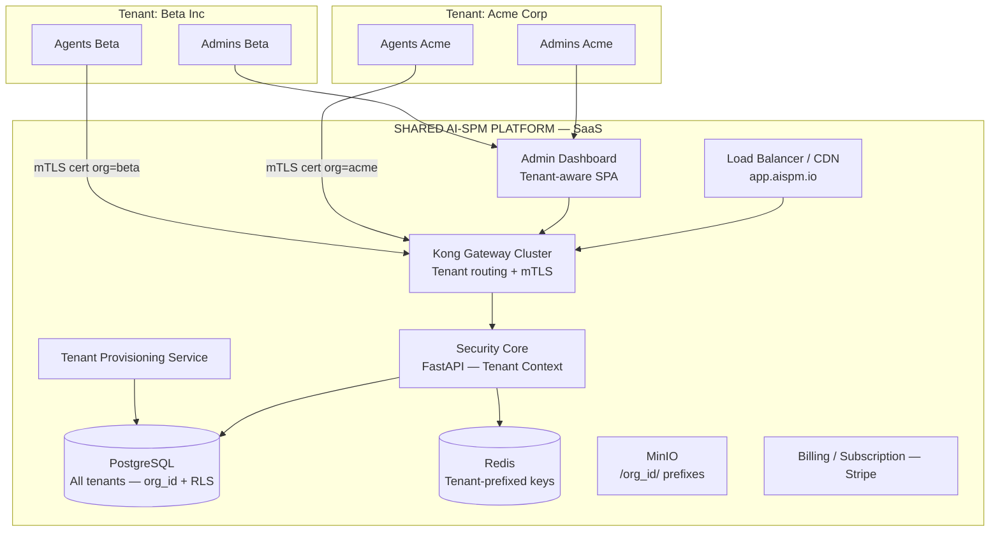
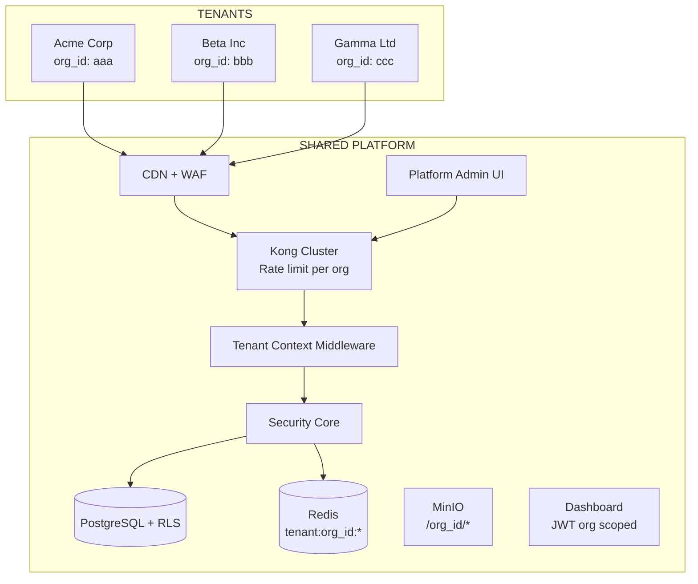
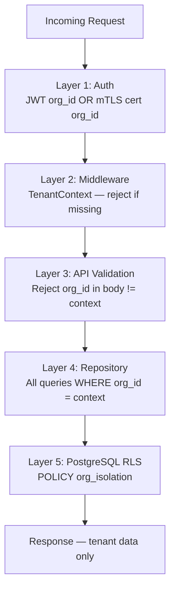
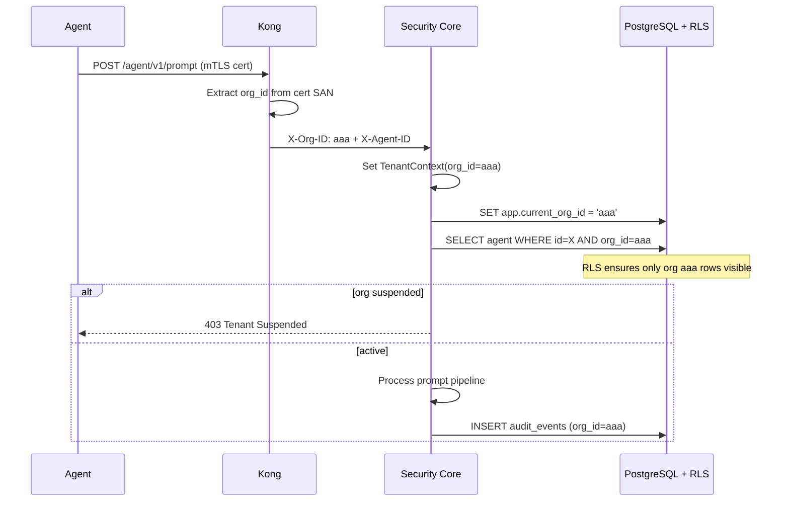
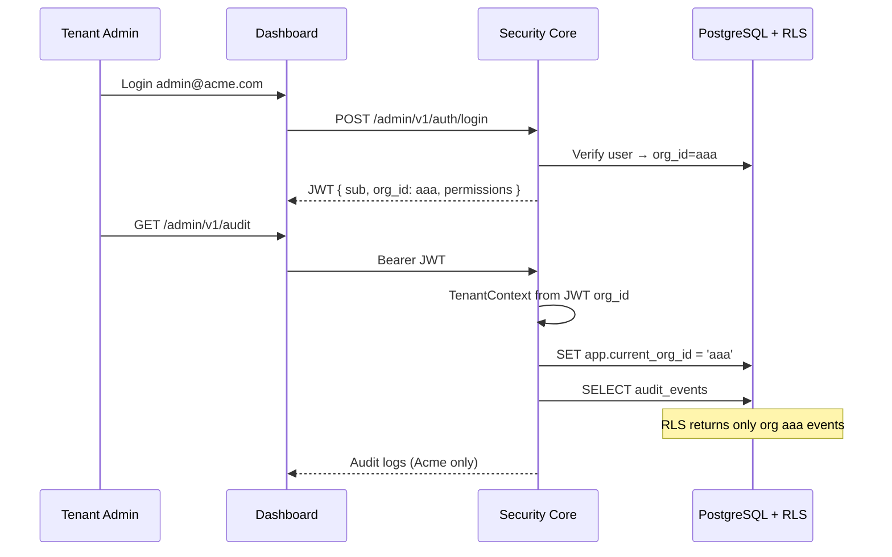
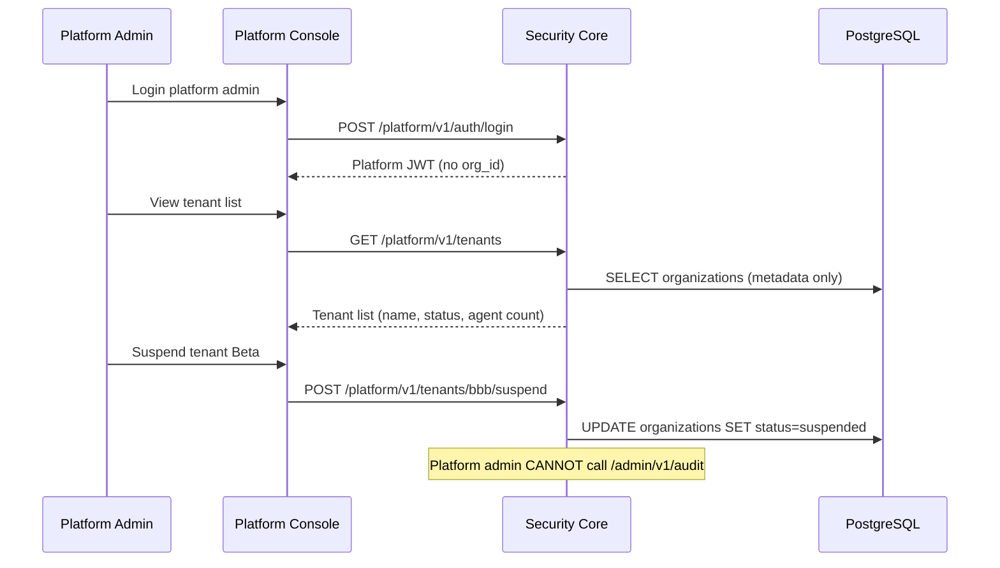
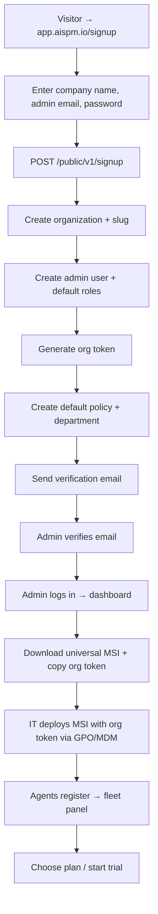
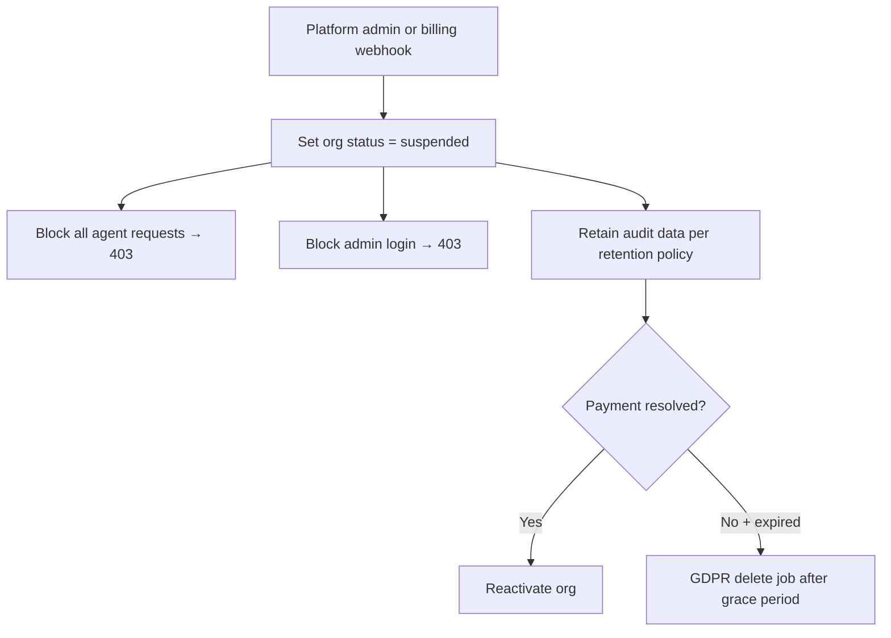
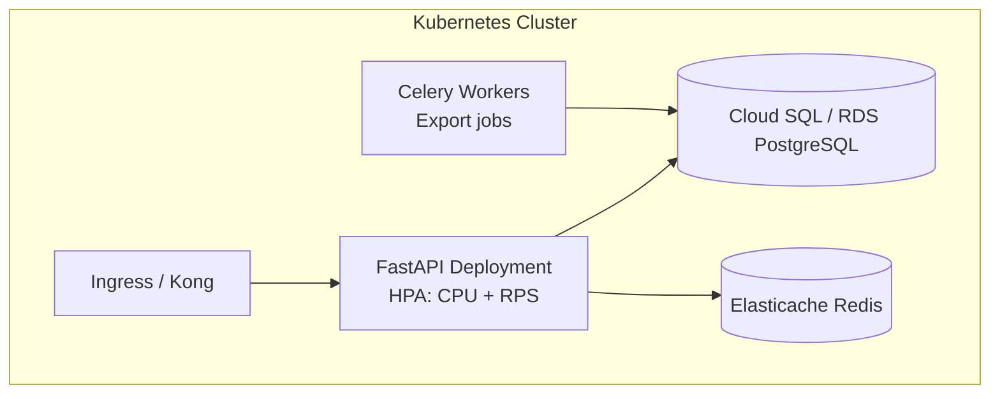

# AI-SPM Platform — SaaS Multi-Tenant Architecture Roadmap

**Document Version:** 1.0  
**Deployment Model:** **SaaS Multi-Tenant (Shared Platform)**  
**Parent Document:** `IMPLEMENTATION_ROADMAP.md`  
**Status:** Planning — Architecture Finalization  
**Source:** AI-SPM Technical Proposal v2.0 (June 2026)

---

## Document Purpose

This roadmap finalizes the **SaaS Multi-Tenant** deployment model: **one shared AI-SPM platform serves many customer companies (tenants)** with strict logical isolation. Each company has multiple admin users and employee agents; no tenant can access another tenant's data.

Use this document to plan, estimate, and implement when selling AI-SPM as:

- **Multi-tenant cloud SaaS** (`app.aispm.io`)
- **Self-service signup** with automated tenant provisioning
- **Subscription/billing** per organization
- **Centralized operations** with economies of scale

---

# 1. Executive Summary

## Deployment Model Overview



## Why Choose SaaS Multi-Tenant

| Factor | Benefit |
|--------|---------|
| **Unit economics** | One infra stack serves N customers — lower marginal cost |
| **Provisioning speed** | New customer live in minutes via self-service |
| **Feature rollout** | Deploy once — all tenants get updates simultaneously |
| **Operational efficiency** | One monitoring stack, one backup strategy, one on-call rotation |
| **Product velocity** | Single codebase path; no N-instance upgrade coordination |
| **SMB market** | Enables lower price tiers and free trials |

## Trade-offs

| Factor | Cost |
|--------|------|
| **Isolation complexity** | Must implement RLS, tenant middleware, cross-tenant tests |
| **Compliance scrutiny** | Enterprise buyers may require dedicated tier anyway |
| **Blast radius** | Platform bug can affect all tenants — needs strong testing |
| **Development time** | +4–6 weeks vs dedicated for tenant layer, billing, platform admin |
| **Noisy neighbor** | Large tenant can impact others — needs rate limits and quotas |

## Business Objective

Build a **scalable SaaS product** where each company (tenant) is fully isolated at the application and database layer, with self-service onboarding and subscription management.

## Technical Objective

- **`organizations` table = tenant** — every record scoped by `org_id`
- **Defense in depth:** middleware + repository layer + PostgreSQL RLS
- **Zero cross-tenant data leakage** — verified by automated security test suite
- **Platform admin** separate from **tenant admin**
- Same core security pipeline: PII, policy, threat, audit

## Core Features (SaaS Additions)

| # | Feature | SaaS-Specific |
|---|---------|---------------|
| 1–9 | Base product features | Same as parent roadmap |
| 10 | **Tenant Provisioning** | Self-service signup → org + admin + subdomain |
| 11 | **Multi-Tenant Isolation** | org_id + RLS + tenant middleware |
| 12 | **Platform Admin Console** | Manage tenants, suspend, usage — no audit content access |
| 13 | **Subscription & Billing** | Plans, limits, Stripe integration |
| 14 | **Tenant Quotas** | Max agents, prompts/day, storage |
| 15 | **SSO per Tenant** | SAML/OIDC (Phase 2) — Okta, Azure AD |

## Non-Functional Requirements (SaaS)

| NFR | Target |
|-----|--------|
| Tenant provisioning | <5 min automated |
| Cross-tenant data leakage | **Zero** — blocking release criterion |
| Latency overhead | <300ms p95 (same as dedicated) |
| Platform availability | 99.9% |
| Tenants on shared stack (MVP) | 50+ |
| Tenants at scale | 1,000+ orgs, 1M+ agents |
| Tenant isolation test | Automated on every CI build |

## Success Criteria

- [ ] Tenant A admin cannot access Tenant B audit/agents/policies (pen test verified)
- [ ] Tenant A agent cannot register with Tenant B org token
- [ ] Self-service signup creates working tenant in <5 min
- [ ] PostgreSQL RLS blocks cross-tenant SELECT even with raw SQL
- [ ] Platform admin can suspend tenant without accessing their audit data
- [ ] All base go-live criteria met **within tenant scope**

---

# 2. Architecture Decision Record (ADR)

## ADR-SaaS-001: Shared Database with org_id + RLS

| Field | Decision |
|-------|----------|
| **Status** | Proposed — Recommended for SaaS |
| **Decision** | Single PostgreSQL cluster; all tables have `org_id`; PostgreSQL Row-Level Security enforces tenant boundary |
| **Rationale** | Industry standard (Slack, Stripe pattern); simpler ops than DB-per-tenant at scale |
| **Alternative rejected** | DB-per-tenant on shared platform — too many connections at 1000+ tenants |

## ADR-SaaS-002: Tenant Context via JWT + mTLS SAN

| Field | Decision |
|-------|----------|
| **Decision** | Admin: JWT contains `org_id`. Agent: mTLS cert SAN contains `org_id`. Middleware sets `TenantContext` on every request |
| **Rationale** | Two auth paths, one isolation primitive |

## ADR-SaaS-003: Platform Admin vs Tenant Admin

| Field | Decision |
|-------|----------|
| **Decision** | Separate `platform_users` table and `/platform/v1/*` API. Platform admin manages tenants, never reads audit_events content |
| **Rationale** | Vendor ops ≠ customer data access (compliance + trust) |

## ADR-SaaS-004: Subdomain per Tenant (Optional MVP)

| Field | Decision |
|-------|----------|
| **Decision** | MVP: shared URL `app.aispm.io` + JWT org scope. Phase 2: `{slug}.app.aispm.io` |
| **Rationale** | JWT scoping sufficient for MVP; subdomain improves branding |

## ADR-SaaS-005: Shared Agent MSI with Runtime Registration

| Field | Decision |
|-------|----------|
| **Decision** | One universal MSI pointing to `gateway.aispm.io`; org token entered at install OR embedded via MDM per customer |
| **Alternative** | Per-tenant MSI builds (same as dedicated) — supported for enterprise tier |

## ADR-SaaS-006: Kubernetes from Phase 1

| Field | Decision |
|-------|----------|
| **Decision** | SaaS MVP deploys on K8s (not single Compose node) for horizontal scale |
| **Rationale** | Multi-tenant workload requires auto-scaling from day one |

---

# 3. Complete Requirement Analysis (SaaS Multi-Tenant)

All base requirements REQ-001 through REQ-024 apply. Below are **SaaS-specific** requirements (mandatory, not deferred).

## REQ-SaaS-001: Tenant Provisioning Service

| Attribute | Value |
|-----------|-------|
| **Purpose** | Create new organization with admin, defaults, org token |
| **Functional Scope** | Signup form; email verification; org slug; seed roles/policies; generate org token |
| **Technical Scope** | FastAPI `/public/v1/signup`; async job; welcome email |
| **Dependencies** | REQ-005, REQ-009 |
| **Priority** | P0 |
| **Phase** | Phase 1 |

## REQ-SaaS-002: Tenant Context Middleware

| Attribute | Value |
|-----------|-------|
| **Purpose** | Every request scoped to exactly one org_id |
| **Functional Scope** | Extract org from JWT or mTLS cert; set contextvar; reject missing org |
| **Technical Scope** | FastAPI middleware + SQLAlchemy session hook |
| **Priority** | P0 |
| **Phase** | Phase 1 |

## REQ-SaaS-003: PostgreSQL Row-Level Security

| Attribute | Value |
|-----------|-------|
| **Purpose** | DB-enforced tenant isolation even if app code bugs |
| **Functional Scope** | RLS policies on all tenant tables; `SET app.current_org_id` per connection |
| **Technical Scope** | Alembic migration with RLS policies |
| **Priority** | P0 |
| **Phase** | Phase 1 |

## REQ-SaaS-004: Cross-Tenant Security Test Suite

| Attribute | Value |
|-----------|-------|
| **Purpose** | Prove Tenant A cannot access Tenant B data |
| **Functional Scope** | Automated tests: API, repository, raw SQL with wrong org_id |
| **Priority** | P0 — **Blocking for production** |
| **Phase** | Phase 1–ongoing |

## REQ-SaaS-005: Platform Admin Console

| Attribute | Value |
|-----------|-------|
| **Purpose** | Vendor manages tenants without accessing customer audit content |
| **Functional Scope** | List tenants; suspend/activate; view usage metrics; reset admin |
| **Technical Scope** | `/platform/v1/*` API; separate auth; no audit_events read permission |
| **Priority** | P0 |
| **Phase** | Phase 2 |

## REQ-SaaS-006: Subscription & Billing

| Attribute | Value |
|-----------|-------|
| **Purpose** | Monetize per-tenant plans |
| **Functional Scope** | Free/Pro/Enterprise tiers; agent limits; Stripe webhooks |
| **Technical Scope** | `subscriptions` table; Stripe integration |
| **Priority** | P1 |
| **Phase** | Phase 2–3 |

## REQ-SaaS-007: Tenant Quotas & Rate Limits

| Attribute | Value |
|-----------|-------|
| **Purpose** | Prevent noisy neighbor; enforce plan limits |
| **Functional Scope** | Max agents, prompts/day, audit retention by plan |
| **Technical Scope** | Kong rate limit per org_id; quota middleware |
| **Priority** | P0 |
| **Phase** | Phase 2 |

## REQ-SaaS-008: Tenant Suspension

| Attribute | Value |
|-----------|-------|
| **Purpose** | Disable tenant for non-payment or abuse |
| **Functional Scope** | Block agent + admin login; retain data per retention policy |
| **Priority** | P0 |
| **Phase** | Phase 2 |

## REQ-SaaS-009: Per-Tenant Encryption Keys (Enterprise Tier)

| Attribute | Value |
|-----------|-------|
| **Purpose** | Encrypt LLM API keys at rest with tenant-specific DEK |
| **Functional Scope** | Envelope encryption; KMS integration |
| **Priority** | P2 |
| **Phase** | Phase 4 |

## REQ-SaaS-010: Tenant Audit Export & GDPR Delete

| Attribute | Value |
|-----------|-------|
| **Purpose** | Data portability and right to erasure |
| **Functional Scope** | Full tenant export; hard delete after retention window |
| **Priority** | P1 |
| **Phase** | Phase 3 |

### Base REQ-025 Upgrade

**REQ-025 Multi-Tenancy** from parent roadmap is **P0 and in scope** for this document — not deferred.

---

# 4. System Architecture

## High-Level Architecture (Shared SaaS)



## Tenant Isolation Model (Defense in Depth)



| Layer | Failure Mode | Result |
|-------|--------------|--------|
| Auth | Wrong org token / cert | 401 Unauthorized |
| Middleware | No org in context | 403 Forbidden |
| API | org_id mismatch in payload | 403 Forbidden |
| Repository | Missing WHERE org_id | Caught by RLS → empty/error |
| RLS | Direct SQL injection attempt | No rows returned |

## Multi-Tenant Database Architecture

```mermaid
erDiagram
    organizations ||--o{ users : tenant_has
    organizations ||--o{ agents : tenant_has
    organizations ||--o{ policies : tenant_has
    organizations ||--o{ audit_events : tenant_has
    organizations ||--o{ subscriptions : has
    organizations ||--o{ departments : has

    platform_users ||--o{ platform_audit_logs : creates

    organizations {
        uuid id PK
        string slug UK
        string name
        string org_token_hash
        enum status active_suspended
        jsonb settings
        timestamp created_at
    }

    subscriptions {
        uuid id PK
        uuid org_id FK
        string plan
        int max_agents
        int max_prompts_per_day
        timestamp expires_at
    }
```

## Authentication Flow (Agent — Multi-Tenant)



## Authentication Flow (Admin — Multi-Tenant)



## Platform Admin Flow (No Customer Data Access)



## Tenant Onboarding Flow (Self-Service)



### Onboarding Steps (Detailed)

| Step | Actor | Action | Data Created |
|------|-------|--------|--------------|
| 1 | Prospect | Submit signup form | `organizations` row (status: pending) |
| 2 | System | Verify email | org status → active |
| 3 | System | Seed RBAC roles for org | org-scoped roles |
| 4 | System | Generate org token | `org_token_hash` |
| 5 | Admin | Login to dashboard | JWT with org_id |
| 6 | Admin | Configure LLM API key | `llm_provider_configs` (org scoped) |
| 7 | Admin | Configure policies | `policies` (org scoped) |
| 8 | IT | Deploy MSI + org token | `agents` register with org_id |
| 9 | System | Start trial / subscription | `subscriptions` row |

## Prompt Lifecycle Flow (Multi-Tenant)

Same 11 steps as parent roadmap, with **tenant context on every step**:

1. User submits prompt → Agent intercepts  
2. Agent → shared gateway (mTLS, cert contains org_id)  
3. Kong validates cert → forwards X-Org-ID  
4. **TenantContext set** → verify org not suspended  
5. **Quota check** → prompts/day within plan limit  
6. Policy check (org aaa policies only)  
7. PII scan + mask  
8. Threat scan  
9. LLM call (org aaa API keys only)  
10. Response scan → agent → user  
11. Audit INSERT with org_id=aaa → **RLS enforced**

## Tenant Suspension Flow



---

# 5. Technology Stack (SaaS Multi-Tenant)

| Category | Technology | SaaS Notes |
|----------|------------|------------|
| **Orchestration** | Kubernetes (EKS/GKE/AKS) | Auto-scale from day one |
| **Ingress** | Kong + cert-manager | Wildcard TLS `*.aispm.io` |
| **Backend** | FastAPI + TenantContext middleware | Required on every route |
| **Database** | PostgreSQL 16 + RLS | Single cluster, org_id on all tables |
| **Connection Pool** | PgBouncer + `SET app.current_org_id` | Per-request org setting |
| **Cache** | Redis — keys prefixed `tenant:{org_id}:` | Prevent cache bleed |
| **Object Storage** | S3/MinIO — path `/org_id/` | MSI, exports isolated |
| **Billing** | Stripe Billing + webhooks | Subscription lifecycle |
| **Email** | SendGrid / SES | Signup, alerts |
| **Auth (Admin)** | JWT with org_id claim | — |
| **Auth (Agent)** | mTLS cert SAN: `org_id={uuid}` | Per-agent cert, bound to org |
| **Auth (Platform)** | Separate platform JWT | No org_id; platform permissions |
| **WAF** | Cloudflare / AWS WAF | DDoS protection |
| **Secrets** | HashiCorp Vault or AWS KMS | Per-tenant DEK for enterprise |
| **Monitoring** | Prometheus + Grafana (per-tenant labels) | `org_id` label on metrics |
| **CI/CD** | GitHub Actions + ArgoCD | GitOps deploy |
| **Agent MSI** | Universal MSI + org token at install | Optional per-tenant build for enterprise |

---

# 6. Database Architecture (SaaS Multi-Tenant)

## Schema Strategy

- **`organizations`** = tenant root entity
- **`org_id` NOT NULL** on every tenant-scoped table
- **Composite indexes** lead with `org_id`: `(org_id, created_at)`, `(org_id, email)`
- **PostgreSQL RLS** on: users, agents, policies, audit_events, departments, llm_provider_configs, subscriptions
- **Platform tables** (no RLS): platform_users, platform_audit_logs, billing_events

## Row-Level Security Policies

```sql
-- Enable RLS on tenant tables
ALTER TABLE audit_events ENABLE ROW LEVEL SECURITY;

-- Tenant isolation policy
CREATE POLICY tenant_isolation ON audit_events
    USING (org_id = current_setting('app.current_org_id')::uuid);

-- Platform admin role bypass (metadata only tables)
-- platform_users table: NO access to audit_events
```

## Application Session Hook

```python
# Every DB session sets org context from TenantContext
await session.execute(
    text("SET app.current_org_id = :org_id"),
    {"org_id": str(tenant_context.org_id)}
)
```

## Additional SaaS Tables

| Table | Purpose |
|-------|---------|
| `subscriptions` | Plan, limits, Stripe subscription ID |
| `usage_daily` | Prompts/day, agents active — for billing |
| `platform_users` | Vendor ops team |
| `platform_audit_logs` | Platform admin actions (suspend tenant, etc.) |
| `tenant_invitations` | Invite admin users to org |

## Sharding Path (10M+ users)

| Scale | Strategy |
|-------|----------|
| 0–1K tenants | Single PostgreSQL + RLS |
| 1K–10K tenants | Citus or read replicas; audit → OpenSearch |
| 10K+ tenants | Shard by org_id hash; dedicated shards for enterprise tenants |

---

# 7. Module Breakdown (SaaS Additions)

| Module | SaaS Responsibility |
|--------|---------------------|
| **MOD-SaaS-01 Tenant Provisioning** | Signup, email verify, org seed, org token |
| **MOD-SaaS-02 Tenant Context** | Middleware, contextvar, session hook |
| **MOD-SaaS-03 RLS Migration** | Alembic policies for all tenant tables |
| **MOD-SaaS-04 Cross-Tenant Tests** | CI security test suite |
| **MOD-SaaS-05 Platform Admin** | Tenant list, suspend, usage — no audit read |
| **MOD-SaaS-06 Billing** | Stripe, plans, webhooks, quota enforcement |
| **MOD-SaaS-07 Quota Enforcer** | Agent count, prompts/day middleware |
| MOD-01–14 (base) | All require org_id scoping in queries |

---

# 8. API Design (SaaS Multi-Tenant)

## API Namespaces

| Namespace | Auth | Scope |
|-----------|------|-------|
| `/public/v1/*` | None | Signup, health |
| `/agent/v1/*` | mTLS (org in cert) | Single tenant per request |
| `/admin/v1/*` | JWT (org_id claim) | Single tenant per request |
| `/platform/v1/*` | Platform JWT | Cross-tenant metadata only |

## New Public Endpoints

### POST /public/v1/signup
**Request:**
```json
{
  "company_name": "Acme Corporation",
  "admin_email": "admin@acme.com",
  "admin_password": "...",
  "admin_full_name": "Jane Security"
}
```
**Response 201:**
```json
{
  "org_id": "uuid",
  "slug": "acme-corp",
  "message": "Verification email sent"
}
```

### GET /public/v1/verify-email?token=...
Activates organization.

## Platform Admin Endpoints

| Method | Endpoint | Purpose |
|--------|----------|---------|
| GET | /platform/v1/tenants | List all orgs (metadata) |
| GET | /platform/v1/tenants/{org_id} | Tenant detail (no audit content) |
| POST | /platform/v1/tenants/{org_id}/suspend | Suspend tenant |
| POST | /platform/v1/tenants/{org_id}/activate | Reactivate |
| GET | /platform/v1/tenants/{org_id}/usage | Agent count, prompts/day |

**Platform admin CANNOT access:**
- `/admin/v1/audit`
- `/admin/v1/policies` content
- Raw prompt/response data

## Admin Endpoints (Tenant-Scoped)

All existing `/admin/v1/*` endpoints automatically scoped by JWT `org_id`.  
**Reject** any request where body contains different `org_id`.

## Agent Endpoints (Tenant-Scoped)

mTLS certificate Subject Alternative Name:
```
URI:spiffe://aispm.io/org/{org_id}/agent/{agent_id}
```

---

# 9. Security Architecture (SaaS Multi-Tenant)

## Isolation Guarantees

| Scenario | Protection |
|----------|------------|
| Admin A tries `GET /admin/v1/audit?org_id=B` | Ignored — JWT org_id used; RLS blocks |
| Agent with org A cert sends to org B resource | mTLS org mismatch → 403 |
| SQL injection bypassing app | RLS returns zero rows |
| Redis cache key collision | Keys prefixed `tenant:{org_id}:` |
| MinIO object access | Path `/org_id/` — IAM policy per prefix |
| Platform admin reads customer prompts | **Architecturally impossible** — no API endpoint |
| Suspended tenant continues usage | Middleware blocks all requests |

## Cross-Tenant Test Matrix (Mandatory CI)

| Test | Expected |
|------|----------|
| Admin JWT org=A accesses audit | Only org A events |
| Admin JWT org=A with agent id from org B | 404 Not Found |
| Agent cert org=A registers | agent.org_id = A |
| Raw SQL as app role without SET org_id | Zero rows (RLS) |
| API fuzzing with org_id in body | 403 if != JWT org |
| Platform JWT calls /admin/v1/audit | 403 Forbidden |

## RBAC (Two Levels)

### Tenant-Level Roles (within org)
Same as dedicated: super_admin, security_admin, auditor, viewer

### Platform-Level Roles (vendor)
| Role | Permissions |
|------|-------------|
| platform_super | tenants:*, billing:read |
| platform_support | tenants:read, tenants:suspend, tenants:reset_admin |
| platform_billing | billing:*, tenants:read |

## OWASP A01 — Broken Access Control (SaaS Critical)

- Tenant context on **every** route — no exceptions
- Integration tests for IDOR on all resource endpoints
- RLS as safety net — not primary (defense in depth)

---

# 10. DevOps & Deployment (SaaS)

## Kubernetes Architecture



## Environment Strategy

| Environment | Tenants |
|-------------|---------|
| dev | Synthetic test tenants (org_test_a, org_test_b) |
| staging | Multi-tenant staging with cross-tenant tests |
| production | All customer tenants |

## CI/CD (SaaS)

Every PR must pass:
1. Unit tests  
2. Integration tests  
3. **Cross-tenant security test suite**  
4. Load test (baseline)  

Deploy via ArgoCD to K8s — single deployment serves all tenants.

## Folder Structure Additions

```
backend/src/ai_spm/
├── tenant/
│   ├── context.py              # TenantContext contextvar
│   ├── middleware.py             # Extract org from JWT/mTLS
│   ├── rls.py                    # SET app.current_org_id hook
│   └── quota.py                  # Plan limit enforcement
├── platform/
│   ├── api/v1/tenants.py         # Platform admin routes
│   └── services/provisioning.py  # Signup + seed
├── billing/
│   ├── stripe_webhook.py
│   └── subscription_service.py
└── tests/
    └── security/
        ├── test_cross_tenant_api.py
        ├── test_cross_tenant_rls.py
        └── test_platform_admin_boundaries.py
```

---

# 11. Development Phases (SaaS — 16 Weeks Recommended)

SaaS adds **4 weeks** to base 12-week plan for tenant layer + platform admin + billing.

## Phase 1: Foundation + Tenant Core (Weeks 1–4)

- [ ] K8s dev cluster
- [ ] TenantContext middleware
- [ ] PostgreSQL RLS policies (all tenant tables)
- [ ] Cross-tenant test suite (CI blocking)
- [ ] Signup + provisioning API
- [ ] Kong + FastAPI + agent registration (org scoped)
- [ ] OpenAI proxy with org-scoped LLM keys

## Phase 2: Security Pipeline + Quotas (Weeks 5–8)

- [ ] PII + mTLS + Windows Service (same as parent)
- [ ] Quota middleware (prompts/day, max agents)
- [ ] Tenant suspension flow
- [ ] Redis key prefixing by org_id

## Phase 3: Dashboard + Platform Admin (Weeks 9–12)

- [ ] Tenant-scoped admin dashboard
- [ ] Platform admin console (tenant list, suspend)
- [ ] Universal MSI + org token install flow
- [ ] Stripe billing integration (basic plans)
- [ ] Audit search (org scoped + RLS verified)

## Phase 4: Threat Detection + Go-Live (Weeks 13–16)

- [ ] Guardrails integration
- [ ] GDPR export/delete per tenant
- [ ] Load test: 50 tenants, 1000 agents
- [ ] Pen test: cross-tenant isolation
- [ ] Production go-live

---

# 12. Sprint Planning (SaaS — Key Additions)

| Sprint | SaaS-Specific Tasks |
|--------|---------------------|
| Sprint 1 | TenantContext middleware; RLS migration v1 |
| Sprint 2 | Cross-tenant test suite in CI |
| Sprint 3 | POST /public/v1/signup + org seed |
| Sprint 4 | mTLS cert with org_id in SAN |
| Sprint 6 | Quota middleware; suspension flow |
| Sprint 8 | Platform admin API (tenants list, suspend) |
| Sprint 10 | Stripe webhooks + subscription table |
| Sprint 14 | Pen test + 50-tenant load test |
| Sprint 16 | SaaS production go-live |

---

# 13. Scalability (SaaS Model)

| Tenants | Agents Total | Architecture |
|---------|--------------|--------------|
| 1–50 | <5K | K8s 3-node; single PostgreSQL |
| 50–500 | 5K–50K | HPA on FastAPI; PG read replica |
| 500–5K | 50K–500K | OpenSearch for audit; Kafka pipeline |
| 5K+ | 500K+ | Citus sharding; multi-region |

---

# 14. Risk Assessment (SaaS)

| Risk | Impact | Mitigation |
|------|--------|------------|
| Cross-tenant data leak | **Critical** | RLS + middleware + mandatory CI tests + pen test |
| Noisy neighbor | High | Per-org rate limits and quotas |
| Platform outage affects all | High | K8s HA; multi-AZ; status page |
| RLS performance overhead | Medium | Benchmark; index org_id first in all composites |
| Billing desync | Medium | Stripe webhooks + reconciliation job |

---

# 15. Production Readiness Checklist (SaaS Platform)

## Tenant Isolation (Blocking)
- [ ] RLS enabled on all tenant tables
- [ ] Cross-tenant CI test suite passes 100%
- [ ] Pen test report: zero cross-tenant findings
- [ ] Manual test: 2 tenants, verify complete separation
- [ ] Platform admin verified cannot read audit content

## Platform
- [ ] K8s HA deployment (multi-AZ)
- [ ] Signup → working tenant in <5 min
- [ ] Suspension blocks agents + admins
- [ ] Stripe billing webhooks tested
- [ ] Quotas enforced per plan
- [ ] GDPR export/delete tested

## Base Product
- [ ] All REQ-001–REQ-024 met within tenant scope
- [ ] Latency p95 <300ms under multi-tenant load

---

# 16. Final Developer Checklist (SaaS Multi-Tenant)

## Tenant Isolation (P0)
- [ ] Implement TenantContext middleware
- [ ] Implement org_id on all tenant tables (NOT NULL + FK)
- [ ] Write Alembic migration: RLS policies for all tenant tables
- [ ] Implement DB session hook: SET app.current_org_id
- [ ] Prefix all Redis keys with tenant:{org_id}:
- [ ] Prefix all MinIO paths with /org_id/
- [ ] Include org_id in mTLS cert SAN
- [ ] Include org_id in JWT claims
- [ ] Reject org_id in request body if != context
- [ ] Write test_cross_tenant_api.py (blocking CI)
- [ ] Write test_cross_tenant_rls.py (blocking CI)
- [ ] Write test_platform_admin_boundaries.py

## Tenant Provisioning (P0)
- [ ] POST /public/v1/signup
- [ ] Email verification flow
- [ ] Org seed script (roles, default policy, department)
- [ ] Org token generation on signup
- [ ] Welcome email with getting started guide

## Platform Admin (P0)
- [ ] platform_users table + auth
- [ ] GET /platform/v1/tenants
- [ ] POST /platform/v1/tenants/{id}/suspend
- [ ] POST /platform/v1/tenants/{id}/activate
- [ ] Platform admin UI (basic)
- [ ] Verify platform admin cannot access /admin/v1/audit

## Billing & Quotas (P1)
- [ ] subscriptions table
- [ ] Stripe integration + webhooks
- [ ] Quota middleware (agents, prompts/day)
- [ ] usage_daily aggregation job

## Base Product
- [ ] Complete REQ-001 through REQ-024 (tenant-scoped)
- [ ] K8s deployment with HPA
- [ ] Universal MSI + org token configuration

---

# 17. Dedicated vs SaaS — Decision Guide

| Criterion | Dedicated Instance | SaaS Multi-Tenant |
|-----------|-------------------|-------------------|
| **Isolation strength** | Strongest (separate DB) | Strong (RLS + middleware) |
| **Time to MVP** | 12 weeks | 16 weeks |
| **Ops cost per customer** | High | Low |
| **Enterprise compliance** | Preferred | Requires pen test + SOC2 |
| **SMB / self-service** | Poor fit | Ideal |
| **Code complexity** | Lower | Higher (tenant layer) |
| **Recommended first** | ✅ If enterprise-first | ✅ If volume SaaS-first |

**Hybrid strategy (recommended long-term):**
- **SaaS** for SMB and mid-market
- **Dedicated instance** for enterprise tier (same codebase, different deploy template)

---

**Related Documents:**
- `IMPLEMENTATION_ROADMAP.md` — Base product roadmap
- `IMPLEMENTATION_ROADMAP_DEDICATED_INSTANCE.md` — Dedicated single-tenant model

**Document End**
